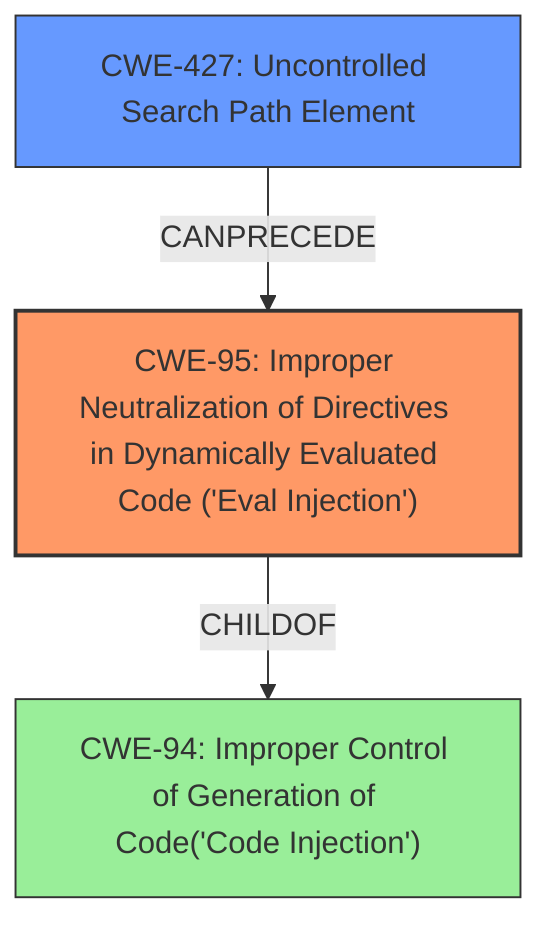

# Raw Analyzer Response for CVE-2021-27928

# Summary
| CWE ID  | CWE Name                                                                                      | Confidence | CWE Abstraction Level | CWE Vulnerability Mapping Label | CWE-Vulnerability Mapping Notes |
| :-------- | :--------------------------------------------------------------------------------------------- | :---------- | :--------------------- | :------------------------------ | :-------------------------------- |
| CWE-95    | Improper Neutralization of Directives in Dynamically Evaluated Code ('Eval Injection')         | 0.9         | Variant                | Primary                         | Allowed                            |
| CWE-427   | Uncontrolled Search Path Element                                                              | 0.8         | Base                   | Secondary                       | Allowed                            |

## Evidence and Confidence

*   **Confidence Score:** 0.85
*   **Evidence Strength:** HIGH

## Relationship Analysis

The primary relationship is that **CWE-427 (Uncontrolled Search Path Element)** can lead to **CWE-95 (Improper Neutralization of Directives in Dynamically Evaluated Code ('Eval Injection'))**. The **untrusted search path** allows an attacker to introduce a malicious component, which is then dynamically evaluated, resulting in code injection. **CWE-95** is a variant of **CWE-94 (Improper Control of Generation of Code('Code Injection'))**, making it a more specific case of code injection. **CWE-427** is a base level CWE, which is a preferred level.

## Vulnerability Chain

The chain of events is:

1.  **Root Cause:** **CWE-427 (Uncontrolled Search Path Element)**: The application uses a search path that includes locations controllable by an attacker.
2.  **Weakness:** **CWE-95 (Improper Neutralization of Directives in Dynamically Evaluated Code ('Eval Injection'))**: The attacker places a malicious file in the **untrusted search path**, which is then dynamically evaluated by the application, leading to code injection.
3.  **Impact:** Remote Code Execution (RCE).

## Summary of Analysis

The initial assessment identified **CWE-95 (Improper Neutralization of Directives in Dynamically Evaluated Code ('Eval Injection'))** and **CWE-427 (Uncontrolled Search Path Element)** as the most relevant CWEs.

The vulnerability description states that an **"untrusted search path leads to eval injection"**. The CVE Reference Links Content Summary confirms this, indicating that the `wsrep_provider` and `wsrep_notify_cmd` variables, writable by a database user with `SUPER` privileges, control the path to a shared object library and a shell script, respectively. This allows an attacker to inject arbitrary code by specifying a malicious shared object or script path.

**CWE-95 (Improper Neutralization of Directives in Dynamically Evaluated Code ('Eval Injection'))** is selected as the primary CWE because the core issue is the dynamic evaluation of code from an **untrusted source**. The description of **CWE-95** perfectly matches this scenario: "The product receives input from an upstream component, but it does not neutralize or incorrectly neutralizes code syntax before using the input in a dynamic evaluation call (e.g. "eval")." The impact is that "an attacker [can] execute arbitrary code."

**CWE-427 (Uncontrolled Search Path Element)** is included as a secondary CWE because the **untrusted search path** is the mechanism that enables the **eval injection**. The description of **CWE-427** states: "The product uses a fixed or controlled search path to find resources, but one or more locations in that path can be under the control of unintended actors."

Both CWEs are at appropriate levels of specificity (Variant and Base, respectively) and are ALLOWED for mapping. The relationship analysis clarifies the chain of events, with the **untrusted search path** enabling the **eval injection**. The evidence is strong, and the confidence in the mapping is high.

Other CWEs Considered:

*   **CWE-78 (Improper Neutralization of Special Elements used in an OS Command ('OS Command Injection'))**: While RCE is the impact, the root cause is not directly related to improper neutralization of OS command elements but rather the dynamic evaluation of code from an **untrusted search path**.
*   **CWE-22 (Improper Limitation of a Pathname to a Restricted Directory ('Path Traversal'))**: Not applicable because the issue is not about traversing directories but rather about executing code from an **untrusted location**.
*   **CWE-426 (Untrusted Search Path)**: This CWE is similar to **CWE-427**, but **CWE-427** is more appropriate because the product uses a *fixed* search path, but elements within the path are under attacker control. **CWE-426** implies the attacker can *modify* the search path.