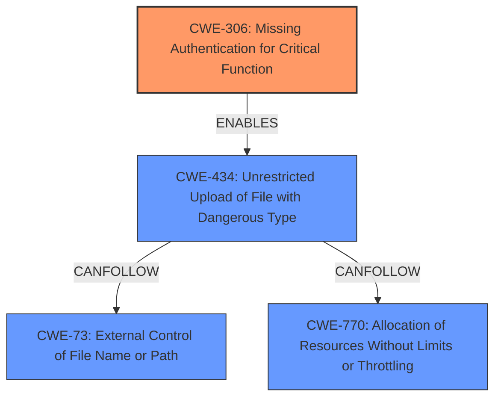

# Analysis Report for CVE-2021-27944

# Vulnerability Analysis Report: CVE-2021-27944

## Description


## Analysis (with Relationship Data)

# Summary
| CWE ID | CWE Name | Confidence | CWE Abstraction Level | CWE Vulnerability Mapping Label | CWE-Vulnerability Mapping Notes |
|---|---|---|---|---|---|
| CWE-306 | Missing Authentication for Critical Function | 1.0 | Base | Allowed | Primary CWE |
| CWE-434 | Unrestricted Upload of File with Dangerous Type | 0.7 | Base | Allowed | Secondary CWE |
| CWE-73 | External Control of File Name or Path | 0.6 | Base | Allowed | Secondary CWE |
| CWE-770 | Allocation of Resources Without Limits or Throttling | 0.5 | Base | Allowed | Secondary CWE |

## Evidence and Confidence

*   **Confidence Score:** 0.8
*   **Evidence Strength:** HIGH

## Relationship Analysis
The primary weakness is **CWE-306 Missing Authentication for Critical Function**, as the vulnerability description explicitly states that high privileged APIs **do not enforce access controls**, allowing unauthenticated access. This is directly related to missing authentication. **CWE-434 Unrestricted Upload of File with Dangerous Type**, **CWE-73 External Control of File Name or Path**, and **CWE-770 Allocation of Resources Without Limits or Throttling** were considered as contributing factors due to the file upload mechanism, but are secondary because the lack of authentication is the primary enabler. The relationships between these CWEs can be viewed as a chain, where missing authentication allows for external control of file paths, unrestricted file uploads, and potential resource exhaustion. **CWE-306** is a child of **CWE-287 Improper Authentication**, but **CWE-306** is more specific.



## Vulnerability Chain
The vulnerability chain starts with the **ROOT CAUSE** of **CWE-306 Missing Authentication for Critical Function**.
  - This leads to **CWE-434 Unrestricted Upload of File with Dangerous Type** which enables the attacker to upload malicious files to the system.
  - Followed by **CWE-73 External Control of File Name or Path**, where the attacker can control the file's location.
  - Finally, **CWE-770 Allocation of Resources Without Limits or Throttling** could also be exploited, if the uploaded file triggers excessive resource consumption.

## Summary of Analysis
The primary assessment is based on the explicit statement in the vulnerability description that the APIs **do not enforce access controls**. This directly implies **CWE-306 Missing Authentication for Critical Function**. The CVE Reference Links Content Summary confirms this by stating that the Vizio TV API allows unauthenticated developer commands, including file upload and execution.

The graph relationships helped to solidify the chain of exploitation. Missing authentication enables the unrestricted upload of files, which then allows control over the file name/path and potential resource exhaustion.

The selected CWEs are at the optimal level of specificity. While **CWE-287 Improper Authentication** and **CWE-284 Improper Access Control** are parent classes, **CWE-306** provides a more precise description of the **weakness**: the complete absence of authentication for critical functions.

Relevant CWE Information:

# Enhanced Context (25 CWEs)
The following CWEs were identified as potentially relevant to this vulnerability:

## CWE-807: Reliance on Untrusted Inputs in a Security Decision
**Abstraction Level**: Base
**Similarity Score**: 0.76
**Source**: dense

**Description**:
The product uses a protection mechanism that relies on the existence or values of an input, but the input can be modified by an untrusted actor in a way that bypasses the protection mechanism.

**Mapping Guidance**:
- Usage: Allowed
- Rationale: This CWE entry is at the Base level of abstraction, which is a preferred level of abstraction for mapping to the root causes of vulnerabilities.

*Not Selected:* The vulnerability's primary issue is the lack of authentication, not reliance on untrusted inputs. This CWE does not fit the scenario.

## CWE-1289: Improper Validation of Unsafe Equivalence in Input
**Abstraction Level**: Base
**Similarity Score**: 0.75
**Source**: dense

**Description**:
The product receives an input value that is used as a resource identifier or other type of reference, but it does not validate or incorrectly validates that the input is equivalent to a potentially-unsafe value.

**Mapping Guidance**:
- Usage: Allowed
- Rationale: This CWE entry is at the Base level of abstraction, which is a preferred level of abstraction for mapping to the root causes of vulnerabilities.

*Not Selected:* While input validation might be a secondary concern, the primary issue is the absence of authentication, making this CWE less relevant.

## CWE-280: Improper Handling of Insufficient Permissions or Privileges
**Abstraction Level**: Base
**Similarity Score**: 0.75
**Source**: dense

**Description**:
The product does not handle or incorrectly handles when it has insufficient privileges to access resources or functionality as specified by their permissions. This may cause it to follow unexpected code paths that may leave the product in an invalid state.

**Mapping Guidance**:
- Usage: Allowed
- Rationale: This CWE entry is at the Base level of abstraction, which is a preferred level of abstraction for mapping to the root causes of vulnerabilities.

*Not Selected:* This is related to privilege management but authentication comes before authorization, so this CWE doesn't fit as well.

## CWE-1220: Insufficient Granularity of Access Control
**Abstraction Level**: Base
**Similarity Score**: 0.75
**Source**: dense

**Description**:
The product implements access controls via a policy or other feature with the intention to disable or restrict accesses (reads and/or writes) to assets in a system from untrusted agents. However, implemented access controls lack required granularity, which renders the control policy too broad because it allows accesses from unauthorized agents to the security-sensitive assets.

**Mapping Guidance**:
- Usage: Allowed
- Rationale: This CWE entry is at the Base level of abstraction, which is a preferred level of abstraction for mapping to the root causes of vulnerabilities.

*Not Selected:* The vulnerability is due to the lack of access control, not insufficient granularity, making this CWE less relevant.

## CWE-274: Improper Handling of Insufficient Privileges
**Abstraction Level**: Base
**Similarity Score**: 0.75
**Source**: dense

**Description**:
The product does not handle or incorrectly handles when it has insufficient privileges to perform an operation, leading to resultant weaknesses.

**Mapping Guidance**:
- Usage: Discouraged
- Rationale: This CWE entry could be deprecated in a future version of CWE.

*Not Selected:* Similar to CWE-280, this is related to privilege management but authentication comes before authorization.

## CWE-183: Permissive List of Allowed Inputs
**Abstraction Level**: Base
**Similarity Score**: 0.74
**Source**: dense

**Description**:
The product implements a protection mechanism that relies on a list of inputs (or properties of inputs) that are explicitly allowed by policy because the inputs are assumed to be safe, but the list is too permissive - that is, it allows an input that is unsafe, leading to resultant weaknesses.

**Mapping Guidance**:
- Usage: Allowed
- Rationale: This CWE entry is at the Base level of abstraction, which is a preferred level of abstraction for mapping to the root causes of vulnerabilities.

*Not Selected:* While the API allows file uploads, the core issue is the missing authentication, making this CWE secondary.

## CWE-653: Improper Isolation or Compartmentalization
**Abstraction Level**: Class
**Similarity Score**: 0.74
**Source**: dense

**Description**:
The product does not properly compartmentalize or isolate functionality, processes, or resources that require different privilege levels, rights, or permissions.

**Mapping Guidance**:
- Usage: Allowed
- Rationale: This CWE entry is at the Base level of abstraction, which is a preferred level of abstraction for mapping to the root causes of vulnerabilities.

*Not Selected:* The vulnerability is more directly related to authentication than compartmentalization.

## CWE-799: Improper Control of Interaction Frequency
**Abstraction Level**: Class
**Similarity Score**: 0.73
**Source**: dense

**Description**:
The product does not properly limit the number or frequency of interactions that it has with an actor, such as the


## CWE Relationship Analysis

Current CWEs represent these abstraction levels: .


### Vulnerability Chain Analysis

**Chain starting from CWE-306:**
- 306 (Missing Authentication for Critical Function) - ROOT


**Chain starting from CWE-73:**
- 73 (External Control of File Name or Path) - ROOT


### CWE Relationship Diagram

```mermaid
graph TD
    classDef primary fill:#f96,stroke:#333,stroke-width:2px
    classDef secondary fill:#69f,stroke:#333
    classDef tertiary fill:#9e9,stroke:#333
```


*Report generated on 2025-04-02 16:54:44*
