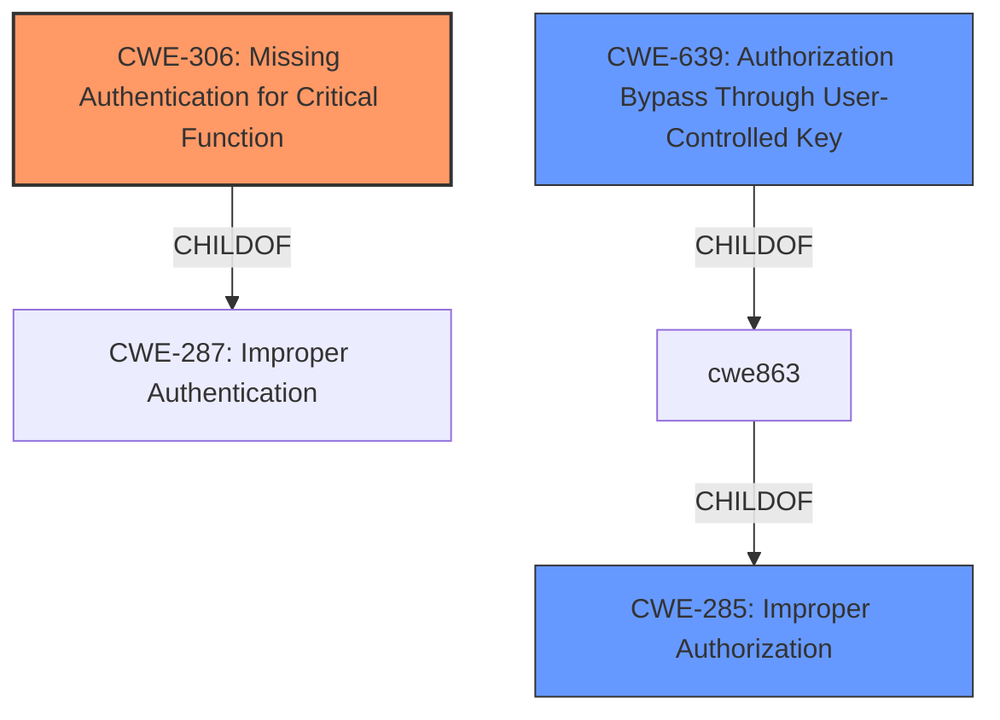

# Analysis for CVE-2021-27963

```markdown
# Summary
| CWE ID    | CWE Name                                                     | Confidence | CWE Abstraction Level | CWE Vulnerability Mapping Label | CWE-Vulnerability Mapping Notes |
| :-------- | :----------------------------------------------------------- | :--------- | :-------------------- | :------------------------------ | :------------------------------ |
| CWE-306   | Missing Authentication for Critical Function                | 0.9        | Base                  | Allowed                         | Primary CWE                     |
| CWE-639   | Authorization Bypass Through User-Controlled Key             | 0.7        | Base                  | Allowed                         | Secondary Candidate             |
| CWE-285   | Improper Authorization                                       | 0.6        | Class                 | Discouraged                     | Secondary Candidate             |

## Evidence and Confidence

*   **Confidence Score:** 0.8
*   **Evidence Strength:** HIGH

## Relationship Analysis
The primary relationship influencing the CWE selection is the hierarchical relationship. CWE-306 **Missing Authentication for Critical Function** is a child of CWE-287 **Improper Authentication**. However, CWE-306 is more specific because the vulnerability description clearly states that there is **missing authentication**. CWE-639 **Authorization Bypass Through User-Controlled Key** and CWE-285 **Improper Authorization** are also considered but deemed less relevant because the core issue is the lack of authentication, not incorrect authorization after authentication.



## Vulnerability Chain
The vulnerability chain starts with the **missing authentication** on the /User/saveUser endpoint, allowing an anonymous user to send a POST request. This leads to the creation of a user with any permissions profile, including SuperAdmin, resulting in privilege escalation and potential system compromise.
  - **Root Cause:** Missing Authentication (CWE-306)
  - **Weakness:** Insecure user creation
  - **Impact:** Privilege escalation, System Compromise

## Summary of Analysis
The initial analysis focused on the **lack of authentication** for a critical function (user creation). The vulnerability description clearly states that an anonymous user can create a SuperAdmin user without any authentication. The CVE Reference Links Content Summary confirms this, stating "The vulnerability stems from an insecure POST request that allows for the creation of a super administrator user. The application **does not properly secure the user creation process, allowing an attacker to create a super admin user without proper authentication** or authorization."

The retriever results suggested CWE-306 **Missing Authentication for Critical Function** as the top candidate, which aligns perfectly with the vulnerability description. Other candidates like CWE-639 **Authorization Bypass Through User-Controlled Key** and CWE-285 **Improper Authorization** were considered but deemed less appropriate because the primary issue is the **absence of authentication**, not an authorization failure after successful authentication. The decision to select CWE-306 is based on the evidence of **missing authentication** for a critical function, making it the most specific and accurate representation of the vulnerability. CWE-306 is at the Base level of abstraction, which is the preferred level.

Relevant CWE Information:
```
## CWE-306: Missing Authentication for Critical Function
**Abstraction:** Base
**Status:** Draft

### Description
The product does not perform any authentication for functionality that requires a provable user identity or consumes a significant amount of resources.
```
```
## CWE-639: Authorization Bypass Through User-Controlled Key
**Abstraction:** Base
**Status:** Incomplete

### Description
The system's authorization functionality does not prevent one user from gaining access to another user's data or record by modifying the key value identifying the data.
```
```
## CWE-285: Improper Authorization
**Abstraction:** Class
**Status:** Draft

### Description
The product does not perform or incorrectly performs an authorization check when an actor attempts to access a resource or perform an action.
```
```