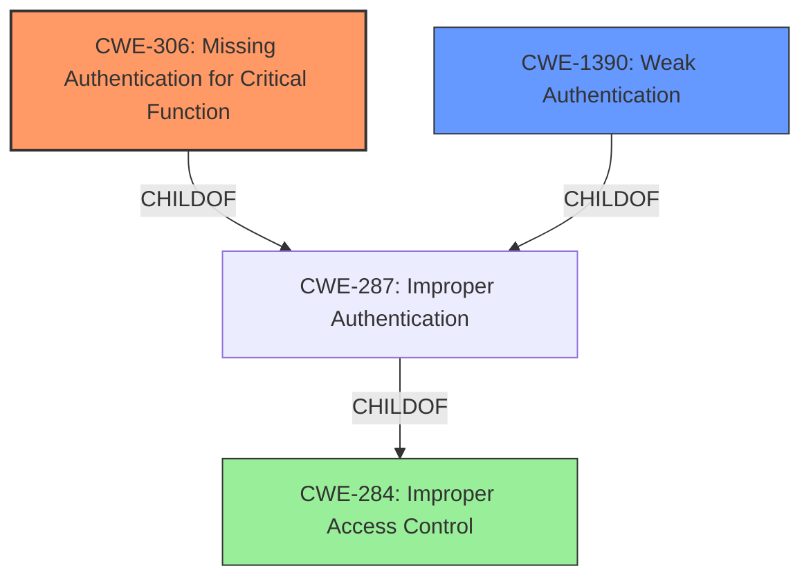

# Analysis for CVE-2021-27990

# Summary
| CWE ID | CWE Name | Confidence | CWE Abstraction Level | CWE Vulnerability Mapping Label | CWE-Vulnerability Mapping Notes |
|---|---|---|---|---|---|
| CWE-306 | Missing Authentication for Critical Function | 0.9 | Base | Allowed | Primary CWE: The application allows direct access to pages without any authentication. |
| CWE-1390 | Weak Authentication | 0.7 | Class | Allowed-with-Review | Secondary CWE: While CWE-306 is a more direct match, the description mentions a **"broken authentication mechanism"**, which also aligns with the broader scope of weak authentication, suggesting that some form of authentication might be present but easily bypassed. |
| CWE-284 | Improper Access Control | 0.5 | Pillar | Discouraged | Secondary CWE: High-level categorization of the authentication issue. |

## Evidence and Confidence

*   **Confidence Score:** 0.8
*   **Evidence Strength:** HIGH

## Relationship Analysis
The analysis focused on identifying the most specific CWE that accurately represents the lack of authentication.
  - CWE-306 (Missing Authentication for Critical Function) is a child of CWE-287 (Improper Authentication), offering a more precise classification.
  - CWE-1390 (Weak Authentication) is also a child of CWE-287, representing cases where authentication exists but is easily bypassed.
  - CWE-284 (Improper Access Control) is a high-level parent of both CWE-287 and CWE-863, representing the overall failure to restrict access.

## Vulnerability Chain
The vulnerability chain involves a missing authentication check leading to unauthorized access and information exposure.
  - **Root Cause:** Missing or broken authentication mechanism (CWE-306, CWE-1390)
  - **Weakness:** Insufficient access control.
  - **Impact:** Exposure of framework, session data theft, and functionality discovery.

## Summary of Analysis
The initial assessment strongly pointed towards CWE-306 due to the direct access to pages without authentication, supported by the statement: "pages such as /medianet/mail.aspx can be called directly." However, the description also mentions a **"broken authentication mechanism"**, which suggests that some form of authentication might be present but easily bypassed. Considering both aspects, CWE-306 is the primary, with CWE-1390 as a secondary consideration.

The evidence from the vulnerability description and CVE reference links supports this classification:
*   **Vulnerability Description:** "Appspace 6.2.4 is vulnerable to a **broken authentication mechanism** where pages such as /medianet/mail.aspx can be called directly and the framework is exposed."
*   **CVE Reference Links Content Summary:** "The core issue is a **broken authentication** vulnerability. Specifically, pages within the AppSpace application can be accessed directly without proper authentication." "The primary weakness is insufficient access control. The application fails to enforce proper authorization checks before allowing access to certain pages."

The selection of CWE-306 and CWE-1390 is at the optimal level of specificity, as they directly address the authentication issues described in the vulnerability. The graph relationships helped in understanding the hierarchy of access control related CWEs and in choosing the most appropriate ones.

Relevant CWE Information:

# Enhanced Context (25 CWEs)
The following CWEs were identified as potentially relevant to this vulnerability:

## CWE-613: Insufficient Session Expiration
**Abstraction Level**: Base
**Similarity Score**: 0.75
**Source**: dense

**Description**:
According to WASC, "Insufficient Session Expiration is when a web site permits an attacker to reuse old session credentials or session IDs for authorization."

**Mapping Guidance**:
- Usage: Allowed
- Rationale: This CWE entry is at the Base level of abstraction, which is a preferred level of abstraction for mapping to the root causes of vulnerabilities.

## CWE-303: Incorrect Implementation of Authentication Algorithm
**Abstraction Level**: Base
**Similarity Score**: 0.74
**Source**: dense

**Description**:
The requirements for the product dictate the use of an established authentication algorithm, but the implementation of the algorithm is incorrect.

**Mapping Guidance**:
- Usage: Allowed
- Rationale: This CWE entry is at the Base level of abstraction, which is a preferred level of abstraction for mapping to the root causes of vulnerabilities.

## CWE-807: Reliance on Untrusted Inputs in a Security Decision
**Abstraction Level**: Base
**Similarity Score**: 0.74
**Source**: dense

**Description**:
The product uses a protection mechanism that relies on the existence or values of an input, but the input can be modified by an untrusted actor in a way that bypasses the protection mechanism.

**Mapping Guidance**:
- Usage: Allowed
- Rationale: This CWE entry is at the Base level of abstraction, which is a preferred level of abstraction for mapping to the root causes of vulnerabilities.

## CWE-799: Improper Control of Interaction Frequency
**Abstraction Level**: Class
**Similarity Score**: 0.74
**Source**: dense

**Description**:
The product does not properly limit the number or frequency of interactions that it has with an actor, such as the number of incoming requests.

**Mapping Guidance**:
- Usage: Allowed-with-Review
- Rationale: This CWE entry is a Class and might have Base-level children that would be more appropriate

## CWE-653: Improper Isolation or Compartmentalization
**Abstraction Level**: Class
**Similarity Score**: 0.74
**Source**: dense

**Description**:
The product does not properly compartmentalize or isolate functionality, processes, or resources that require different privilege levels, rights, or permissions.

**Mapping Guidance**:
- Usage: Allowed
- Rationale: This CWE entry is at the Base level of abstraction, which is a preferred level of abstraction for mapping to the root causes of vulnerabilities.

## CWE-274: Improper Handling of Insufficient Privileges
**Abstraction Level**: Base
**Similarity Score**: 0.74
**Source**: dense

**Description**:
The product does not handle or incorrectly handles when it has insufficient privileges to perform an operation, leading to resultant weaknesses.

**Mapping Guidance**:
- Usage: Discouraged
- Rationale: This CWE entry could be deprecated in a future version of CWE.

## CWE-1390: Weak Authentication
**Abstraction Level**: Class
**Similarity Score**: 0.74
**Source**: dense

**Description**:
The product uses an authentication mechanism to restrict access to specific users or identities, but the mechanism does not sufficiently prove that the claimed identity is correct.

**Mapping Guidance**:
- Usage: Allowed-with-Review
- Rationale: This CWE entry is a Class and might have Base-level children that would be more appropriate

## CWE-404: Improper Resource Shutdown or Release
**Abstraction Level**: Class
**Similarity Score**: 0.74
**Source**: dense

**Description**:
The product does not release or incorrectly releases a resource before it is made available for re-use.

**Mapping Guidance**:
- Usage: Allowed-with-Review
- Rationale: This CWE entry is a Class and might have Base-level children that would be more appropriate

## CWE-1391: Use of Weak Credentials
**Abstraction Level**: Class
**Similarity Score**: 0.74
**Source**: dense

**Description**:
The product uses weak credentials (such as a default key or hard-coded password) that can be calculated, derived, reused, or guessed by an attacker.

**Mapping Guidance**:
- Usage: Allowed-with-Review
- Rationale: This CWE entry is a Class and might have Base-level children that would be more appropriate

## CWE-668: Exposure of Resource to Wrong Sphere
**Abstraction Level**: Class
**Similarity Score**: 0.74
**Source**: dense

**Description**:
The product exposes a resource to the wrong control sphere, providing unintended actors with inappropriate access to the resource.

**Mapping Guidance**:
- Usage: Discouraged
- Rationale: CWE-668 is high-level and is often misused as a catch-all when lower-level CWE IDs might be applicable. It is sometimes used for low-information vulnerability reports [REF-1287]. It is a level-1 Class (i.e