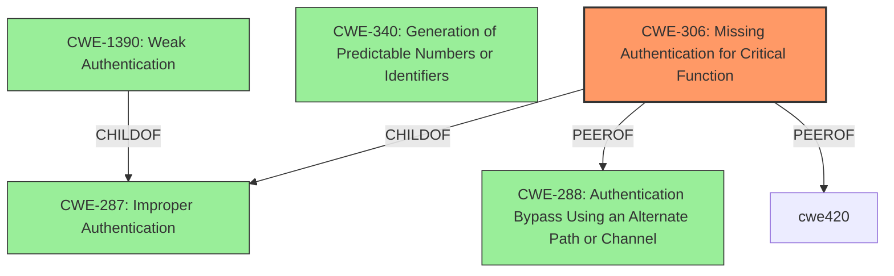

# Enhanced Analysis for CVE-2021-28024

# Summary
| CWE ID | CWE Name | Confidence | CWE Abstraction Level | CWE Vulnerability Mapping Label | CWE-Vulnerability Mapping Notes |
|---|---|---|---|---|---|
| CWE-306 | Missing Authentication for Critical Function | 1.0 | Base | Allowed | Primary CWE |

## Evidence and Confidence

*   **Confidence Score:** 1.0
*   **Evidence Strength:** HIGH

## Relationship Analysis
The primary relationship that influenced the decision was the ChildOf relationship between CWE-306 and CWE-287 (Improper Authentication). While CWE-287 is a broader class, the vulnerability clearly indicates a complete absence of authentication for a critical function, making CWE-306 the more specific and accurate choice. Other relationships, such as PeerOf and CanPrecede/CanFollow, were less relevant in this case. The base abstraction level of CWE-306 aligns well with the detailed nature of the vulnerability description.



## Vulnerability Chain
The chain of root cause and weaknesses is straightforward:
1.  **ROOT CAUSE:** Missing Authentication (CWE-306)
2.  **IMPACT:** Unauthorized System Access.

## Summary of Analysis
The initial analysis strongly pointed towards CWE-306 as the primary weakness. The description explicitly states that an attacker can log in "without using a password," indicating a complete lack of authentication for the login form.

The supporting evidence is the **impact** "Unauthorized system access" achieved via the **vector** "login without using a password" which indicates an **ROOT CAUSE** of missing authentication.

The graph relationships reinforced the choice of CWE-306 because it is a child of the more general CWE-287, and the vulnerability details justify the more specific classification. The retriever results also list CWE-306 as a strong candidate.

CWE-306 is the optimal level of specificity because it directly addresses the core issue: the absence of any authentication mechanism. This is more precise than the broader CWE-287, which covers cases of insufficient authentication.

Relevant CWE Information:
* **Vulnerability Description:** Unauthorized system access in the login form in ServiceTonic Helpdesk software version < 9.0.35937 allows attacker to login without using a password.
* **Vulnerability Description Key Phrases:**
    *   **impact:** Unauthorized system access
    *   **vector:** login without using a password

# Enhanced Context (25 CWEs)
The following CWEs were identified as potentially relevant to this vulnerability:

## CWE-1391: Use of Weak Credentials
**Abstraction Level**: Class
**Similarity Score**: 0.78
**Source**: dense

**Description**:
The product uses weak credentials (such as a default key or hard-coded password) that can be calculated, derived, reused, or guessed by an attacker.

**Mapping Guidance**:
- Usage: Allowed-with-Review
- Rationale: This CWE entry is a Class and might have Base-level children that would be more appropriate
*Not Selected:* This CWE does not fit because the vulnerability allows login without any credentials at all, not just weak ones.

## CWE-303: Incorrect Implementation of Authentication Algorithm
**Abstraction Level**: Base
**Similarity Score**: 0.77
**Source**: dense

**Description**:
The requirements for the product dictate the use of an established authentication algorithm, but the implementation of the algorithm is incorrect.

**Mapping Guidance**:
- Usage: Allowed
- Rationale: This CWE entry is at the Base level of abstraction, which is a preferred level of abstraction for mapping to the root causes of vulnerabilities.
*Not Selected:* This CWE does not apply as there is no mention of an authentication algorithm being implemented incorrectly, but rather a complete lack of authentication.

## CWE-807: Reliance on Untrusted Inputs in a Security Decision
**Abstraction Level**: Base
**Similarity Score**: 0.76
**Source**: dense

**Description**:
The product uses a protection mechanism that relies on the existence or values of an input, but the input can be modified by an untrusted actor in a way that bypasses the protection mechanism.

**Mapping Guidance**:
- Usage: Allowed
- Rationale: This CWE entry is at the Base level of abstraction, which is a preferred level of abstraction for mapping to the root causes of vulnerabilities.
*Not Selected:* This CWE is not applicable because the vulnerability stems from the absence of authentication, not the reliance on untrusted inputs.

## CWE-74: Improper Neutralization of Special Elements in Output Used by a Downstream Component ('Injection')
**Abstraction Level**: Class
**Similarity Score**: 0.76
**Source**: dense

**Description**:
The product constructs all or part of a command, data structure, or record using externally-influenced input from an upstream component, but it does not neutralize or incorrectly neutralizes special elements that could modify how it is parsed or interpreted when it is sent to a downstream component.

**Mapping Guidance**:
- Usage: Discouraged
- Rationale: CWE-74 is high-level and often misused when lower-level weaknesses are more appropriate.
*Not Selected:* This CWE is not relevant as the vulnerability is not related to injection.

## CWE-798: Use of Hard-coded Credentials
**Abstraction Level**: Base
**Similarity Score**: 0.76
**Source**: dense

**Description**:
The product contains hard-coded credentials, such as a password or cryptographic key.

**Mapping Guidance**:
- Usage: Allowed
- Rationale: This CWE entry is at the Base level of abstraction, which is a preferred level of abstraction for mapping to the root causes of vulnerabilities.
*Not Selected:* This CWE is not applicable because the vulnerability allows login without any credentials, not due to the use of hard-coded credentials.

## CWE-1390: Weak Authentication
**Abstraction Level**: Class
**Similarity Score**: 0.76
**Source**: dense

**Description**:
The product uses an authentication mechanism to restrict access to specific users or identities, but the mechanism does not sufficiently prove that the claimed identity is correct.

**Mapping Guidance**:
- Usage: Allowed-with-Review
- Rationale: This CWE entry is a Class and might have Base-level children that would be more appropriate
*Not Selected:* While related to authentication, this CWE implies some form of authentication exists but is weak. The vulnerability describes a complete absence of authentication.

## CWE-294: Authentication Bypass by Capture-replay
**Abstraction Level**: Base
**Similarity Score**: 0.75
**Source**: dense

**Description**:
A capture-replay flaw exists when the design of the product makes it possible for a malicious user to sniff network traffic and bypass authentication by replaying it to the server in question to the same effect as the original message (or with minor changes).

**Mapping Guidance**:
- Usage: Allowed
- Rationale: This CWE entry is at the Base level of abstraction, which is a preferred level of abstraction for mapping to the root causes of vulnerabilities.
*Not Selected:* This vulnerability does not involve capture-replay.

## CWE-330: Use of Insufficiently Random Values
**Abstraction Level**: Class
**Similarity Score**: 0.75
**Source**: dense

**Description**:
The product uses insufficiently random numbers or values in a security context that depends on unpredictable numbers.

**Mapping Guidance**:
- Usage: Discouraged
- Rationale: This CWE entry is a level-1 Class (i.e., a child of a Pillar). It might have lower-level children that would be more appropriate
*Not Selected:* This CWE is not relevant.

## CWE-472: External Control of Assumed-Immutable Web Parameter
**Abstraction Level**: Base
**Similarity Score**: 0.75
**Source**: dense

**Description**:
The web application does not sufficiently verify inputs that are assumed to be immutable but are actually externally controllable, such as hidden form fields.

**Mapping Guidance**:
- Usage: Allowed
- Rationale: This CWE entry is at the Base level of abstraction, which is a preferred level of abstraction for mapping to the root causes of vulnerabilities.
*Not Selected:* This CWE is


## CWE Relationship Analysis

Current CWEs represent these abstraction levels: .


### Vulnerability Chain Analysis

**Chain starting from CWE-288:**
- 288 (Authentication Bypass Using an Alternate Path or Channel) - ROOT


**Chain starting from CWE-306:**
- 306 (Missing Authentication for Critical Function) - ROOT


### CWE Relationship Diagram

```mermaid
graph TD
    classDef primary fill:#f96,stroke:#333,stroke-width:2px
    classDef secondary fill:#69f,stroke:#333
    classDef tertiary fill:#9e9,stroke:#333
```