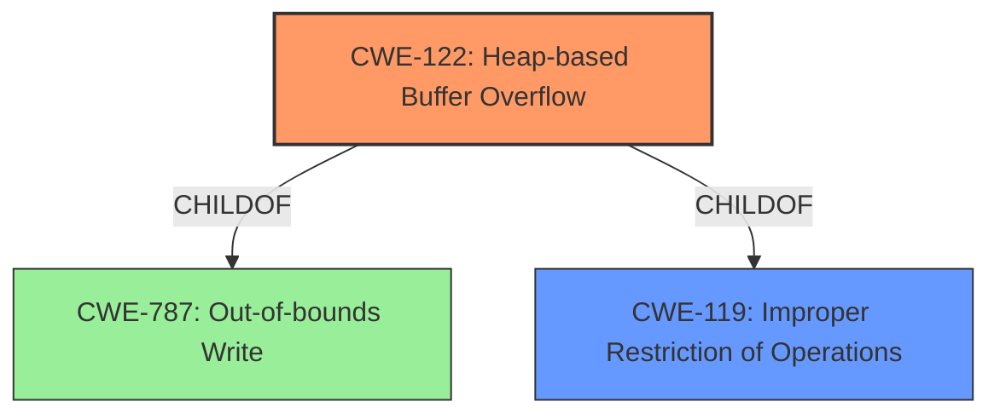

# Analysis for CVE-2021-28026

# Summary
| CWE ID | CWE Name | Confidence | CWE Abstraction Level | CWE Vulnerability Mapping Label | CWE-Vulnerability Mapping Notes |
|---|---|---|---|---|---|
| CWE-122 | Heap-based Buffer Overflow | 1.0 | Variant | Allowed | Primary CWE |
| CWE-119 | Improper Restriction of Operations within the Bounds of a Memory Buffer | 0.7 | Class | Discouraged | Secondary Candidate |

## Evidence and Confidence

*   **Confidence Score:** 1.0
*   **Evidence Strength:** HIGH

## Relationship Analysis
The primary CWE is CWE-122 (Heap-based Buffer Overflow), a Variant of CWE-787 (Out-of-bounds Write) and CWE-119 (Improper Restriction of Operations within the Bounds of a Memory Buffer). CWE-119 is a Class-level CWE, which is more abstract than CWE-122. The vulnerability description explicitly mentions a "heap **buffer overflow**", strongly suggesting CWE-122.

## Vulnerability Chain
The vulnerability chain involves:
1.  A malicious JXL file is crafted.
2.  The djxl tool decodes the file.
3.  A heap **buffer overflow** occurs in `/lib/jxl/coeff_order.cc ReadPermutation` (CWE-122).
4.  This leads to potential arbitrary code execution or denial of service.

The root cause is the heap **buffer overflow** (CWE-122), and the impact is arbitrary code execution or denial of service.

## Summary of Analysis
The initial analysis strongly points to a **buffer overflow**. The vulnerability description clearly states a "heap **buffer overflow**" in the `ReadPermutation` function when decoding a malicious JXL file. The CVE Reference Links Content Summary reinforces this by stating the "**Root cause of vulnerability:** Heap-buffer-overflow in the jpeg-xl decode routine within the djxl tool."

The Retriever Results list CWE-119 (Improper Restriction of Operations within the Bounds of a Memory Buffer) as the top match, but its Usage is "Discouraged". CWE-122 (Heap-based Buffer Overflow) is a better fit as it is a Variant (more specific) of CWE-119 and directly relates to the "heap **buffer overflow**" mentioned in the description.

Therefore, the primary CWE is CWE-122, representing the heap **buffer overflow**. CWE-119 is a secondary candidate, as it is a more general class of weakness.

Relevant CWE Information:

# Enhanced Context (25 CWEs)

## CWE-131: Incorrect Calculation of Buffer Size
**Abstraction Level**: Base
**Similarity Score**: 0.76
**Source**: dense
**Description**:
The product does not correctly calculate the size to be used when allocating a buffer, which could lead to a buffer overflow.
**Mapping Guidance**:
- Usage: Allowed

## CWE-124: Buffer Underwrite ('Buffer Underflow')
**Abstraction Level**: Base
**Similarity Score**: 0.76
**Source**: dense
**Description**:
The product writes to a buffer using an index or pointer that references a memory location prior to the beginning of the buffer.
**Mapping Guidance**:
- Usage: Allowed

## CWE-191: Integer Underflow (Wrap or Wraparound)
**Abstraction Level**: Base
**Similarity Score**: 0.75
**Source**: dense
**Description**:
The product subtracts one value from another, such that the result is less than the minimum allowable integer value, which produces a value that is not equal to the correct result.
**Mapping Guidance**:
- Usage: Allowed

## CWE-680: Integer Overflow to Buffer Overflow
**Abstraction Level**: Compound
**Similarity Score**: 0.74
**Source**: dense
**Description**:
The product performs a calculation to determine how much memory to allocate, but an integer overflow can occur that causes less memory to be allocated than expected, leading to a buffer overflow.
**Mapping Guidance**:
- Usage: Discouraged

## CWE-126: Buffer Over-read
**Abstraction Level**: Variant
**Similarity Score**: 0.74
**Source**: dense
**Description**:
The product reads from a buffer using buffer access mechanisms such as indexes or pointers that reference memory locations after the targeted buffer.
**Mapping Guidance**:
- Usage: Allowed

## CWE-805: Buffer Access with Incorrect Length Value
**Abstraction Level**: Base
**Similarity Score**: 0.74
**Source**: dense
**Description**:
The product uses a sequential operation to read or write a buffer, but it uses an incorrect length value that causes it to access memory that is outside of the bounds of the buffer.
**Mapping Guidance**:
- Usage: Allowed

## CWE-193: Off-by-one Error
**Abstraction Level**: Base
**Similarity Score**: 0.73
**Source**: dense
**Description**:
A product calculates or uses an incorrect maximum or minimum value that is 1 more, or 1 less, than the correct value.
**Mapping Guidance**:
- Usage: Allowed

## CWE-125: Out-of-bounds Read
**Abstraction Level**: Base
**Similarity Score**: 0.73
**Source**: dense
**Description**:
The product reads data past the end, or before the beginning, of the intended buffer.
**Mapping Guidance**:
- Usage: Allowed

## CWE-190: Integer Overflow or Wraparound
**Abstraction Level**: Base
**Similarity Score**: 0.73
**Source**: dense
**Description**:
The product performs a calculation that can
         produce an integer overflow or wraparound when the logic
         assumes that the resulting value will always be larger than
         the original value. This occurs when an integer value is
         incremented to a value that is too large to store in the
         associated representation. When this occurs, the value may
         become a very small or negative number.
**Mapping Guidance**:
- Usage: Allowed

## CWE-674: Uncontrolled Recursion
**Abstraction Level**: Class
**Similarity Score**: 0.73
**Source**: dense
**Description**:
The product does not properly control the amount of recursion that takes place,  consuming excessive resources, such as allocated memory or the program stack.
**Mapping Guidance**:
- Usage: Allowed-with-Review

## CWE-190: Integer Overflow or Wraparound
**Abstraction Level**: Base
**Similarity Score**: 6251.80
**Source**: sparse
**Description**:
The product performs a calculation that can
         produce an integer overflow or wraparound when the logic
         assumes that the resulting value will always be larger than
         the original value. This occurs when an integer value is
         incremented to a value that is too large to store in the
         associated representation. When this occurs, the value may
         become a very small or negative number.
**Mapping Guidance**:
- Usage: Allowed

## CWE-125: Out-of-bounds Read
**Abstraction Level**: Base
**Similarity Score**: 5827.90
**Source**: sparse
**Description**:
The product reads data past the end, or before the beginning, of the intended buffer.
**Mapping Guidance**:
- Usage: Allowed

## CWE-193: Off-by-one Error
**Abstraction Level**: Base
**Similarity Score**: 5777.54
**Source**: sparse
**Description**:
A product calculates or uses an incorrect maximum or minimum value that is 1 more, or 1 less, than the correct value.
**Mapping Guidance**:
- Usage: Allowed

## CWE-1284: Improper Validation of Specified Quantity in Input
**Abstraction Level**: Base
**Similarity Score**: 5643.04
**Source**: sparse
**Description**:
The product receives input that is expected to specify a quantity (such as size or length), but it does not validate or incorrectly validates that the quantity has the required properties.
**Mapping Guidance**:
- Usage: Allowed

## CWE-119: Improper Restriction of Operations within the Bounds of a Memory Buffer
**Abstraction Level**: Class
**Similarity Score**: 5586.60
**Source**: sparse
**Description**:
The product performs operations on a memory buffer, but it reads from or writes to a memory location outside the buffer's intended boundary. This may result in read or write operations