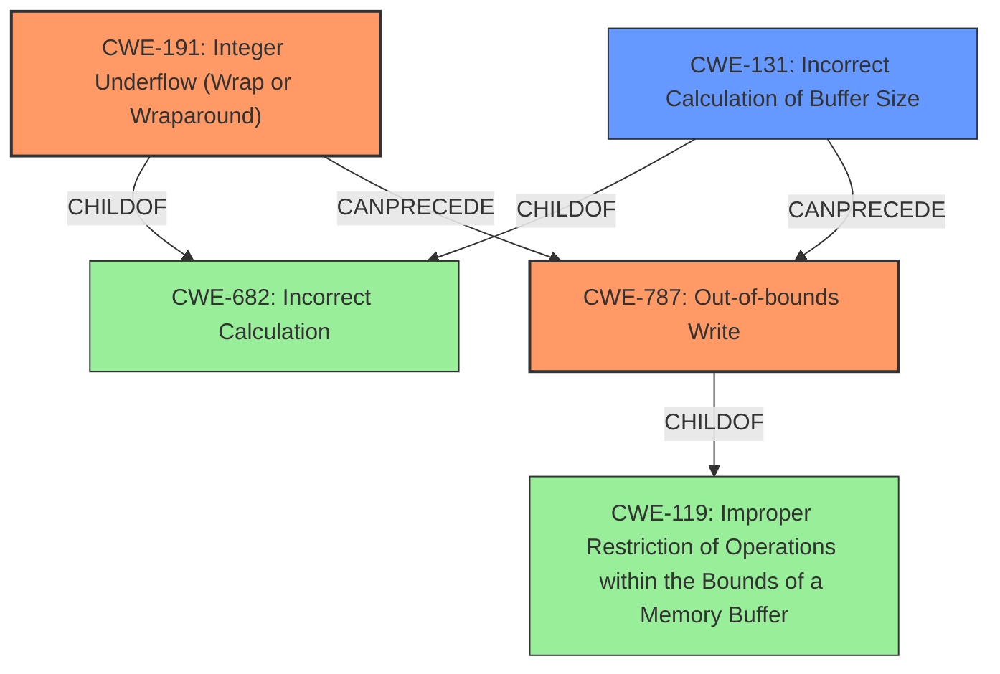

# Enhanced Analysis for CVE-2021-28027

# Summary
| CWE ID  | CWE Name                                                      | Confidence | CWE Abstraction Level | CWE Vulnerability Mapping Label | CWE-Vulnerability Mapping Notes |
| :-------- | :------------------------------------------------------------ | :--------- | :---------------------- | :------------------------------ | :-------------------------------- |
| CWE-191 | Integer Underflow (Wrap or Wraparound)                      | 1.00       | Base                    | Primary                         | Allowed                           |
| CWE-787 | Out-of-bounds Write                                           | 1.00       | Base                    | Primary                         | Allowed                           |
| CWE-131 | Incorrect Calculation of Buffer Size                          | 0.75       | Base                    | Secondary                       | Allowed                           |

## Evidence and Confidence

*   **Confidence Score:** 1.0
*   **Evidence Strength:** HIGH

## Relationship Analysis
The primary weakness involves an **integer underflow (CWE-191)** that directly leads to an **out-of-bounds write (CWE-787)**. CWE-191 is a child of CWE-682 (Incorrect Calculation), and CWE-787 is a child of CWE-119 (Improper Restriction of Operations within the Bounds of a Memory Buffer). There's also a potential relationship where the **incorrect calculation of the buffer size (CWE-131)** due to the integer underflow contributes to the out-of-bounds write. I selected the base level CWEs of CWE-191 and CWE-787 as the most specific matches for this vulnerability.



## Vulnerability Chain
The vulnerability chain starts with:
1.  An **integer underflow (CWE-191)** when calculating the buffer size.
2.  This leads to an **incorrect calculation of the buffer size (CWE-131)**
3.  Resulting in an **out-of-bounds write (CWE-787)**.

## Summary of Analysis
The initial assessment of the vulnerability pointed towards both an **integer underflow** and an **out-of-bounds write**, as described in the vulnerability description: "There is an **integer underflow and out-of-bounds write** during the loading of a bgzip block." The CVE Reference Links Content Summary confirms this, stating: "Integer underflow during buffer size calculation... Subsequent write operations would lead to writing outside of the intended memory region, causing memory corruption"

Based on this evidence, I've identified the following CWEs as most relevant:

*   **CWE-191: Integer Underflow (Wrap or Wraparound)** - This is the root cause of the vulnerability. The code subtracts values without proper validation, leading to a result smaller than the minimum allowable integer value. This is directly supported by the CVE Reference Links Content Summary: "The code calculates the size of a buffer by subtracting `HEADER_SIZE` and `MIN_EXTRA_SIZE` from `block_size`. If `block_size` is too small, this subtraction can result in an integer underflow leading to a very large buffer size."
*   **CWE-787: Out-of-bounds Write** - This is the direct consequence of the integer underflow. The underflow leads to the calculation of an incorrect buffer size, resulting in a write operation outside the intended memory region. This is also confirmed by the CVE Reference Links Content Summary: "The calculated buffer size, due to the underflow, could be larger than the allocated buffer. Subsequent write operations would lead to writing outside of the intended memory region, causing memory corruption."
*   **CWE-131: Incorrect Calculation of Buffer Size** - The underflow leads to an incorrect calculation, but it is already represented by CWE-191.

I considered **CWE-119: Improper Restriction of Operations within the Bounds of a Memory Buffer**, but it's a class-level CWE and less specific than **CWE-787**.

Therefore, I selected **CWE-191** and **CWE-787** as the primary CWEs, representing the root cause and its direct consequence, respectively. I have high confidence in this assessment (Confidence Score: 1.0) due to the clear evidence provided in the vulnerability description and the CVE Reference Links Content Summary. The selected CWEs are at the optimal level of specificity, being base-level CWEs that accurately describe the vulnerability's mechanics.

Relevant CWE Information:

# Enhanced Context (25 CWEs)
The following CWEs were identified as potentially relevant to this vulnerability:

## CWE-191: Integer Underflow (Wrap or Wraparound)
**Abstraction Level**: Base
**Similarity Score**: 0.80
**Source**: dense

**Description**:
The product subtracts one value from another, such that the result is less than the minimum allowable integer value, which produces a value that is not equal to the correct result.

**Mapping Guidance**:
- Usage: Allowed
- Rationale: This CWE entry is at the Base level of abstraction, which is a preferred level of abstraction for mapping to the root causes of vulnerabilities.


## CWE-131: Incorrect Calculation of Buffer Size
**Abstraction Level**: Base
**Similarity Score**: 0.79
**Source**: dense

**Description**:
The product does not correctly calculate the size to be used when allocating a buffer, which could lead to a buffer overflow.

**Mapping Guidance**:
- Usage: Allowed
- Rationale: This CWE entry is at the Base level of abstraction, which is a preferred level of abstraction for mapping to the root causes of vulnerabilities.


## CWE-805: Buffer Access with Incorrect Length Value
**Abstraction Level**: Base
**Similarity Score**: 0.78
**Source**: dense

**Description**:
The product uses a sequential operation to read or write a buffer, but it uses an incorrect length value that causes it to access memory that is outside of the bounds of the buffer.

**Mapping Guidance**:
- Usage: Allowed
- Rationale: This CWE entry is at the Base level of abstraction, which is a preferred level of abstraction for mapping to the root causes of vulnerabilities.


## CWE-193: Off-by-one Error
**Abstraction Level**: Base
**Similarity Score**: 0.77
**Source**: dense

**Description**:
A product calculates or uses an incorrect maximum or minimum value that is 1 more, or 1 less, than the correct value.

**Mapping Guidance**:
- Usage: Allowed
- Rationale: This CWE entry is at the Base level of abstraction, which is a preferred level of abstraction for mapping to the root causes of vulnerabilities.


## CWE-125: Out-of-bounds Read
**Abstraction Level**: Base
**Similarity Score**: 0.77
**Source**: dense

**Description**:
The product reads data past the end, or before the beginning, of the intended buffer.

**Mapping Guidance**:
- Usage: Allowed
- Rationale: This CWE entry is at the Base level of abstraction, which is a preferred level of abstraction for mapping to the root causes of vulnerabilities.


## CWE-197: Numeric Truncation Error
**Abstraction Level**: Base
**Similarity Score**: 0.77
**Source**: dense

**Description**:
Truncation errors occur when a primitive is cast to a primitive of a smaller size and data is lost in the conversion.

**Mapping Guidance**:
- Usage: Allowed
- Rationale: This CWE entry is at the Base level of abstraction, which is a preferred level of abstraction for mapping to the root causes of vulnerabilities.


## CWE-124: Buffer Underwrite ('Buffer Underflow')
**Abstraction Level**: Base
**Similarity Score**: 0.77
**Source**: dense

**Description**:
The product writes to a buffer using an index or pointer that references a memory location prior to the beginning of the buffer.

**Mapping Guidance**:
- Usage: Allowed
- Rationale: This CWE entry is at the Base level of abstraction, which is a preferred level of abstraction for mapping to the root causes


## CWE Relationship Analysis

Current CWEs represent these abstraction levels: .


### Vulnerability Chain Analysis

**Chain starting from CWE-787:**
- 787 (Out-of-bounds Write) - ROOT


**Chain starting from CWE-805:**
- 805 (Buffer Access with Incorrect Length Value) - ROOT


### CWE Relationship Diagram

```mermaid
graph TD
    classDef primary fill:#f96,stroke:#333,stroke-width:2px
    classDef secondary fill:#69f,stroke:#333
    classDef tertiary fill:#9e9,stroke:#333
```