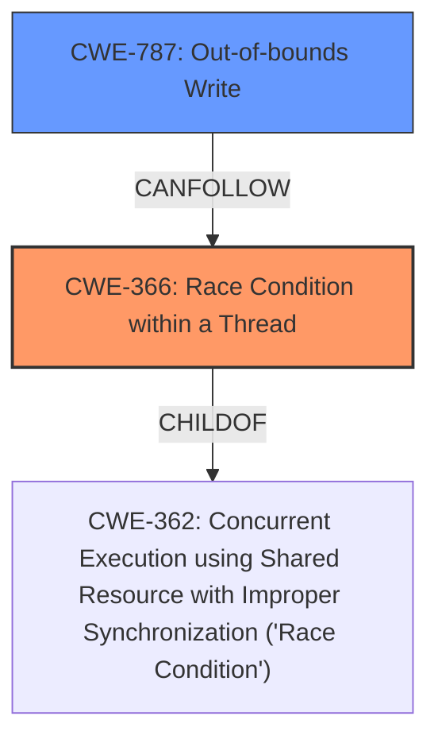

# Raw Analyzer Response for CVE-2021-28037

# Summary
| CWE ID | CWE Name | Confidence | CWE Abstraction Level | CWE Vulnerability Mapping Label | CWE-Vulnerability Mapping Notes |
|---|---|---|---|---|---|
| CWE-366 | Race Condition within a Thread | 0.9 | Base | Primary | Allowed |
| CWE-787 | Out-of-bounds Write | 0.5 | Base | Secondary | Allowed |

## Evidence and Confidence

*   **Confidence Score:** 0.7
*   **Evidence Strength:** MEDIUM

## Relationship Analysis
The primary CWE is CWE-366, representing the **data race** condition. CWE-366 is a base-level CWE, a child of CWE-362, which is a more general class. The **memory corruption** consequence could indicate an out-of-bounds write (CWE-787), which is a common result of data races and memory corruption.

## Vulnerability Chain
The vulnerability chain starts with the **unconditional implementation of Sync for Intern**, leading to a **data race**, and potentially resulting in **memory corruption**.
- The root cause is the improper implementation of Sync.
- The weakness is the resulting **data race**.
- The impact is **memory corruption**.

## Summary of Analysis
The initial assessment focused on the provided evidence that indicated the **root cause** as the **unconditional implementation of Sync for Intern** and the **weakness** as a **data race**. The retriever results favored CWE-366 and CWE-362, both related to race conditions.

The final decision is to assign CWE-366 as the primary CWE because it directly addresses the identified **data race** within a thread, aligning with the base-level abstraction preference. CWE-787 is a possible secondary CWE due to the **memory corruption** impact, but the evidence more strongly supports the **data race** as the primary issue. The graph relationships influenced the decision by showing how CWE-366 relates to the more general CWE-362 and how it can potentially lead to CWE-787. The chosen CWEs are at the optimal level of specificity, with CWE-366 being a base-level CWE and more specific than the class-level CWE-362.

The evidence is "The `Intern<T>` type in the `internment` crate unconditionally implemented the `Sync` trait, even when the underlying type `T` did not implement `Sync`." This led to "data races on `T` when `T` is not `Sync`." and "Data races lead to undefined behavior" and ultimately "memory corruption".

Relevant CWE Information:

# Enhanced Context (25 CWEs)

## CWE-366: Race Condition within a Thread
**Abstraction Level**: Base
**Similarity Score**: 0.78
**Source**: dense

**Description**:
If two threads of execution use a resource simultaneously, there exists the possibility that resources may be used while invalid, in turn making the state of execution undefined.

**Mapping Guidance**:
- Usage: Allowed
- Rationale: This CWE entry is at the Base level of abstraction, which is a preferred level of abstraction for mapping to the root causes of vulnerabilities.

## CWE-787: Out-of-bounds Write
**Abstraction Level**: base
**Similarity Score**: 3.30
**Source**: graph

**Description**:
CWE-787: Out-of-bounds Write

**Mapping Guidance**:
- Usage: Allowed
- Rationale: This CWE entry is at the Base level of abstraction, which is a preferred level of abstraction for mapping to the root causes of vulnerabilities.

**Relationships**:
- CANFOLLOW -> CWE-825
- CANFOLLOW -> CWE-824
- CANFOLLOW -> CWE-823
- CANFOLLOW -> CWE-822
- PARENTOF -> CWE-124

**Explanation of Selected CWEs:**

*   **CWE-366: Race Condition within a Thread**
    *   The vulnerability description explicitly mentions a **data race**, which aligns perfectly with the definition of a race condition. The **unconditional implementation of Sync for Intern** allows concurrent access to the `Intern` struct, leading to the race condition.
    *   A race condition can lead to unpredictable behavior, including crashes, deadlocks, or data corruption.
    *   This is a base-level CWE, providing a specific classification for the vulnerability.
    *   The mapping guidance allows its use and confirms that it is at the base level of abstraction.
*   **CWE-787: Out-of-bounds Write**
    *   The vulnerability's impact is **memory corruption**, which can be a consequence of an out-of-bounds write. The **data race** may result in writing data beyond the allocated buffer.
    *   Out-of-bounds writes can lead to arbitrary code execution, denial of service, or information disclosure.
    *   This is a base-level CWE.
    *   The mapping guidance allows its use.

**Explanation of Omitted CWEs:**

*   **CWE-362: Concurrent Execution using Shared Resource with Improper Synchronization ('Race Condition')**: This is a class-level CWE, and CWE-366 is a more specific child of this CWE.
*   **CWE-908: Use of Uninitialized Resource**: While memory corruption is mentioned, there's no direct evidence of using an uninitialized resource.
*   **CWE-367: Time-of-check Time-of-use (TOCTOU) Race Condition**: This CWE involves checking the state of a resource before using it, which isn't explicitly mentioned in the vulnerability description.
*   **CWE-188: Reliance on Data/Memory Layout**: This CWE is about incorrect assumptions about memory layout, which isn't the primary issue here.
*   **CWE-123: Write-what-where Condition**: This CWE is more specific than what is described. The current description shows that we can cause memory corruption, but we don't know where and what can be written.
*   **CWE-476: NULL Pointer Dereference**: There's no mention of null pointers in the description.
*   **CWE-122: Heap-based Buffer Overflow**: It's possible that the memory corruption could be a heap-based buffer overflow, but there's no direct evidence.
*   **CWE-125: Out-of-bounds Read**: Similar to CWE-787, this could be a consequence, but the primary issue is the race condition.