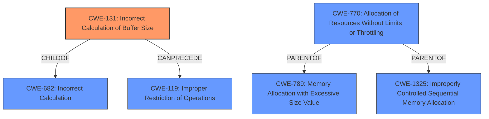

# Enhanced Analysis for CVE-2021-28039

# Summary
| CWE ID  | CWE Name                                                                 | Confidence | CWE Abstraction Level | CWE Vulnerability Mapping Label | CWE-Vulnerability Mapping Notes |
| :-------- | :----------------------------------------------------------------------- | :--------- | :---------------------- | :------------------------------ | :------------------------------ |
| CWE-131   | Incorrect Calculation of Buffer Size                                     | 0.85       | Base                    | Primary                         | Allowed                       |
| CWE-770   | Allocation of Resources Without Limits or Throttling                    | 0.6        | Base                    | Secondary                       | Allowed                       |

## Evidence and Confidence

*   **Confidence Score:** 0.8
*   **Evidence Strength:** HIGH

## Relationship Analysis
The primary CWE is CWE-131 (Incorrect Calculation of Buffer Size), which is a base-level CWE. Its relationships include being a child of CWE-682 (Incorrect Calculation) and having a CANPRECEDE relationship with CWE-119 (Improper Restriction of Operations within the Bounds of a Memory Buffer). CWE-770 (Allocation of Resources Without Limits or Throttling) is a base level CWE with PARENTOF relationships with CWE-789 (Memory Allocation with Excessive Size Value) and CWE-1325 (Improperly Controlled Sequential Memory Allocation).



## Vulnerability Chain
The vulnerability chain starts with an **incorrect calculation of the required p2m list size** (CWE-131), leading to a situation where the kernel attempts to map invalid addresses. This can potentially lead to uncontrolled resource allocation (CWE-770) and ultimately a denial-of-service impact in the form of a crash.

## Summary of Analysis
The initial assessment, based on the vulnerability description and CVE reference, points to the **misuse of guest physical addresses** due to the **incorrect calculation** of the p2m list size. The vulnerability description states: "In some less-common configurations, an x86 PV guest OS user can crash a Dom0 or driver domain via a large amount of I/O activity. The issue relates to **misuse of guest physical addresses** when a configuration has CONFIG_XEN_UNPOPULATED_ALLOC but not CONFIG_XEN_BALLOON_MEMORY_HOTPLUG." The "CVE Reference Links Content Summary" confirms this by stating: "The vulnerability is caused by a **miscalculation** of the required p2m list size in specific Xen Dom0/driver domain configurations." This directly supports the selection of CWE-131 (Incorrect Calculation of Buffer Size) as the primary weakness.

The retriever results also support this, with CWE-131 having a high similarity score. The retriever also suggests considering CWE-770 (Allocation of Resources Without Limits or Throttling), which could be a secondary weakness as the miscalculation leads to the potential for allocating resources without proper limits, potentially contributing to the denial-of-service condition.

The graph relationships show that CWE-131 can precede CWE-119 (Improper Restriction of Operations within the Bounds of a Memory Buffer), suggesting that the incorrect size calculation can lead to out-of-bounds memory access. The description mentions how the kernel allocates guest physical addresses via the ZONE\_DEVICE mechanism, and the p2m list isn't properly sized to cover the ZONE\_DEVICE allocated addresses which confirms the incorrect calculation.

The selected CWEs are at the optimal level of specificity because CWE-131 directly addresses the root cause of the vulnerability, which is the incorrect size calculation. While higher-level CWEs like CWE-682 (Incorrect Calculation) could be considered, CWE-131 provides a more precise description of the weakness. CWE-770 is also at the appropriate level as a contributing factor to the denial-of-service impact.


## CWE Relationship Analysis

Current CWEs represent these abstraction levels: .


### Vulnerability Chain Analysis

**Chain starting from CWE-131:**
- 131 (Incorrect Calculation of Buffer Size) - ROOT


**Chain starting from CWE-789:**
- 789 (Memory Allocation with Excessive Size Value) - ROOT


### CWE Relationship Diagram

```mermaid
graph TD
    classDef primary fill:#f96,stroke:#333,stroke-width:2px
    classDef secondary fill:#69f,stroke:#333
    classDef tertiary fill:#9e9,stroke:#333
```