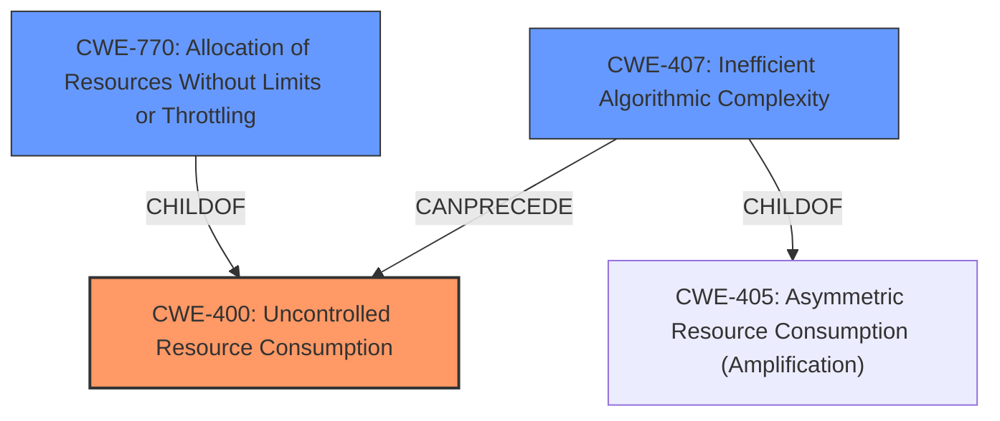

# Raw Analyzer Response for CVE-2021-28089

# Summary
| CWE ID | CWE Name | Confidence | CWE Abstraction Level | CWE Vulnerability Mapping Label | CWE-Vulnerability Mapping Notes |
|---|---|---|---|---|---|
| CWE-400 | Uncontrolled Resource Consumption | 0.9 | Class | Allowed-with-Review | Primary CWE |
| CWE-770 | Allocation of Resources Without Limits or Throttling | 0.7 | Base | Allowed | Secondary Candidate |
| CWE-407 | Inefficient Algorithmic Complexity | 0.6 | Class | Allowed-with-Review | Secondary Candidate |

## Evidence and Confidence

*   **Confidence Score:** 0.9
*   **Evidence Strength:** HIGH

## Relationship Analysis
The primary CWE selected is CWE-400, **Uncontrolled Resource Consumption**. This is a Class-level CWE.
- CWE-770, **Allocation of Resources Without Limits or Throttling**, is a child of CWE-400, representing a more specific scenario.
- CWE-407, **Inefficient Algorithmic Complexity**, is also related because the consumption of resources is due to the inefficient way the Tor software is handling directory data.

## Vulnerability Chain
The vulnerability chain starts with the **incorrect function call** to `dump_desc()`, which leads to a **missing length argument**, resulting in a **potential unbounded read** and ultimately causing **uncontrolled resource consumption** by the Tor instance, leading to a denial-of-service.

## Summary of Analysis
The initial assessment, based on the vulnerability description and CVE reference, points towards **uncontrolled resource consumption** due to an **incorrect function call**. The `dump_desc()` function lacked a length argument, leading to processing data beyond intended boundaries. The most appropriate CWE is CWE-400, **Uncontrolled Resource Consumption**, because the attacker can exhaust CPU resources.

The CVE Reference Links Content Summary states:
- "By sending specially crafted directory data with a large number of small, unparseable descriptors, an attacker could force the Tor instance to consume excessive CPU resources while trying to parse the data."

While CWE-770, **Allocation of Resources Without Limits or Throttling**, could also be considered, the provided information does not specifically mention the allocation of new resources, but rather the excessive consumption of CPU resources due to the **incorrect handling** of existing data. Therefore, CWE-400 is a better fit because it is more general.

CWE-407, **Inefficient Algorithmic Complexity**, is also a possible candidate. The `dump_desc()` function processes potentially unparseable directory information, and the **incorrect call** to this function combined with the lack of a length argument results in excessive CPU consumption.

CWE-400 is chosen as the primary CWE because the vulnerability description explicitly mentions the exhaustion of CPU resources. It directly aligns with the description of CWE-400. Although a more specific CWE could be chosen, the information provided does not provide enough information.

Relevant CWE Information:

# Enhanced Context (25 CWEs)
The following CWEs were identified as potentially relevant to this vulnerability:

## CWE-226: Sensitive Information in Resource Not Removed Before Reuse
**Abstraction Level**: Base
**Similarity Score**: 0.80
**Source**: dense

**Description**:
The product releases a resource such as memory or a file so that it can be made available for reuse, but it does not clear or "zeroize" the information contained in the resource before the product performs a critical state transition or makes the resource available for reuse by other entities.

**Mapping Guidance**:
- Usage: Allowed
- Rationale: This CWE entry is at the Base level of abstraction, which is a preferred level of abstraction for mapping to the root causes of vulnerabilities.

CWE-226 is not the correct CWE since the sensitive information of a resource is not the issue.

## CWE-404: Improper Resource Shutdown or Release
**Abstraction Level**: Class
**Similarity Score**: 0.79
**Source**: dense

**Description**:
The product does not release or incorrectly releases a resource before it is made available for re-use.

**Mapping Guidance**:
- Usage: Allowed-with-Review
- Rationale: This CWE entry is a Class and might have Base-level children that would be more appropriate

CWE-404 is not the correct CWE since the resource is not incorrectly released.

## CWE-772: Missing Release of Resource after Effective Lifetime
**Abstraction Level**: Base
**Similarity Score**: 0.76
**Source**: dense

**Description**:
The product does not release a resource after its effective lifetime has ended, i.e., after the resource is no longer needed.

**Mapping Guidance**:
- Usage: Allowed
- Rationale: This CWE entry is at the Base level of abstraction, which is a preferred level of abstraction for mapping to the root causes of vulnerabilities.

CWE-772 is not the correct CWE since the resource is not released after its effective lifetime.

## CWE-789: Memory Allocation with Excessive Size Value
**Abstraction Level**: Variant
**Similarity Score**: 0.76
**Source**: dense

**Description**:
The product allocates memory based on an untrusted, large size value, but it does not ensure that the size is within expected limits, allowing arbitrary amounts of memory to be allocated.

**Mapping Guidance**:
- Usage: Allowed
- Rationale: This CWE entry is at the Variant level of abstraction, which is a preferred level of abstraction for mapping to the root causes of vulnerabilities.

CWE-789 is not the correct CWE since memory allocation is not the root cause.

## CWE-664: Improper Control of a Resource Through its Lifetime
**Abstraction Level**: Pillar
**Similarity Score**: 0.76
**Source**: dense

**Description**:
The product does not maintain or incorrectly maintains control over a resource throughout its lifetime of creation, use, and release.

**Mapping Guidance**:
- Usage: Discouraged
- Rationale: This CWE entry is high-level when lower-level children are available.

CWE-664 is too abstract and not specific enough.

## CWE-667: Improper Locking
**Abstraction Level**: Class
**Similarity Score**: 0.75
**Source**: dense

**Description**:
The product does not properly acquire or release a lock on a resource, leading to unexpected resource state changes and behaviors.

**Mapping Guidance**:
- Usage: Allowed-with-Review
- Rationale: This CWE entry is a Class and might have Base-level children that would be more appropriate

CWE-667 is not the correct CWE since improper locking is not the issue.

## CWE-1325: Improperly Controlled Sequential Memory Allocation
**Abstraction Level**: Base
**Similarity Score**: 0.74
**Source**: dense

**Description**:
The product manages a group of objects or resources and performs a separate memory allocation for each object, but it does not properly limit the total amount of memory that is consumed by all of the combined objects.

**Mapping Guidance**:
- Usage: Allowed
- Rationale: This CWE entry is at the Base level of abstraction, which is a preferred level of abstraction for mapping to the root causes of vulnerabilities.

CWE-1325 is not the correct CWE since the product is not improperly controlling sequential memory allocation.

## CWE-405: Asymmetric Resource Consumption (Amplification)
**Abstraction Level**: Class
**Similarity Score**: 0.74
**Source**: dense

**Description**:
The product does not properly control situations in which an adversary can cause the product to consume or produce excessive resources without requiring the adversary to invest equivalent work or otherwise prove authorization, i.e., the adversary's influence is "asymmetric."

**Mapping Guidance**:
- Usage: Allowed-with-Review
- Rationale: This CWE entry is a Class and might have Base-level children that would be more appropriate

CWE-405 is not the correct CWE since the root cause is not asymmetric resource consumption.

## CWE-668: Exposure of Resource to Wrong Sphere
**Abstraction Level**: Class
**Similarity Score**: 0.74
**Source**: dense

**Description**:
The product exposes a resource to the wrong control sphere, providing unintended actors with inappropriate access to the resource.

**Mapping Guidance**:
- Usage: Disc