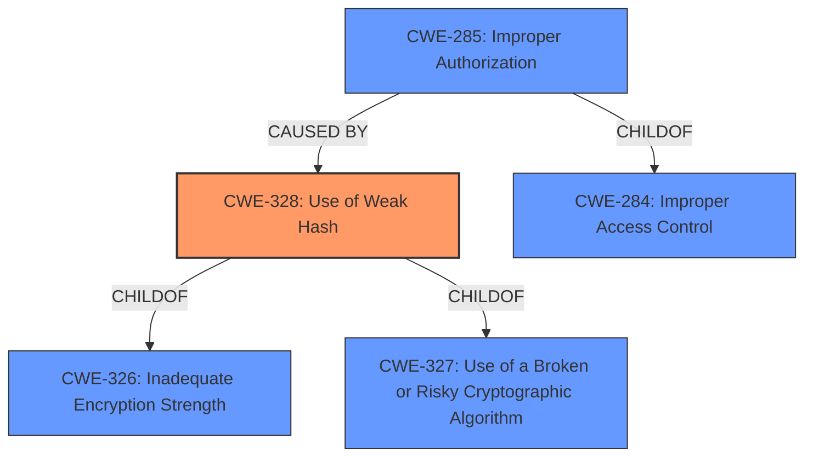

# Raw Analyzer Response for CVE-2021-28093

# Summary
| CWE ID | CWE Name | Confidence | CWE Abstraction Level | CWE Vulnerability Mapping Label | CWE-Vulnerability Mapping Notes |
|---|---|---|---|---|---|
| CWE-328 | Use of Weak Hash | 1.0 | Base | Primary | Allowed |
| CWE-285 | Improper Authorization | 0.7 | Class | Secondary | Allowed-with-Review |

## Evidence and Confidence

*   **Confidence Score:** 0.9
*   **Evidence Strength:** HIGH

## Relationship Analysis
The primary CWE is CWE-328, which directly addresses the **use of a weak hash** function (Adler32) as the root cause. CWE-285 is a related weakness because the **incorrect access control** stems from the hash collision issues. CWE-328 is a child of CWE-326 and CWE-327, indicating that it's related to cryptographic issues and risky cryptographic algorithms, but CWE-328 is the more specific and fitting choice. CWE-285 is a child of CWE-284 (Improper Access Control) and could be a consequence of the weak hash usage.

## Vulnerability Chain
The vulnerability chain begins with the **use of a weak hash** function (Adler32), leading to **hash collisions**, which then results in **incorrect access control** and potential exposure of sensitive information.

## Summary of Analysis
The analysis is based on the vulnerability description and the "CVE Reference Links Content Summary," which clearly states that the vulnerability stems from the **use of a weak hashing algorithm** (Adler32) that leads to **hash collisions**. The "Vulnerability Description Key Phrases" also highlight "**hash collisions**" as the root cause and "**Incorrect Access Control**" as a weakness.

The evidence includes:
*   "The vulnerability stems from the **use of a weak hashing algorithm** (Adler32) to generate cache keys..."
*   "This weak hashing mechanism is prone to **hash collisions**, where different inputs (images) produce the same hash key."
*   "**Improper Authorization (CWE-285)**: The system does not properly ensure that the cached content corresponds to the requested resource due to the weak hash function."
*   "**hash collisions**: The Adler32 algorithm is susceptible to both accidental and purposeful hash collisions."
*   "**weakness:** **Incorrect Access Control**"
*   "**rootcause:** **hash collisions**"

CWE-328 (Use of Weak Hash) is the most appropriate choice because it directly addresses the root cause of the vulnerability. The MITRE mapping guidance for CWE-328 recommends its use and states, "This CWE entry is at the Base level of abstraction, which is a preferred level of abstraction for mapping to the root causes of vulnerabilities." CWE-285 is a secondary weakness because the incorrect access control is a consequence of the hash collisions.

Other CWEs considered but not used:

*   CWE-407 (Inefficient Algorithmic Complexity): While algorithmic complexity could be a factor in hash collision resistance, the core issue is the **use of a weak hash** function, not the inefficiency of the algorithm itself.
*   CWE-330 (Use of Insufficiently Random Values): Randomness is not the core issue here; it's the collision resistance of the hashing algorithm.
*   CWE-327 (Use of a Broken or Risky Cryptographic Algorithm): This is a broader category, and CWE-328 is a more specific fit for the **use of a weak hash**.
*   CWE-611 (Improper Restriction of XML External Entity Reference), CWE-612 (Improper Authorization of Index Containing Sensitive Information), CWE-208 (Observable Timing Discrepancy), CWE-916 (Use of Password Hash With Insufficient Computational Effort), CWE-863 (Incorrect Authorization), CWE-1240 (Use of a Cryptographic Primitive with a Risky Implementation): These are not directly related to the **use of a weak hash** function in this specific case.