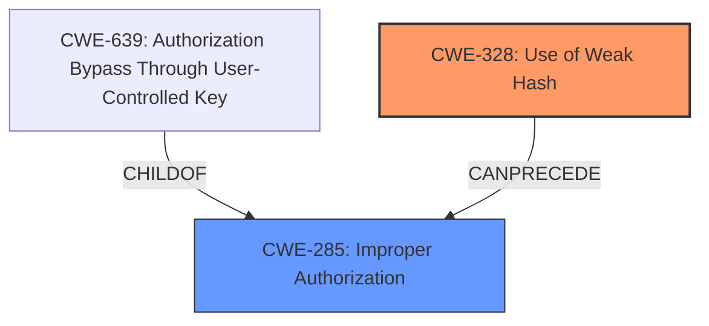

# Analysis for CVE-2021-28094

# Summary
| CWE ID | CWE Name | Confidence | CWE Abstraction Level | CWE Vulnerability Mapping Label | CWE-Vulnerability Mapping Notes |
|---|---|---|---|---|---|
| CWE-328 | Use of Weak Hash | 1.0 | Base | Allowed | Primary CWE |
| CWE-285 | Improper Authorization | 0.7 | Class | Allowed-with-Review | Secondary Candidate |

## Evidence and Confidence

*   **Confidence Score:** 0.85
*   **Evidence Strength:** HIGH

## Relationship Analysis
The primary relationship that impacted my decision was the ChildOf relationship. CWE-328 (Use of Weak Hash) is a base CWE that describes the specific use of a weak hashing algorithm, which directly relates to the root cause of the vulnerability.
CWE-285 (Improper Authorization) is a class CWE and a parent of CWE-639 (Authorization Bypass Through User-Controlled Key). The initial analysis considered CWE-285 due to the "Incorrect Access Control" weakness description. However, the root cause lies in the use of a weak hash algorithm. Therefore, CWE-328 is considered more precise and is chosen as the primary.

## Vulnerability Chain
The vulnerability chain starts with the **use of CRC32 as a weak hash function (CWE-328)**, which leads to **hash collisions**, ultimately resulting in **incorrect access control (CWE-285)** for converted documents.

## Summary of Analysis
The analysis is based on the provided evidence, which clearly indicates that the root cause of the vulnerability is the use of a weak hashing algorithm (CRC32). The "Vulnerability Description" states that "**hash collisions** can occur, due to use of CRC32". The "CVE Reference Links Content Summary" confirms this by stating, "The vulnerability stems from the use of a weak hashing algorithm (CRC32) to generate cache keys for converted documents." This leads to the system serving the cached content of one document when another is requested, resulting in **improper authorization (CWE-285)**.

The graph relationships influenced the final selection by highlighting the connection between the weak hash and the resulting authorization issue. CWE-328 is at the optimal level of specificity as it directly addresses the root cause, while CWE-285 describes the consequence of this weakness.

Relevant CWE Information:

# Enhanced Context (25 CWEs)

## CWE-328: Use of Weak Hash
**Abstraction Level**: Base
**Similarity Score**: 0.77
**Source**: dense

**Description**:
The product uses an algorithm that produces a digest (output value) that does not meet security expectations for a hash function that allows an adversary to reasonably determine the original input (preimage attack), find another input that can produce the same hash (2nd preimage attack), or find multiple inputs that evaluate to the same hash (birthday attack).

**Mapping Guidance**:
- Usage: Allowed
- Rationale: This CWE entry is at the Base level of abstraction, which is a preferred level of abstraction for mapping to the root causes of vulnerabilities.

### Technical Explanation for CWE-328:
- How the vulnerability's details match the CWE's characteristics: The vulnerability description explicitly mentions that the root cause is "**hash collisions**" due to the "use of CRC32", which is a weak hash function. The "CVE Reference Links Content Summary" further supports this by stating "The vulnerability stems from the use of a weak hashing algorithm (CRC32) to generate cache keys for converted documents."
- The security implications and potential impact: The use of a weak hash function leads to collisions, allowing attackers to potentially access documents they are not authorized to view.
- Any parent-child relationships or chain patterns that influenced your mapping: CWE-328 is a child of CWE-327 (Use of a Broken or Risky Cryptographic Algorithm), indicating that it is a specific type of cryptographic weakness.
- Whether the weakness is primary or secondary in the vulnerability: This is the primary weakness as it is the root cause of the vulnerability.
- How the official MITRE mapping guidance influenced your decision: The MITRE mapping guidance states that CWE-328 is at the Base level of abstraction, which is a preferred level for mapping root causes. The usage is "Allowed".

### Technical Explanation for CWE-285:
- How the vulnerability's details match the CWE's characteristics: The "**Incorrect Access Control**" described in the "Vulnerability Description" aligns with the concept of improper authorization. Due to **hash collisions**, users can potentially access documents they are not authorized to view.
- The security implications and potential impact: Unauthorized access to sensitive documents, leading to information disclosure.
- Any parent-child relationships or chain patterns that influenced your mapping: CWE-285 is a parent of CWE-639 (Authorization Bypass Through User-Controlled Key).
- Whether the weakness is primary or secondary in the vulnerability: This is a secondary weakness as it results from the primary weakness (CWE-328).
- How the official MITRE mapping guidance influenced your decision: The MITRE mapping guidance states that CWE-285 is a Class level CWE, which might have more appropriate Base level children. The usage is "Allowed-with-Review".

### Other CWEs Considered but Not Used:
- CWE-1240 (Use of a Cryptographic Primitive with a Risky Implementation): While CRC32 could be considered a risky implementation, the primary issue is its weakness as a hash function, not necessarily its implementation.
- CWE-916 (Use of Password Hash With Insufficient Computational Effort): This CWE is specific to password hashing, which is not the case in this vulnerability.
- CWE-863 (Incorrect Authorization): The root cause is not just authorization, but specifically the collision vulnerability.