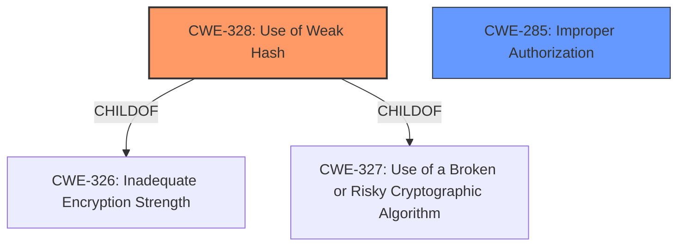

# Raw Analyzer Response for CVE-2021-28095

# Summary
| CWE ID | CWE Name | Confidence | CWE Abstraction Level | CWE Vulnerability Mapping Label | CWE-Vulnerability Mapping Notes |
|---|---|---|---|---|---|
| CWE-328 | Use of Weak Hash | 1.0 | Base | Primary | Allowed |
| CWE-285 | Improper Authorization | 0.7 | Base | Secondary | Allowed |

## Evidence and Confidence

*   **Confidence Score:** 0.85
*   **Evidence Strength:** HIGH

## Relationship Analysis
The primary CWE, CWE-328 **[CWE-328: Use of Weak Hash]**, is a Base level CWE, which is the preferred level. The secondary CWE, CWE-285 **[CWE-285: Improper Authorization]**, is also a Base level CWE.

## Vulnerability Chain
The vulnerability chain starts with the use of a **weak hash** (CRC32) leading to **hash collisions**, which results in **incorrect access control** and potential **loss of confidentiality** and **integrity**.

## Summary of Analysis
Based on the vulnerability description and the provided CVE Reference Links Content Summary, the primary **root cause** is the use of a **weak hashing algorithm** (CRC32), which leads to **hash collisions**. The **weakness** in the hashing algorithm directly contributes to **incorrect access control**, as the system relies on these hashes for identifying and serving cached documents.

The vulnerability description states: "OX Documents before 7.10.5-rev5 has **Incorrect Access Control** for documents that contain XML structures because **hash collisions** can occur, due to use of CRC32."

The CVE Reference Links Content Summary further elaborates:
*   "The vulnerability stems from the use of a **weak hashing algorithm** (CRC32) for caching documents in Open-Xchange's office component. This **weak hashing** mechanism is susceptible to both accidental and deliberate **hash collisions**."
*   "**Improper Authorization (CWE-285)**: The system does not properly authorize access to cached documents due to the **weak hashing algorithm**."
*   "**Hash Collision**: The use of CRC32 for cache keys makes the system vulnerable to **hash collisions**."
*   "An attacker can cause the system to serve a cached version of a different document due to **hash collisions**."

The retriever results also list CWE-328 **[CWE-328: Use of Weak Hash]** as the top candidate, which aligns with the description.

CWE-328 **[CWE-328: Use of Weak Hash]** is at the Base level of abstraction, which is preferred. Its description matches the vulnerability: "The product uses an algorithm that produces a digest (output value) that does not meet security expectations for a hash function that allows an adversary to reasonably determine the original input (preimage attack), find another input that can produce the same hash (2nd preimage attack), or find multiple inputs that evaluate to the same hash (birthday attack)."

CWE-285 **[CWE-285: Improper Authorization]** is included to capture the resulting access control issue.

Other CWEs Considered:

*   CWE-611 **[CWE-611: Improper Restriction of XML External Entity Reference]**: While the documents contain XML structures, the vulnerability's root cause is not related to XML external entities. It is about the hash collision caused by the use of CRC32.
*   CWE-407 **[CWE-407: Inefficient Algorithmic Complexity]**: While hash collisions can impact performance, the core issue is not the inefficiency of the algorithm but the security implications of using a **weak** hash function.

Therefore, the selected CWEs are at the optimal level of specificity, representing the **root cause** (CWE-328 **[CWE-328: Use of Weak Hash]**) and the direct consequence (**incorrect access control**).