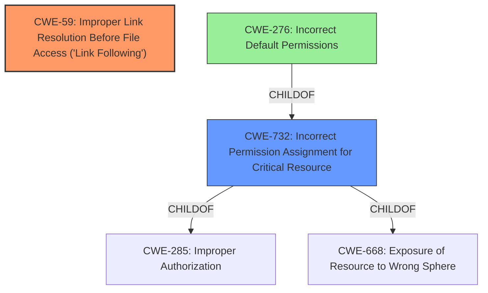

# Analysis for CVE-2021-28098

# Summary
| CWE ID | CWE Name | Confidence | CWE Abstraction Level | CWE Vulnerability Mapping Label | CWE-Vulnerability Mapping Notes |
|---|---|---|---|---|---|
| CWE-59 | Improper Link Resolution Before File Access ('Link Following') | 0.9 | Base | Allowed | Primary CWE |
| CWE-732 | Incorrect Permission Assignment for Critical Resource | 0.7 | Class | Allowed-with-Review | Secondary CWE |
| CWE-276 | Incorrect Default Permissions | 0.6 | Base | Allowed | Secondary CWE |

## Evidence and Confidence

*   **Confidence Score:** 0.8
*   **Evidence Strength:** HIGH

## Relationship Analysis
The primary CWE is CWE-59, which is the root cause of the vulnerability. CWE-732 is a Class-level CWE representing incorrect permission assignment, which contributes to the exploitability of the link following issue. CWE-276 is a Base-level CWE for incorrect default permissions, indicating a specific type of permission issue that could lead to the vulnerability.

## Vulnerability Chain
The vulnerability chain starts with **incorrect permission assignment** for the log file directory, allowing the Everyone group to have full permissions. This allows an attacker to create a symbolic link pointing to a privileged location. Due to **improper link resolution**, the logging function follows the symbolic link, resulting in a log file with incorrect permissions in a privileged location. This allows an attacker to replace the log file with a malicious DLL, leading to DLL hijacking and **local privilege escalation**.

## Summary of Analysis
The primary weakness is CWE-59, as the core issue is the **improper handling of symbolic links**, allowing an attacker to redirect the logging function to a privileged location. The vulnerability description explicitly mentions the use of a symbolic link to point the log file to %WINDIR%\System32.
_"Using a symbolic link allows an attacker to point the log file to a privileged location such as %WINDIR%\System32."_
CWE-59 directly addresses this type of vulnerability: _"The product attempts to access a file based on the filename, but it does not properly prevent that filename from identifying a link or shortcut that resolves to an unintended resource."_

CWE-732, Incorrect Permission Assignment for Critical Resource, is a secondary contributing factor, as the **incorrect permissions** on the log file directory enable the creation of the symbolic link by an unprivileged user.
_"SecureConnector runs with administrative privileges and writes logs entries to a file in %PROGRAMDATA%\ForeScout SecureConnector\ that has full permissions for the Everyone group."_
This aligns with the description of CWE-732: _"The product specifies permissions for a security-critical resource in a way that allows that resource to be read or modified by unintended actors."_

CWE-276, Incorrect Default Permissions, could be considered if the permissions assigned were incorrect by default, however, there is no strong supporting evidence to select CWE-276, so a lower confidence score is assigned.

Other CWEs Considered:

*   CWE-61 (UNIX Symbolic Link (Symlink) Following): This is a Compound CWE that encompasses multiple weaknesses. While relevant, it is less specific than CWE-59, which directly addresses the improper link resolution.
*   CWE-427 (Uncontrolled Search Path Element): This CWE is not applicable as the vulnerability does not involve an uncontrolled search path. The issue is with the logging function following a symbolic link, not with how the system searches for resources.
*   CWE-367 (Time-of-check Time-of-use (TOCTOU) Race Condition): While a race condition could potentially exacerbate the vulnerability, it is not the primary weakness. The core issue is the improper link resolution, not a race condition between checking and using the file.
*   CWE-1386 (Insecure Operation on Windows Junction / Mount Point): This CWE is specific to Windows junctions and mount points. Although the description mentions symbolic links, junctions are also a factor, making this CWE potentially relevant but less precise than CWE-59.
*   CWE-250 (Execution with Unnecessary Privileges): While SecureConnector runs with administrative privileges, this is not the direct cause of the vulnerability. The issue is the improper handling of symbolic links, which allows an attacker to leverage those privileges.