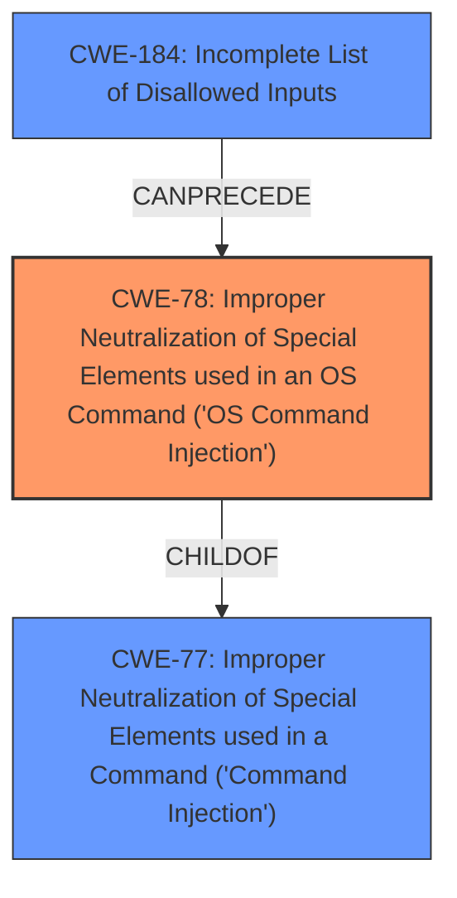

# Enhanced Analysis for CVE-2021-28113

# Summary
| CWE ID | CWE Name | Confidence | CWE Abstraction Level | CWE Vulnerability Mapping Label | CWE-Vulnerability Mapping Notes |
|---|---|---|---|---|---|
| CWE-78 | Improper Neutralization of Special Elements used in an OS Command ('OS Command Injection') | 1.0 | Base | Allowed | Primary CWE |
| CWE-77 | Improper Neutralization of Special Elements used in a Command ('Command Injection') | 0.7 | Class | Allowed-with-Review | Secondary Candidate |
| CWE-184 | Incomplete List of Disallowed Inputs | 0.5 | Base | Allowed | Secondary Candidate |

## Evidence and Confidence

*   **Confidence Score:** 0.9
*   **Evidence Strength:** HIGH

## Relationship Analysis
The primary relationship influencing my decision is the ChildOf relationship between CWE-78 and CWE-77. CWE-78 is a Base level CWE that is a more specific instance of CWE-77 which is a Class level CWE. The vulnerability description explicitly states that the vulnerability is a **command injection** vulnerability that allows attackers to execute OS commands. The CanPrecede relationship between CWE-184 and CWE-78 was considered as it is possible that an incomplete list of disallowed inputs could lead to the **OS Command Injection**, but there is not enough information in the description to support this relationship.



## Vulnerability Chain
The vulnerability chain starts with the **improper neutralization** of special elements in the cookieDomain and relayDomain parameters. This leads to the ability to inject OS commands, resulting in the execution of those commands as a privileged system account.
- **Root Cause:** Improper Neutralization of Special Elements used in an OS Command (CWE-78)
- **Impact:** Execution of OS commands as a privileged system account.

## Summary of Analysis
The initial analysis strongly pointed towards CWE-78 due to the explicit mention of **command injection** and the ability to execute OS commands. The retriever results also listed CWE-78 as a top candidate.

The primary basis for my assessment is the vulnerability description itself, which states: "A **command injection** vulnerability in the cookieDomain and relayDomain parameters of Okta Access Gateway before 2020.9.3 allows attackers (with admin access to the Okta Access Gateway UI) to execute OS commands as a privileged system account."

The graph relationships influenced my selection by highlighting the hierarchical connection between CWE-78 and CWE-77. While CWE-77 is a broader category, CWE-78 provides a more specific classification that aligns directly with the vulnerability's nature.

CWE-78 is selected as the optimal level of specificity because it accurately captures the root cause of the vulnerability, which is the **improper neutralization** of special elements used in constructing OS commands, leading to **command injection**.
- CWE-78 is a Base level CWE and it's Usage is Allowed.
- CWE-77 is a Class level CWE and it's Usage is Allowed-with-Review because "CWE-77 is often misused when OS command injection (CWE-78) was intended instead [REF-1287]."
- CWE-184 was also considered because an incomplete list of disallowed inputs could lead to the **OS Command Injection**.

Relevant CWE Information:

# Enhanced Context (25 CWEs)
The following CWEs were identified as potentially relevant to this vulnerability:

## CWE-74: Improper Neutralization of Special Elements in Output Used by a Downstream Component ('Injection')
This was not selected. CWE-74 is a class-level weakness, and the description specifically mentions OS commands being executed, making CWE-78 a better fit.

## CWE-184: Incomplete List of Disallowed Inputs
CWE-184 was considered because the **command injection** could be due to an incomplete list of disallowed characters or commands. It was not selected as the primary weakness, as the description does not explicitly state that an incomplete list of disallowed inputs is the root cause. It's Usage is Allowed.

## CWE-1289: Improper Validation of Unsafe Equivalence in Input
This was not selected. There is no evidence of "unsafe equivalence" in the vulnerability description.

## CWE-807: Reliance on Untrusted Inputs in a Security Decision
This was not selected. The vulnerability is more directly related to **command injection** than relying on untrusted inputs for a security decision.

## CWE-138: Improper Neutralization of Special Elements
This was not selected. CWE-138 is a class-level weakness, and the vulnerability description specifically mentions OS commands being executed, making CWE-78 a better fit.

## CWE-653: Improper Isolation or Compartmentalization
This was not selected. There is no mention of isolation or compartmentalization issues in the vulnerability description.

## CWE-80: Improper Neutralization of Script-Related HTML Tags in a Web Page (Basic XSS)
This was not selected. The vulnerability is related to **command injection**, not Cross-Site Scripting (XSS).

## CWE-41: Improper Resolution of Path Equivalence
This was not selected. The vulnerability description does not mention path equivalence issues.

## CWE-150: Improper Neutralization of Escape, Meta, or Control Sequences
This was not selected. While related to neutralization, the description specifies OS commands, making CWE-78 a more direct fit.

## CWE-943: Improper Neutralization of Special Elements in Data Query Logic
This was not selected. The vulnerability is related to **command injection**, not SQL injection.

## CWE-116: Improper Encoding or Escaping of Output
This was not selected. While encoding/escaping issues can contribute to injection vulnerabilities, the description focuses on **command injection**, making CWE-78 a more direct fit.

## CWE-88: Improper Neutralization of Argument Delimiters in a Command ('Argument Injection')
This was not selected. While related to command construction, the description doesn't specifically point to argument delimiter issues, making CWE-78 a more direct fit.

## CWE-22: Improper Limitation of a Pathname to a Restricted Directory ('Path Traversal')
This was not selected. The vulnerability description does not mention path traversal issues.

## CWE-98: Improper Control of Filename for Include/Require Statement in PHP Program ('PHP Remote File Inclusion')
This was not selected. This is specific to PHP file inclusion, which is not relevant to the described vulnerability.

## CWE-94: Improper Control of Generation of Code ('Code Injection')
This was not selected. The vulnerability is specifically about **command injection**, not general code injection.

## CWE-79: Improper Neutralization of Input During Web Page Generation ('Cross-site Scripting')
This was not selected. The vulnerability is related to **command injection**, not Cross-Site Scripting (XSS).

## CWE-434: Unrestricted Upload of File with Dangerous Type
This was not selected. The vulnerability description does not mention file upload issues.

## CWE-426: Untrusted Search Path
This was not selected. The vulnerability description does not mention issues with the search path.

## CWE-494: Download of Code Without Integrity Check
This was not selected. The vulnerability description does not mention issues with downloading code.


## CWE Relationship Analysis

Current CWEs represent these abstraction levels: .


### Vulnerability Chain Analysis

**Chain starting from CWE-116:**
- 116 (Improper Encoding or Escaping of Output) - ROOT


**Chain starting from CWE-434:**
- 434 (Unrestricted Upload of File with Dangerous Type) - ROOT


### CWE Relationship Diagram

```mermaid
graph TD
    classDef primary fill:#f96,stroke:#333,stroke-width:2px
    classDef secondary fill:#69f,stroke:#333
    classDef tertiary fill:#9e9,stroke:#333
```