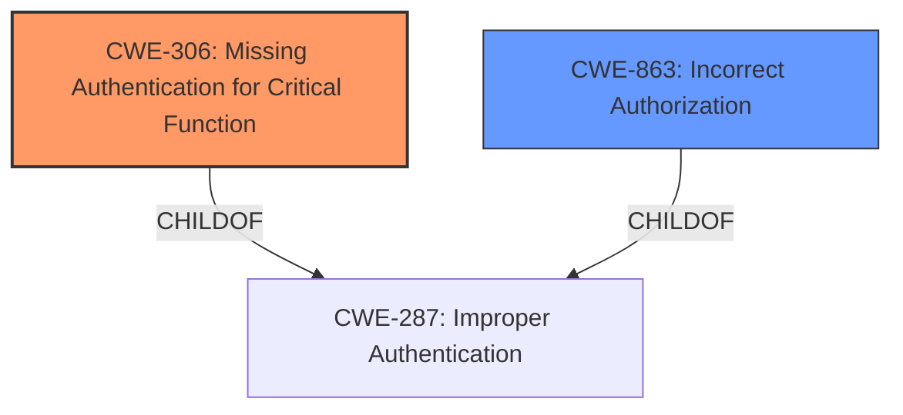

# Raw Analyzer Response for CVE-2021-28122

# Summary
| CWE ID | CWE Name | Confidence | CWE Abstraction Level | CWE Vulnerability Mapping Label | CWE-Vulnerability Mapping Notes |
|---|---|---|---|---|---|
| CWE-306 | Missing Authentication for Critical Function | 1.0 | Base | Primary | Allowed |
| CWE-863 | Incorrect Authorization | 0.7 | Class | Secondary | Allowed-with-Review |

## Evidence and Confidence

*   **Confidence Score:** 0.9
*   **Evidence Strength:** HIGH

## Relationship Analysis
The primary CWE, CWE-306 [Missing Authentication for Critical Function], is a base-level weakness that directly addresses the root cause described in the vulnerability. It is related to CWE-287 [Improper Authentication] as a child. CWE-863 [Incorrect Authorization] is a class-level weakness, which could apply as a secondary concern if there were authorization checks, but they were implemented incorrectly. Given the lack of any authentication, CWE-306 is the more specific and appropriate choice.

## Vulnerability Chain
The vulnerability chain starts with the **missing authentication** on the WebUI component, leading to unauthenticated users being able to create, read, update, or delete entries in the subscriber database. This is a direct cause-and-effect relationship where the absence of authentication is the root cause, and the unauthorized data manipulation is the impact.
  - Missing Authentication --> Unauthorized Data Manipulation

## Summary of Analysis
The initial assessment focused on the **request-validation issue** which was caused by the **missing authentication**. The evidence from the CVE Reference Links Content Summary clearly indicates that the root cause was the **lack of proper authentication and authorization checks** in the webui component. The express.js configuration in `webui/server/routes/index.js` **failed to validate the user** making API calls to the subscriber database.

The vulnerability description states: "The WebUI component allows an unauthenticated user to use a crafted HTTP API request to create, read, update, or delete entries in the subscriber database... The issue occurs because Express is not set up to require authentication." This strongly supports the selection of CWE-306 [Missing Authentication for Critical Function] as the primary weakness.

CWE-306 [Missing Authentication for Critical Function] is chosen because it directly reflects the **lack of authentication** for critical functions. This is at the base level of abstraction, which is the preferred level. Other CWEs like CWE-863 [Incorrect Authorization] were considered but deemed less appropriate since there wasn't an authorization check happening at all. The relationship graph shows that CWE-306 [Missing Authentication for Critical Function] is a child of CWE-287 [Improper Authentication], making it a more specific choice. The provided evidence, combined with the CWE specifications, led to this conclusion.

Relevant CWE Information:

# Enhanced Context (25 CWEs)
The following CWEs were identified as potentially relevant to this vulnerability:

## CWE-303: Incorrect Implementation of Authentication Algorithm
**Abstraction Level**: Base
**Similarity Score**: 0.78
**Source**: dense

**Description**:
The requirements for the product dictate the use of an established authentication algorithm, but the implementation of the algorithm is incorrect.
**Rationale:** This CWE is not selected because the vulnerability stems from a complete lack of authentication, not an incorrect implementation of an existing algorithm.

## CWE-74: Improper Neutralization of Special Elements in Output Used by a Downstream Component ('Injection')
**Abstraction Level**: Class
**Similarity Score**: 0.78
**Source**: dense
**Rationale:** This CWE is not selected because the root cause isn't related to injection. It's a higher-level weakness that doesn't fit the scenario.

## CWE-90: Improper Neutralization of Special Elements used in an LDAP Query ('LDAP Injection')
**Abstraction Level**: Base
**Similarity Score**: 0.76
**Source**: dense
**Rationale:** This CWE is not selected because it is specific to LDAP queries, and the vulnerability is not related to LDAP.

## CWE-204: Observable Response Discrepancy
**Abstraction Level**: Base
**Similarity Score**: 0.76
**Source**: dense
**Rationale:** This CWE is not selected because the vulnerability is not directly related to different responses revealing internal state.

## CWE-1390: Weak Authentication
**Abstraction Level**: Class
**Similarity Score**: 0.76
**Source**: dense
**Rationale:** This CWE is not selected because it represents a general class of weak authentication, whereas the vulnerability is a complete lack of authentication, making CWE-306 more specific.

## CWE-639: Authorization Bypass Through User-Controlled Key
**Abstraction Level**: Base
**Similarity Score**: 0.76
**Source**: dense
**Rationale:** This CWE is not selected because there is no user-controlled key involved in bypassing authorization. The vulnerability is due to a complete lack of authentication.

## CWE-917: Improper Neutralization of Special Elements used in an Expression Language Statement ('Expression Language Injection')
**Abstraction Level**: Base
**Similarity Score**: 0.76
**Source**: dense
**Rationale:** This CWE is not selected because the vulnerability is not related to expression language injection.

## CWE-212: Improper Removal of Sensitive Information Before Storage or Transfer
**Abstraction Level**: Base
**Similarity Score**: 0.76
**Source**: dense
**Rationale:** This CWE is not relevant as the vulnerability is not about sensitive information removal.

## CWE-41: Improper Resolution of Path Equivalence
**Abstraction Level**: Base
**Similarity Score**: 0.76
**Source**: dense
**Rationale:** This CWE is not related to the described vulnerability.

## CWE-807: Reliance on Untrusted Inputs in a Security Decision
**Abstraction Level**: Base
**Similarity Score**: 0.75
**Source**: dense
**Rationale:** This CWE does not fit the scenario as the vulnerability is not due to reliance on untrusted inputs in a security decision, but rather the absence of a security decision in the first place.

## CWE-1336: Improper Neutralization of Special Elements Used in a Template Engine
**Abstraction Level**: Base
**Similarity Score**: 5739.40
**Source**: sparse
**Rationale:** This CWE does not fit the root cause of the vulnerability which is due to a missing authentication.

## CWE-863: Incorrect Authorization
**Abstraction Level**: Class
**Similarity Score**: 5720.15
**Source**: sparse
**Rationale:** This CWE could be considered as a secondary concern, but given the complete lack of any authentication mechanism, CWE-306 is a better fit.

## CWE-918: Server-Side Request Forgery (SSRF)
**Abstraction Level**: Base
**Similarity Score**: 5638.49
**Source**: sparse
**Rationale:** This CWE is not selected as the vulnerability does not involve server-side request forgery.

## CWE-306: Missing Authentication for Critical Function
**Abstraction Level**: Base
**Similarity Score**: 5587.15
**Source**: sparse
**Rationale:** This CWE is selected as the primary weakness because the product does not perform any authentication for critical functions.

## CWE-116: Improper Encoding or Escaping of Output
**Abstraction Level**: Class
**Similarity Score**: 5557.91
**Source**: sparse
**Rationale:** This CWE is not selected as the vulnerability does not involve improper encoding or escaping of output.

## CWE-613: Insufficient Session Expiration
**Abstraction Level**: base
**Similarity Score**: 4.33
**Source**: graph
**Rationale**: This CWE is not relevant to the described vulnerability.

## CWE-79: Improper Neutralization of Input During Web Page Generation ('Cross-site Scripting')
**Abstraction Level**: base
**Similarity Score**: 4.31
**Source**: graph
**Rationale**: This CWE is not relevant to the described vulnerability.

## CWE-89: Improper Neutralization of Special Elements used in an SQL Command ('SQL Injection')
**Abstraction Level**: base
**Similarity Score**: 3.89
**Source**: graph
**Rationale**: This CWE is not relevant to the described vulnerability.

## CWE-178: Improper Handling of Case Sensitivity
**Abstraction Level**: base
**Similarity Score**: 3.64
**Source**: graph
**Rationale**: This CWE is not relevant to the described vulnerability.

## CWE-1289: Improper Validation of Unsafe Equivalence in Input
**