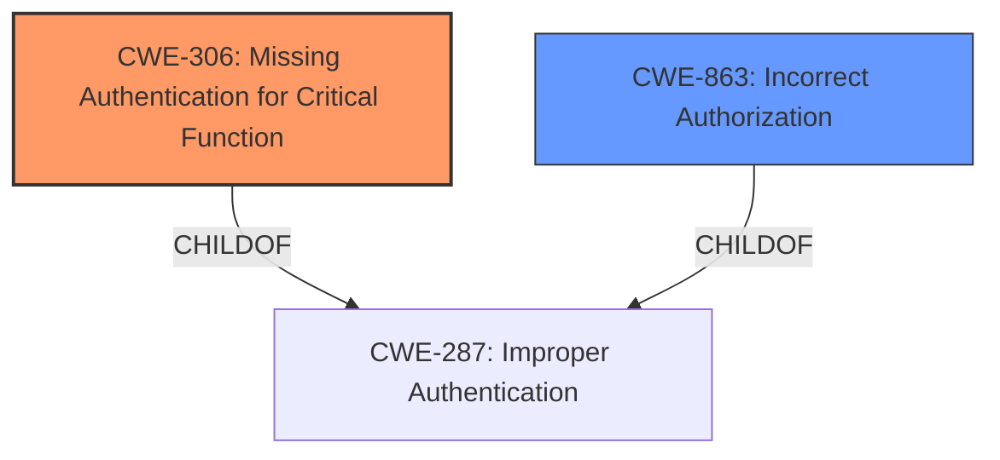

# Analysis for CVE-2021-28122

# Summary
| CWE ID | CWE Name | Confidence | CWE Abstraction Level | CWE Vulnerability Mapping Label | CWE-Vulnerability Mapping Notes |
|---|---|---|---|---|---|
| CWE-306 | Missing Authentication for Critical Function | 1.0 | Base | Primary | Allowed |
| CWE-863 | Incorrect Authorization | 0.7 | Class | Secondary | Allowed-with-Review |

## Evidence and Confidence

*   **Confidence Score:** 0.9
*   **Evidence Strength:** HIGH

## Relationship Analysis
The primary CWE, CWE-306 [Missing Authentication for Critical Function], is a base-level weakness that directly addresses the root cause described in the vulnerability. It is related to CWE-287 [Improper Authentication] as a child. CWE-863 [Incorrect Authorization] is a class-level weakness, which could apply as a secondary concern if there were authorization checks, but they were implemented incorrectly. Given the lack of any authentication, CWE-306 is the more specific and appropriate choice.

## Vulnerability Chain
The vulnerability chain starts with the **missing authentication** on the WebUI component, leading to unauthenticated users being able to create, read, update, or delete entries in the subscriber database. This is a direct cause-and-effect relationship where the absence of authentication is the root cause, and the unauthorized data manipulation is the impact.
  - Missing Authentication --> Unauthorized Data Manipulation

## Summary of Analysis
The initial assessment focused on the **request-validation issue** which was caused by the **missing authentication**. The evidence from the CVE Reference Links Content Summary clearly indicates that the root cause was the **lack of proper authentication and authorization checks** in the webui component. The express.js configuration in `webui/server/routes/index.js` **failed to validate the user** making API calls to the subscriber database.

The vulnerability description states: "The WebUI component allows an unauthenticated user to use a crafted HTTP API request to create, read, update, or delete entries in the subscriber database... The issue occurs because Express is not set up to require authentication." This strongly supports the selection of CWE-306 [Missing Authentication for Critical Function] as the primary weakness.

CWE-306 [Missing Authentication for Critical Function] is chosen because it directly reflects the **lack of authentication** for critical functions. This is at the base level of abstraction, which is the preferred level. Other CWEs like CWE-863 [Incorrect Authorization] were considered but deemed less appropriate since there wasn't an authorization check happening at all. The relationship graph shows that CWE-306 [Missing Authentication for Critical Function] is a child of CWE-287 [Improper Authentication], making it a more specific choice. The provided evidence, combined with the CWE specifications, led to this conclusion.

Relevant CWE Information:

# Enhanced Context (25 CWEs)
The following CWEs were identified as potentially relevant to this vulnerability:

## CWE-303: Incorrect Implementation of Authentication Algorithm
**Abstraction Level**: Base
**Similarity Score**: 0.78
**Source**: dense

**Description**:
The requirements for the product dictate the use of an established authentication algorithm, but the implementation of the algorithm is incorrect.
**Rationale:** This CWE is not selected because the vulnerability stems from a complete lack of authentication, not an incorrect implementation of an existing algorithm.

## CWE-74: Improper Neutralization of Special Elements in Output Used by a Downstream Component ('Injection')
**Abstraction Level**: Class
**Similarity Score**: 0.78
**Source**: dense
**Rationale:** This CWE is not selected because the root cause isn't related to injection. It's a higher-level weakness that doesn't fit the scenario.

## CWE-90: Improper Neutralization of Special Elements used in an LDAP Query ('LDAP Injection')
**Abstraction Level**: Base
**Similarity Score**: 0.76
**Source**: dense
**Rationale:** This CWE is not selected because it is specific to LDAP queries, and the vulnerability is not related to LDAP.

## CWE-204: Observable Response Discrepancy
**Abstraction Level**: Base
**Similarity Score**: 0.76
**Source**: dense
**Rationale:** This CWE is not selected because the vulnerability is not directly related to different responses revealing internal state.

## CWE-1390: Weak Authentication
**Abstraction Level**: Class
**Similarity Score**: 0.76
**Source**: dense
**Rationale:** This CWE is not selected because it represents a general class of weak authentication, whereas the vulnerability is a complete lack of authentication, making CWE-306 more specific.

## CWE-639: Authorization Bypass Through User-Controlled Key
**Abstraction Level**: Base
**Similarity Score**: 0.76
**Source**: dense
**Rationale:** This CWE is not selected because there is no user-controlled key involved in bypassing authorization. The vulnerability is due to a complete lack of authentication.

## CWE-917: Improper Neutralization of Special Elements used in an Expression Language Statement ('Expression Language Injection')
**Abstraction Level**: Base
**Similarity Score**: 0.76
**Source**: dense
**Rationale:** This CWE is not selected because the vulnerability is not related to expression language injection.

## CWE-212: Improper Removal of Sensitive Information Before Storage or Transfer
**Abstraction Level**: Base
**Similarity Score**: 0.76
**Source**: dense
**Rationale:** This CWE is not relevant as the vulnerability is not about sensitive information removal.

## CWE-41: Improper Resolution of Path Equivalence
**Abstraction Level**: Base
**Similarity Score**: 0.76
**Source**: dense
**Rationale:** This CWE is not related to the described vulnerability.

## CWE-807: Reliance on Untrusted Inputs in a Security Decision
**Abstraction Level**: Base
**Similarity Score**: 0.75
**Source**: dense
**Rationale:** This CWE does not fit the scenario as the vulnerability is not due to reliance on untrusted inputs in a security decision, but rather the absence of a security decision in the first place.

## CWE-1336: Improper Neutralization of Special Elements Used in a Template Engine
**Abstraction Level**: Base
**Similarity Score**: 5739.40
**Source**: sparse
**Rationale:** This CWE does not fit the root cause of the vulnerability which is due to a missing authentication.

## CWE-863: Incorrect Authorization
**Abstraction Level**: Class
**Similarity Score**: 5720.15
**Source**: sparse
**Rationale:** This CWE could be considered as a secondary concern, but given the complete lack of any authentication mechanism, CWE-306 is a better fit.

## CWE-918: Server-Side Request Forgery (SSRF)
**Abstraction Level**: Base
**Similarity Score**: 5638.49
**Source**: sparse
**Rationale:** This CWE is not selected as the vulnerability does not involve server-side request forgery.

## CWE-306: Missing Authentication for Critical Function
**Abstraction Level**: Base
**Similarity Score**: 5587.15
**Source**: sparse
**Rationale:** This CWE is selected as the primary weakness because the product does not perform any authentication for critical functions.

## CWE-116: Improper Encoding or Escaping of Output
**Abstraction Level**: Class
**Similarity Score**: 5557.91
**Source**: sparse
**Rationale:** This CWE is not selected as the vulnerability does not involve improper encoding or escaping of output.

## CWE-613: Insufficient Session Expiration
**Abstraction Level**: base
**Similarity Score**: 4.33
**Source**: graph
**Rationale**: This CWE is not relevant to the described vulnerability.

## CWE-79: Improper Neutralization of Input During Web Page Generation ('Cross-site Scripting')
**Abstraction Level**: base
**Similarity Score**: 4.31
**Source**: graph
**Rationale**: This CWE is not relevant to the described vulnerability.

## CWE-89: Improper Neutralization of Special Elements used in an SQL Command ('SQL Injection')
**Abstraction Level**: base
**Similarity Score**: 3.89
**Source**: graph
**Rationale**: This CWE is not relevant to the described vulnerability.

## CWE-178: Improper Handling of Case Sensitivity
**Abstraction Level**: base
**Similarity Score**: 3.64
**Source**: graph
**Rationale**: This CWE is not relevant to the described vulnerability.

## CWE-1289: Improper Validation of Unsafe Equivalence in Input
**

# Enhanced Query for CVE-2021-28122

## Vulnerability Description
A **request-validation issue** was discovered in Open5GS 2.1.3 through 2.2.x before 2.2.1. The WebUI component allows an unauthenticated user to use a crafted HTTP API request to create, read, update, or delete entries in the subscriber database. For example, new administrative users can be added. The issue occurs because Express is not set up to require authentication.

### Vulnerability Description Key Phrases
- **weakness:** **request-validation issue**
- **impact:** create, read, update, or delete entries in the subscriber database
- **vector:** crafted HTTP API request
- **attacker:** unauthenticated user
- **product:** Open5GS
- **version:** 2.1.3 through 2.2.x before 2.2.1
- **component:** WebUI component

## CVE Reference Links Content Summary
Based on the provided content, here's an analysis related to CVE-2021-28122:

**1. Verification of CVE Relevance:**

The content directly relates to CVE-2021-28122.  The vulnerability is described in issue #837 as an "Authentication Bypass in Webui", and this issue is addressed by the changes introduced in pull request #838.

**2. Vulnerability Details:**

*   **Root Cause:** The root cause was the lack of proper authentication and authorization checks in the webui component. The express.js configuration in `webui/server/routes/index.js` failed to validate the user making API calls to the subscriber database.
*   **Weaknesses/Vulnerabilities Present:**
    *   **Authentication Bypass:** Unauthenticated users could bypass the login mechanism and interact with the subscriber database directly through HTTP requests.
    *   **Insecure API Endpoints:** The API endpoints for accessing the database (e.g., `/api/db/account`, `/api/db/profile`, `/api/db/subscriber`) did not enforce proper access control.
    *   **Lack of JWT Validation:** The initial implementation lacked proper JWT validation leading to spoofing of tokens.
*   **Impact of Exploitation:**
    *   **Data Breach:** Attackers could read sensitive subscriber data.
    *   **Data Manipulation:** Attackers could create, update, and delete subscriber entries.
    *   **Privilege Escalation:** Attackers could add administrative users.
    *   **Denial of Service:** Attackers could delete all subscriber data.
*   **Attack Vectors:**
    *   **HTTP Requests:**  Attackers could craft malicious HTTP GET, POST, PUT, PATCH, and DELETE requests to interact directly with the exposed API endpoints.
    *   **Bypassing Login Page:** The vulnerability could be exploited by directly making API requests, bypassing the normal login process.
*  **Required Attacker Capabilities/Position:**
    *   **Network Access:** The attacker needs network access to the system where the webui component is deployed, as the API is exposed on a specific port (3000).
    *   **Basic HTTP Knowledge:** The attacker needs a basic understanding of HTTP request methods and how to craft them.

**3. Additional Details:**
*  **Fix:** The fix was implemented by adding authentication using JWT tokens to all `/api/db/*` endpoints, requiring a valid token for database access.  The pull request #838 introduces this token-based authentication to protect the vulnerable endpoints.
*  **Default Key Issue:** The initial fix had a default JWT secret key, which was vulnerable to spoofing and it was recommended to use an environment variable to set it.
* **Initial Implementation Issue:**  The initial implementation required users to log out and log back in to get a token. This was later addressed to automatically redirect users to the login page if there wasn't a valid token. However, the automatic redirection was later reverted and the user would have to log in again after the security patch was applied.
*   **Package Lock Issue:** The discussion also revealed an issue with `npm install` under different npm versions, leading to changes in the `package-lock.json`. However, this was determined to be expected behavior and not a cause for concern. It was suggested that `npm ci` should be used instead for clean installs.

**4. Summary**

The content describes a significant authentication bypass vulnerability in the Open5GS webui, which could have allowed unauthenticated attackers to read and manipulate the subscriber database. The fix included implementing a JWT token based authentication on the vulnerable API endpoints. This information provides a clear understanding of the vulnerability, how it was addressed, and other related issues encountered during the fix process.

**5.  Additional Notes from Other Content**

*   **v2.2.1 Release:** The vulnerability was patched in version v2.2.1 and the users of the webui had to log out and log back in after the upgrade to v2.2.1.
*   **Comparison of v2.2.0 to v2.2.1:** The diff between v2.2.0 and v2.2.1 includes the API token addition and associated fixes.
* **Release Notes:** The release notes for several Open5GS releases mention security fixes, including "Several vulnerabilities have been resolved" in v2.7.1 and further fixes in v2.7.2. While these are not explicitly attributed to CVE-2021-28122, they indicate ongoing security efforts.

## Retriever Results

### Top Combined Results

| Rank | CWE ID | Name | Abstraction | Usage  | Retrievers | Individual Scores |
|------|--------|------|-------------|-------|------------|-------------------|
| 1 | 306 | Missing Authentication for Critical Function | Base | Allowed | sparse | 0.362 |
| 2 | 863 | Incorrect Authorization | Class | Allowed-with-Review | sparse | 0.328 |
| 3 | 918 | Server-Side Request Forgery (SSRF) | Base | Allowed | sparse | 0.325 |
| 4 | 352 | Cross-Site Request Forgery (CSRF) | Compound | Allowed | sparse | 0.322 |
| 5 | 1336 | Improper Neutralization of Special Elements Used in a Template Engine | Base | Allowed | sparse | 0.318 |
| 6 | 303 | Incorrect Implementation of Authentication Algorithm | Base | Allowed | dense | 0.518 |
| 7 | 613 | Insufficient Session Expiration | Base | Allowed | graph | 0.002 |
| 8 | 862 | Missing Authorization | Class | Allowed-with-Review | sparse | 0.317 |
| 9 | 89 | Improper Neutralization of Special Elements used in an SQL Command ('SQL Injection') | Base | Allowed | sparse | 0.316 |
| 10 | 90 | Improper Neutralization of Special Elements used in an LDAP Query ('LDAP Injection') | Base | Allowed | sparse | 0.313 |

# Complete CWE Specifications

## CWE-306: Missing Authentication for Critical Function
**Abstraction:** Base
**Status:** Draft

### Description
The product does not perform any authentication for functionality that requires a provable user identity or consumes a significant amount of resources.

### Extended Description
Not provided

### Alternative Terms
None

### Relationships
ChildOf -> CWE-287
ChildOf -> CWE-287

### Mapping Guidance
**Usage:** Allowed
**Rationale:** This CWE entry is at the Base level of abstraction, which is a preferred level of abstraction for mapping to the root causes of vulnerabilities.
**Comments:** Carefully read both the name and description to ensure that this mapping is an appropriate fit. Do not try to 'force' a mapping to a lower-level Base/Variant simply to comply with this preferred level of abstraction.
**Reasons:**
- Acceptable-Use

### Observed Examples
- **CVE-2022-31260:** Chain: a digital asset management program has an undisclosed backdoor in the legacy version of a PHP script (CWE-912) that could allow an unauthenticated user to export metadata (CWE-306)
- **CVE-2022-29951:** TCP-based protocol in Programmable Logic Controller (PLC) has no authentication.
- **CVE-2022-29952:** Condition Monitor firmware uses a protocol that does not require authentication.

## CWE-863: Incorrect Authorization
**Abstraction:** Class
**Status:** Incomplete

### Description
The product performs an authorization check when an actor attempts to access a resource or perform an action, but it does not correctly perform the check.

### Extended Description
Not provided

### Alternative Terms
AuthZ: "AuthZ" is typically used as an abbreviation of "authorization" within the web application security community. It is distinct from "AuthN" (or, sometimes, "AuthC") which is an abbreviation of "authentication." The use of "Auth" as an abbreviation is discouraged, since it could be used for either authentication or authorization.

### Relationships
ChildOf -> CWE-285
ChildOf -> CWE-284

### Mapping Guidance
**Usage:** Allowed-with-Review
**Rationale:** This CWE entry is a Class and might have Base-level children that would be more appropriate
**Comments:** Examine children of this entry to see if there is a better fit
**Reasons:**
- Abstraction

### Additional Notes
**[Terminology]** 

Assuming a user with a given identity, authorization is the process of determining whether that user can access a given resource, based on the user's privileges and any permissions or other access-control specifications that apply to the resource.

### Observed Examples
- **CVE-2021-39155:** Chain: A microservice integration and management platform compares the hostname in the HTTP Host header in a case-sensitive way (CWE-178, CWE-1289), allowing bypass of the authorization policy (CWE-863) using a hostname with mixed case or other variations.
- **CVE-2019-15900:** Chain: sscanf() call is used to check if a username and group exists, but the return value of sscanf() call is not checked (CWE-252), causing an uninitialized variable to be checked (CWE-457), returning success to allow authorization bypass for executing a privileged (CWE-863).
- **CVE-2009-2213:** Gateway uses default "Allow" configuration for its authorization settings.

## CWE-918: Server-Side Request Forgery (SSRF)
**Abstraction:** Base
**Status:** Incomplete

### Description
The web server receives a URL or similar request from an upstream component and retrieves the contents of this URL, but it does not sufficiently ensure that the request is being sent to the expected destination.

### Extended Description
Not provided

### Alternative Terms
XSPA: Cross Site Port Attack
SSRF: Server-Side Request Forgery

### Relationships
ChildOf -> CWE-441
ChildOf -> CWE-610

### Mapping Guidance
**Usage:** Allowed
**Rationale:** This CWE entry is at the Base level of abstraction, which is a preferred level of abstraction for mapping to the root causes of vulnerabilities.
**Comments:** Carefully read both the name and description to ensure that this mapping is an appropriate fit. Do not try to 'force' a mapping to a lower-level Base/Variant simply to comply with this preferred level of abstraction.
**Reasons:**
- Acceptable-Use

### Additional Notes
**[Relationship]** CWE-918 (SSRF) and CWE-611 (XXE) are closely related, because they both involve web-related technologies and can launch outbound requests to unexpected destinations. However, XXE can be performed client-side, or in other contexts in which the software is not acting directly as a server, so the "Server" portion of the SSRF acronym does not necessarily apply.

### Observed Examples
- **CVE-2023-32786:** Chain: LLM integration framework has prompt injection (CWE-1427) that allows an attacker to force the service to retrieve data from an arbitrary URL, essentially providing SSRF (CWE-918) and potentially injecting content into downstream tasks.
- **CVE-2021-26855:** Server Side Request Forgery (SSRF) in mail server, as exploited in the wild per CISA KEV.
- **CVE-2021-21973:** Server Side Request Forgery in cloud platform, as exploited in the wild per CISA KEV.

## CWE-352: Cross-Site Request Forgery (CSRF)
**Abstraction:** Compound
**Status:** Stable

### Description
The web application does not, or can not, sufficiently verify whether a well-formed, valid, consistent request was intentionally provided by the user who submitted the request.

### Extended Description
When a web server is designed to receive a request from a client without any mechanism for verifying that it was intentionally sent, then it might be possible for an attacker to trick a client into making an unintentional request to the web server which will be treated as an authentic request. This can be done via a URL, image load, XMLHttpRequest, etc. and can result in exposure of data or unintended code execution.

### Alternative Terms
Session Riding
Cross Site Reference Forgery
XSRF

### Relationships
ChildOf -> CWE-345
ChildOf -> CWE-345
Requires -> CWE-346
Requires -> CWE-441
Requires -> CWE-642
Requires -> CWE-613

### Mapping Guidance
**Usage:** Allowed
**Rationale:** This is a well-known Composite of multiple weaknesses that must all occur simultaneously, although it is attack-oriented in nature.
**Comments:** While attack-oriented composites are supported in CWE, they have not been a focus of research. There is a chance that future research or CWE scope clarifications will change or deprecate them. Perform root-cause analysis to determine if other weaknesses allow CSRF attacks to occur, and map to those weaknesses. For example, predictable CSRF tokens might allow bypass of CSRF protection mechanisms; if this occurs, they might be better characterized as randomness/predictability weaknesses.
**Reasons:**
- Other

### Additional Notes
**[Relationship]** 

There can be a close relationship between XSS and CSRF (CWE-352). An attacker might use CSRF in order to trick the victim into submitting requests to the server in which the requests contain an XSS payload. A well-known example of this was the Samy worm on MySpace [REF-956]. The worm used XSS to insert malicious HTML sequences into a user's profile and add the attacker as a MySpace friend. MySpace friends of that victim would then execute the payload to modify their own profiles, causing the worm to propagate exponentially. Since the victims did not intentionally insert the malicious script themselves, CSRF was a root cause.

**[Theoretical]** 

The CSRF topology is multi-channel:

  - Attacker (as outsider) to intermediary (as user). The interaction point is either an external or internal channel.

  - Intermediary (as user) to server (as victim). The activation point is an internal channel.

### Observed Examples
- **CVE-2004-1703:** Add user accounts via a URL in an img tag
- **CVE-2004-1995:** Add user accounts via a URL in an img tag
- **CVE-2004-1967:** Arbitrary code execution by specifying the code in a crafted img tag or URL

## CWE-1336: Improper Neutralization of Special Elements Used in a Template Engine
**Abstraction:** Base
**Status:** Incomplete

### Description
The product uses a template engine to insert or process externally-influenced input, but it does not neutralize or incorrectly neutralizes special elements or syntax that can be interpreted as template expressions or other code directives when processed by the engine.

### Extended Description

Many web applications use template engines that allow developers to insert externally-influenced values into free text or messages in order to generate a full web page, document, message, etc. Such engines include Twig, Jinja2, Pug, Java Server Pages, FreeMarker, Velocity, ColdFusion, Smarty, and many others - including PHP itself. Some CMS (Content Management Systems) also use templates.

Template engines often have their own custom command or expression language. If an attacker can influence input into a template before it is processed, then the attacker can invoke arbitrary expressions, i.e. perform injection attacks. For example, in some template languages, an attacker could inject the expression "{{7*7}}" and determine if the output returns "49" instead. The syntax varies depending on the language.

In some cases, XSS-style attacks can work, which can obscure the root cause if the developer does not closely investigate the root cause of the error.

Template engines can be used on the server or client, so both "sides" could be affected by injection. The mechanisms of attack or the affected technologies might be different, but the mistake is fundamentally the same.

### Alternative Terms
Server-Side Template Injection / SSTI: This term is used for injection into template engines being used by a server.
Client-Side Template Injection / CSTI: This term is used for injection into template engines being used by a client.

### Relationships
ChildOf -> CWE-94

### Mapping Guidance
**Usage:** Allowed
**Rationale:** This CWE entry is at the Base level of abstraction, which is a preferred level of abstraction for mapping to the root causes of vulnerabilities.
**Comments:** Carefully read both the name and description to ensure that this mapping is an appropriate fit. Do not try to 'force' a mapping to a lower-level Base/Variant simply to comply with this preferred level of abstraction.
**Reasons:**
- Acceptable-Use

### Additional Notes
**[Relationship]** Since expression languages are often used in templating languages, there may be some overlap with CWE-917 (Expression Language Injection). XSS (CWE-79) is also co-located with template injection.

**[Maintenance]** The interrelationships and differences between CWE-917 and CWE-1336 need to be further clarified.

### Observed Examples
- **CVE-2024-34359:** Chain: Python bindings for LLM library do not use a sandboxed environment when parsing a template and constructing a prompt, allowing jinja2 Server Side Template Injection and code execution - one variant of a "prompt injection" attack.
- **CVE-2017-16783:** server-side template injection in content management server
- **CVE-2020-9437:** authentication / identity management product has client-side template injection

## CWE-303: Incorrect Implementation of Authentication Algorithm
**Abstraction:** Base
**Status:** Draft

### Description
The requirements for the product dictate the use of an established authentication algorithm, but the implementation of the algorithm is incorrect.

### Extended Description
This incorrect implementation may allow authentication to be bypassed.

### Alternative Terms
None

### Relationships
ChildOf -> CWE-1390

### Mapping Guidance
**Usage:** Allowed
**Rationale:** This CWE entry is at the Base level of abstraction, which is a preferred level of abstraction for mapping to the root causes of vulnerabilities.
**Comments:** Carefully read both the name and description to ensure that this mapping is an appropriate fit. Do not try to 'force' a mapping to a lower-level Base/Variant simply to comply with this preferred level of abstraction.
**Reasons:**
- Acceptable-Use

### Observed Examples
- **CVE-2003-0750:** Conditional should have been an 'or' not an 'and'.

## CWE-613: Insufficient Session Expiration
**Abstraction:** Base
**Status:** Incomplete

### Description
According to WASC, "Insufficient Session Expiration is when a web site permits an attacker to reuse old session credentials or session IDs for authorization."

### Extended Description
Not provided

### Alternative Terms
None

### Relationships
ChildOf -> CWE-672
ChildOf -> CWE-672
CanPrecede -> CWE-287

### Mapping Guidance
**Usage:** Allowed
**Rationale:** This CWE entry is at the Base level of abstraction, which is a preferred level of abstraction for mapping to the root causes of vulnerabilities.
**Comments:** Carefully read both the name and description to ensure that this mapping is an appropriate fit. Do not try to 'force' a mapping to a lower-level Base/Variant simply to comply with this preferred level of abstraction.
**Reasons:**
- Acceptable-Use

### Additional Notes
**[Other]** The lack of proper session expiration may improve the likely success of certain attacks. For example, an attacker may intercept a session ID, possibly via a network sniffer or Cross-site Scripting attack. Although short session expiration times do not help if a stolen token is immediately used, they will protect against ongoing replaying of the session ID. In another scenario, a user might access a web site from a shared computer (such as at a library, Internet cafe, or open work environment). Insufficient Session Expiration could allow an attacker to use the browser's back button to access web pages previously accessed by the victim.

## CWE-862: Missing Authorization
**Abstraction:** Class
**Status:** Incomplete

### Description
The product does not perform an authorization check when an actor attempts to access a resource or perform an action.

### Extended Description
Not provided

### Alternative Terms
AuthZ: "AuthZ" is typically used as an abbreviation of "authorization" within the web application security community. It is distinct from "AuthN" (or, sometimes, "AuthC") which is an abbreviation of "authentication." The use of "Auth" as an abbreviation is discouraged, since it could be used for either authentication or authorization.

### Relationships
ChildOf -> CWE-285
ChildOf -> CWE-284

### Mapping Guidance
**Usage:** Allowed-with-Review
**Rationale:** This CWE entry is a Class and might have Base-level children that would be more appropriate
**Comments:** Examine children of this entry to see if there is a better fit
**Reasons:**
- Abstraction

### Additional Notes
**[Terminology]** Assuming a user with a given identity, authorization is the process of determining whether that user can access a given resource, based on the user's privileges and any permissions or other access-control specifications that apply to the resource.

### Observed Examples
- **CVE-2022-24730:** Go-based continuous deployment product does not check that a user has certain privileges to update or create an app, allowing adversaries to read sensitive repository information
- **CVE-2009-3168:** Web application does not restrict access to admin scripts, allowing authenticated users to reset administrative passwords.
- **CVE-2009-3597:** Web application stores database file under the web root with insufficient access control (CWE-219), allowing direct request.

## CWE-89: Improper Neutralization of Special Elements used in an SQL Command ('SQL Injection')
**Abstraction:** Base
**Status:** Stable

### Description
The product constructs all or part of an SQL command using externally-influenced input from an upstream component, but it does not neutralize or incorrectly neutralizes special elements that could modify the intended SQL command when it is sent to a downstream component. Without sufficient removal or quoting of SQL syntax in user-controllable inputs, the generated SQL query can cause those inputs to be interpreted as SQL instead of ordinary user data.

### Extended Description
Not provided

### Alternative Terms
SQL injection: a common attack-oriented phrase
SQLi: a common abbreviation for "SQL injection"

### Relationships
ChildOf -> CWE-943
ChildOf -> CWE-74

### Mapping Guidance
**Usage:** Allowed
**Rationale:** This CWE entry is at the Base level of abstraction, which is a preferred level of abstraction for mapping to the root causes of vulnerabilities.
**Comments:** Carefully read both the name and description to ensure that this mapping is an appropriate fit. Do not try to 'force' a mapping to a lower-level Base/Variant simply to comply with this preferred level of abstraction.
**Reasons:**
- Acceptable-Use

### Additional Notes
**[Relationship]** SQL injection can be resultant from special character mismanagement, MAID, or denylist/allowlist problems. It can be primary to authentication errors.

### Observed Examples
- **CVE-2023-32530:** SQL injection in security product dashboard using crafted certificate fields
- **CVE-2021-42258:** SQL injection in time and billing software, as exploited in the wild per CISA KEV.
- **CVE-2021-27101:** SQL injection in file-transfer system via a crafted Host header, as exploited in the wild per CISA KEV.

## CWE-90: Improper Neutralization of Special Elements used in an LDAP Query ('LDAP Injection')
**Abstraction:** Base
**Status:** Draft

### Description
The product constructs all or part of an LDAP query using externally-influenced input from an upstream component, but it does not neutralize or incorrectly neutralizes special elements that could modify the intended LDAP query when it is sent to a downstream component.

### Extended Description
Not provided

### Alternative Terms
None

### Relationships
ChildOf -> CWE-943

### Mapping Guidance
**Usage:** Allowed
**Rationale:** This CWE entry is at the Base level of abstraction, which is a preferred level of abstraction for mapping to the root causes of vulnerabilities.
**Comments:** Carefully read both the name and description to ensure that this mapping is an appropriate fit. Do not try to 'force' a mapping to a lower-level Base/Variant simply to comply with this preferred level of abstraction.
**Reasons:**
- Acceptable-Use

### Additional Notes
**[Relationship]** Factors: resultant to special character mismanagement, MAID, or denylist/allowlist problems. Can be primary to authentication and verification errors.

### Observed Examples
- **CVE-2021-41232:** Chain: authentication routine in Go-based agile development product does not escape user name (CWE-116), allowing LDAP injection (CWE-90)
- **CVE-2005-2301:** Server does not properly escape LDAP queries, which allows remote attackers to cause a DoS and possibly conduct an LDAP injection attack.

