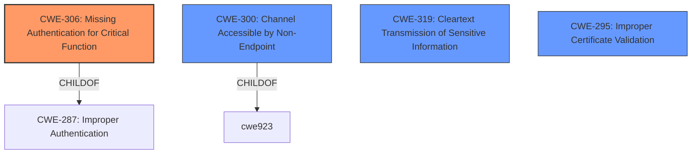

# Analysis for CVE-2021-28124

# Summary
| CWE ID  | CWE Name                                                          | Confidence | CWE Abstraction Level | CWE Vulnerability Mapping Label | CWE-Vulnerability Mapping Notes |
| :-------- | :---------------------------------------------------------------- | :--------- | :-------------------- | :------------------------------ | :-------------------------------- |
| CWE-306 | Missing Authentication for Critical Function                       | 1          | Base                  | Primary CWE                     | Allowed                           |
| CWE-300 | Channel Accessible by Non-Endpoint                                | 0.5        | Class                 | Secondary Candidate             | Discouraged                      |
| CWE-319 | Cleartext Transmission of Sensitive Information                   | 0.4        | Base                  | Secondary Candidate             | Allowed                           |
| CWE-295 | Improper Certificate Validation                                   | 0.4        | Base                  | Secondary Candidate             | Allowed                           |

## Evidence and Confidence

*   **Confidence Score:** 0.9
*   **Evidence Strength:** HIGH

## Relationship Analysis
The primary CWE is CWE-306 which is a base level CWE. It is a child of CWE-287 which is improper authentication. There are other potential candidates to consider that are peers of CWE-295, but the description focuses on the missing authentication. The main relationship is a hierarchical one, with CWE-306 providing the most specific description of the vulnerability.

## Vulnerability Chain
The chain starts with the **missing server authentication** (CWE-306), leading to a man-in-the-middle (MITM) attack on the support channel UI session.
  - The missing authentication is the root cause
  - The MITM attack is the impact.

## Summary of Analysis
The initial analysis focused on identifying the **root cause** of the vulnerability, which is the **missing server authentication**. This aligns directly with CWE-306, "Missing Authentication for Critical Function". The retriever results also listed CWE-306 as a potential candidate. The other candidates are less applicable because they don't address the **root cause** of the vulnerability, only the impact.

*   The assessment is heavily based on the vulnerability description, specifically the phrase "**Missing server authentication**".
*   The graph relationships show that CWE-306 is a child of CWE-287, "Improper Authentication," which is a more general category. However, CWE-306 is more specific and accurately describes the vulnerability.
*   The selected CWE is at the optimal level of specificity because it directly addresses the **root cause** of the vulnerability, which is the **missing authentication** for a critical function.

Relevant CWE Information:

# Enhanced Context (25 CWEs)
The following CWEs were identified as potentially relevant to this vulnerability:

## CWE-300: Channel Accessible by Non-Endpoint
**Abstraction Level**: Class
**Similarity Score**: 0.78
**Source**: dense

**Description**:
The product does not adequately verify the identity of actors at both ends of a communication channel, or does not adequately ensure the integrity of the channel, in a way that allows the channel to be accessed or influenced by an actor that is not an endpoint.

**Mapping Guidance**:
- Usage: Discouraged
- Rationale: CWE-300 is commonly misused for vulnerabilities in which the prerequisites for exploitation require the adversary to be in a privileged "in-the-middle" position.

## CWE-306: Missing Authentication for Critical Function
**Abstraction Level**: Base
**Similarity Score**: 2.47
**Source**: graph

**Description**:
CWE-306: Missing Authentication for Critical Function

**Mapping Guidance**:
- Usage: Allowed
- Rationale: This CWE entry is at the Base level of abstraction, which is a preferred level of abstraction for mapping to the root causes of vulnerabilities.

### CWE Analysis and Selection:

*   **CWE-306: Missing Authentication for Critical Function**
    *   **Explanation:** The vulnerability description explicitly states "**Missing server authentication**," which directly corresponds to the definition of CWE-306. This weakness allows an attacker to perform a man-in-the-middle attack.
    *   **Security Implications:** This allows an attacker to impersonate a legitimate server, potentially gaining access to sensitive data or control over the system.
    *   **Relationship:** CWE-306 is a child of CWE-287 (Improper Authentication), providing a more specific classification.
    *   **Mapping Guidance:** The usage is "Allowed," and the rationale states that it's at the Base level of abstraction, which is preferred.
    *   **Confidence:** 1

*   **CWE-300: Channel Accessible by Non-Endpoint**
    *   **Explanation:** This CWE describes a situation where a communication channel can be accessed or influenced by an unauthorized actor. While the vulnerability does lead to a MITM, CWE-306 is a better fit.
    *   **Security Implications:** This can lead to eavesdropping and modification of communication.
    *   **Relationship:** CWE-300 is a class-level CWE, making it less specific than CWE-306. It is a parent of CWE-923.
    *   **Mapping Guidance:** The usage is "Discouraged" because it's often misused when a more specific root cause can be identified.
    *   **Confidence:** 0.5

*   **CWE-319: Cleartext Transmission of Sensitive Information**
    *   **Explanation:** This CWE describes the transmission of sensitive data in cleartext. While MITM could enable sniffing of data, the root cause is the lack of authentication, not cleartext transmission.
    *   **Security Implications:** Allows unauthorized actors to intercept sensitive data.
    *   **Relationship:** None directly related
    *   **Mapping Guidance:** Usage is "Allowed," but it's not the primary weakness.
    *   **Confidence:** 0.4

*   **CWE-295: Improper Certificate Validation**
    *   **Explanation:** This CWE describes improper validation of certificates. While this is related to authentication, the vulnerability description does not mention certificates, so this is less applicable.
    *   **Security Implications:** Allows attackers to spoof trusted entities.
    *   **Relationship:** PeerOf -> CWE-322
    *   **Mapping Guidance:** Usage is "Allowed," but it's not the primary weakness.
    *   **Confidence:** 0.4

*   **CWE-1188: Initialization of a Resource with an Insecure Default**
    *   **Explanation:** This CWE describes a situation where a resource is initialized with an insecure default. The vulnerability description does not mention any resource initialization, so this is not applicable.

*   **CWE-302: Authentication Bypass by Assumed-Immutable Data**
    *   **Explanation:** This CWE describes authentication bypass by manipulating data elements assumed to be immutable. The vulnerability description does not mention any data manipulation, so this is less applicable.