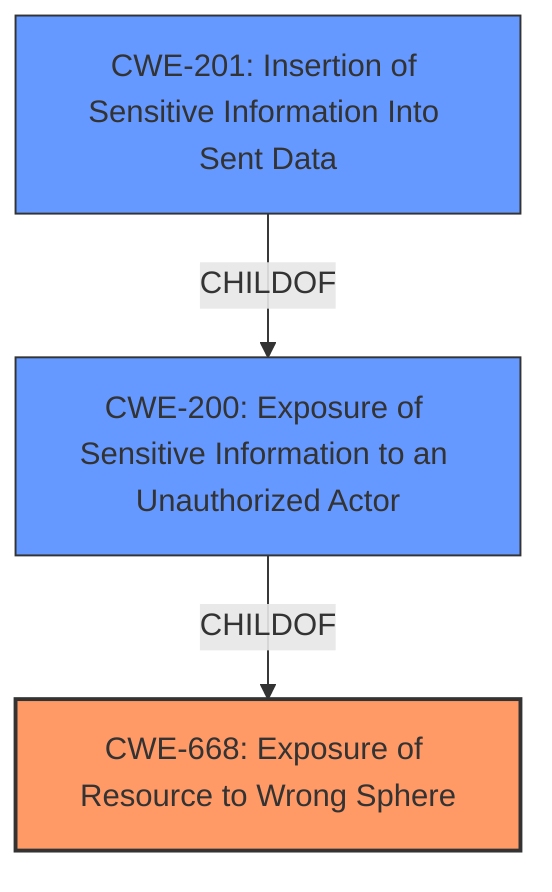

# Analysis for CVE-2021-28133

# Summary
| CWE ID | CWE Name | Confidence | CWE Abstraction Level | CWE Vulnerability Mapping Label | CWE-Vulnerability Mapping Notes |
|---|---|---|---|---|---|
| CWE-668 | Exposure of Resource to Wrong Sphere | 0.9 | Class | Primary | Allowed |
| CWE-200 | Exposure of Sensitive Information to an Unauthorized Actor | 0.7 | Class | Secondary | Discouraged |
| CWE-201 | Insertion of Sensitive Information Into Sent Data | 0.6 | Base | Secondary | Allowed |

## Evidence and Confidence

*   **Confidence Score:** 0.8
*   **Evidence Strength:** HIGH

## Relationship Analysis
The primary relationship that influenced my decision was the parent-child relationship between CWE-668 and CWE-200. CWE-668 (Exposure of Resource to Wrong Sphere) is a broader classification, while CWE-200 (Exposure of Sensitive Information to an Unauthorized Actor) is a child of CWE-668, representing a more specific case of exposing sensitive data. However, given the nature of the vulnerability, where screen contents are unintentionally exposed, CWE-668 is more appropriate to represent the root cause. While CWE-201 represents the insertion of sensitive information to sent data, this vulnerability is due to the application exposing the resource to the wrong sphere by not properly restricting the rendering of UI layers.

## Vulnerability Chain
The chain of events for this vulnerability is as follows:
1.  **Improper Handling of Screen Sharing:** The root cause is the **improper** way Zoom handles screen sharing of specific application windows.
2.  **Exposure of Resource to Wrong Sphere (CWE-668):** This leads to the exposure of unshared screen content to other meeting participants.
3.  **Exposure of Sensitive Information to an Unauthorized Actor (CWE-200):** Sensitive data present in the unshared windows is then unintentionally revealed.
4.  **Potential Data Exfiltration:** An attacker could record the meeting and later review the recording to access the exposed data.

## Summary of Analysis
Initially, the vulnerability description and the "CVE Reference Links Content Summary" section pointed towards both CWE-668 and CWE-200. The key evidence for CWE-668 is: "The core issue is that screen content from unshared windows is briefly exposed to other meeting participants when it shouldn't be.". This directly aligns with the description of CWE-668, which discusses exposing a resource to the wrong control sphere.

The "CVE Reference Links Content Summary" states: "Exposure of Resource to Wrong Sphere (CWE-668): The core issue is that screen content from unshared windows is briefly exposed to other meeting participants when it shouldn't be."

The "Vulnerability Description Key Phrases" section and CVE description highlight the **impact** of reading private information, making CWE-200 a reasonable consideration as a secondary weakness because sensitive information is exposed. The retriever results listed CWE-201 as a possibility.

Although the retriever results listed CWE-201, this CWE is less appropriate because the vulnerability isn't primarily about inserting sensitive data into sent data, but rather the **improper** exposure of screen content due to the **improper** handling of the screen sharing functionality.

CWE-668 is at the Class level, but it is more fitting than its children, as the **root cause** is the application's **failure** to properly control access to the screen resource. It is important to note that CWE-668 is discouraged for use, but based on the vulnerability notes, it can be used if lower-level CWE IDs are not applicable.

Therefore, CWE-668 is the most appropriate primary CWE, capturing the **root cause** of the vulnerability.

Relevant CWE Information:

# Enhanced Context (25 CWEs)
The following CWEs were identified as potentially relevant to this vulnerability:

## CWE-59: Improper Link Resolution Before File Access ('Link Following')
**Abstraction Level**: Base
**Similarity Score**: 0.81
**Source**: dense

**Description**:
The product attempts to access a file based on the filename, but it does not properly prevent that filename from identifying a link or shortcut that resolves to an unintended resource.

**Mapping Guidance**:
- Usage: Allowed
- Rationale: This CWE entry is at the Base level of abstraction, which is a preferred level of abstraction for mapping to the root causes of vulnerabilities.

## CWE-61: UNIX Symbolic Link (Symlink) Following
**Abstraction Level**: Compound
**Similarity Score**: 0.81
**Source**: dense

**Description**:
The product, when opening a file or directory, does not sufficiently account for when the file is a symbolic link that resolves to a target outside of the intended control sphere. This could allow an attacker to cause the product to operate on unauthorized files.

**Mapping Guidance**:
- Usage: Allowed
- Rationale: This is a well-known Composite of multiple weaknesses that must all occur simultaneously, although it is attack-oriented in nature.

## CWE-41: Improper Resolution of Path Equivalence
**Abstraction Level**: Base
**Similarity Score**: 0.75
**Source**: dense

**Description**:
The product is vulnerable to file system contents disclosure through path equivalence. Path equivalence involves the use of special characters in file and directory names. The associated manipulations are intended to generate multiple names for the same object.

**Mapping Guidance**:
- Usage: Allowed
- Rationale: This CWE entry is at the Base level of abstraction, which is a preferred level of abstraction for mapping to the root causes of vulnerabilities.

## CWE-62: UNIX Hard Link
**Abstraction Level**: Variant
**Similarity Score**: 0.75
**Source**: dense

**Description**:
The product, when opening a file or directory, does not sufficiently account for when the name is associated with a hard link to a target that is outside of the intended control sphere. This could allow an attacker to cause the product to operate on unauthorized files.

**Mapping Guidance**:
- Usage: Allowed
- Rationale: This CWE entry is at the Variant level of abstraction, which is a preferred level of abstraction for mapping to the root causes of vulnerabilities.

## CWE-668: Exposure of Resource to Wrong Sphere
**Abstraction Level**: Class
**Similarity Score**: 0.74
**Source**: dense

**Description**:
The product exposes a resource to the wrong control sphere, providing unintended actors with inappropriate access to the resource.

**Mapping Guidance**:
- Usage: Discouraged
- Rationale: CWE-668 is high-level and is often misused as a catch-all when lower-level CWE IDs might be applicable. It is sometimes used for low-information vulnerability reports [REF-1287]. It is a level-1 Class (i.e., a child of a Pillar). It is not useful for trend analysis.

## CWE-23: Relative Path Traversal
**Abstraction Level**: Base
**Similarity Score**: 0.73
**Source**: dense

**Description**:
The product uses external input to construct a pathname that should be within a restricted directory, but it does not properly neutralize sequences such as ".." that can resolve to a location that is outside of that directory.

**Mapping Guidance**:
- Usage: Allowed
- Rationale: This CWE entry is at the Base level of abstraction, which is a preferred level of abstraction for mapping to the root causes of vulnerabilities.

## CWE-667: Improper Locking
**Abstraction Level**: Class
**Similarity Score**: 0.73
**Source**: dense

**Description**:
The product does not properly acquire or release a lock on a resource, leading to unexpected resource state changes and behaviors.

**Mapping Guidance**:
- Usage: Allowed-with-Review
- Rationale: This CWE entry is a Class and might have Base-level children that would be more appropriate

## CWE-427: Uncontrolled Search Path Element
**Abstraction Level**: Base
**Similarity Score**: 0.72
**Source**: dense

**Description**:
The product uses a fixed or controlled search path to find resources, but one or more locations in that path can be under the control of unintended actors.

**Mapping Guidance**:
- Usage: Allowed
- Rationale: This CWE entry is at the Base level of abstraction, which is a preferred level of abstraction for mapping to the root causes of vulnerabilities.

## CWE-73: External Control of File Name or Path
**Abstraction Level**: Base
**Similarity Score**: 0.72
**Source**: dense

**