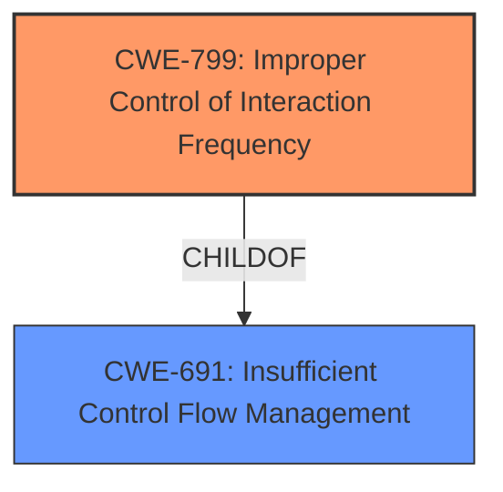

# Analysis for CVE-2021-28135

# Summary
| CWE ID  | CWE Name                                                 | Confidence | CWE Abstraction Level | CWE Vulnerability Mapping Label | CWE-Vulnerability Mapping Notes |
| :-------- | :------------------------------------------------------- | :--------- | :-------------------- | :------------------------------ | :------------------------------ |
| CWE-799 | Improper Control of Interaction Frequency                  | 0.9        | Class                | Primary                       | Allowed-with-Review             |

## Evidence and Confidence

*   **Confidence Score:** 0.9
*   **Evidence Strength:** HIGH

## Relationship Analysis
The primary identified weakness is CWE-799 [Improper Control of Interaction Frequency], which is a class-level CWE. There are no direct child CWEs that specifically apply to the Bluetooth LMP response handling context. The parent of CWE-799 is CWE-691 [Insufficient Control Flow Management]. Given the provided evidence, CWE-799 is the most specific and appropriate classification.

## Vulnerability Chain
The vulnerability chain starts with the **improper handling of continuous unsolicited LMP responses**, leading to a denial-of-service condition.

## Summary of Analysis
The primary weakness is the **failure to properly handle the reception of continuous unsolicited LMP responses**, leading to a denial of service. The vulnerability description clearly states: "The Bluetooth Classic implementation in Espressif ESP-IDF 4.4 and earlier **does not properly handle the reception of continuous unsolicited LMP responses**, allowing attackers in radio range to trigger a denial of service (crash) in ESP32 by flooding the target device with LMP Feature Response data." This aligns well with CWE-799 [Improper Control of Interaction Frequency].

The selection of CWE-799 is based on the evidence provided, specifically the **rootcause** phrase and the CVE summary, which indicates that the product **does not properly handle the reception of continuous unsolicited LMP responses**. This aligns with the description of CWE-799, which states that "The product does not properly limit the number or frequency of interactions that it has with an actor."

The confidence level is high because the vulnerability description and the CVE summary directly support the selection of CWE-799. The retriever results also list CWE-799 as the top combined result, further supporting this selection.
The graph relationships influenced the decision by illustrating that CWE-799 is a class-level CWE, and there are no more specific child CWEs that are applicable in this context.

Relevant CWE Information:

# Enhanced Context (25 CWEs)

## CWE-131: Incorrect Calculation of Buffer Size
**Abstraction Level**: Base
**Similarity Score**: 0.77
**Source**: dense

**Description**:
The product does not correctly calculate the size to be used when allocating a buffer, which could lead to a buffer overflow.

**Mapping Guidance**:
- Usage: Allowed
- Rationale: This CWE entry is at the Base level of abstraction, which is a preferred level of abstraction for mapping to the root causes of vulnerabilities.

*Not Selected*: While a buffer overflow could potentially be triggered by this vulnerability, the root cause is the **improper handling of LMP responses**, not an incorrect calculation of buffer size.

## CWE-404: Improper Resource Shutdown or Release
**Abstraction Level**: Class
**Similarity Score**: 0.77
**Source**: dense

**Description**:
The product does not release or incorrectly releases a resource before it is made available for re-use.

**Mapping Guidance**:
- Usage: Allowed-with-Review
- Rationale: This CWE entry is a Class and might have Base-level children that would be more appropriate

*Not Selected*: The primary issue is not related to resource release, but rather the handling of incoming LMP responses.

## CWE-226: Sensitive Information in Resource Not Removed Before Reuse
**Abstraction Level**: Base
**Similarity Score**: 0.76
**Source**: dense

**Description**:
The product releases a resource such as memory or a file so that it can be made available for reuse, but it does not clear or "zeroize" the information contained in the resource before the product performs a critical state transition or makes the resource available for reuse by other entities.

**Mapping Guidance**:
- Usage: Allowed
- Rationale: This CWE entry is at the Base level of abstraction, which is a preferred level of abstraction for mapping to the root causes of vulnerabilities.

*Not Selected*: This CWE is not relevant as the vulnerability does not involve the release of resources containing sensitive information.

## CWE-789: Memory Allocation with Excessive Size Value
**Abstraction Level**: Variant
**Similarity Score**: 0.76
**Source**: dense

**Description**:
The product allocates memory based on an untrusted, large size value, but it does not ensure that the size is within expected limits, allowing arbitrary amounts of memory to be allocated.

**Mapping Guidance**:
- Usage: Allowed
- Rationale: This CWE entry is at the Variant level of abstraction, which is a preferred level of abstraction for mapping to the root causes of vulnerabilities.

*Not Selected*: This is not about memory allocation with excessive size, but about **handling the frequency of interactions**.

## CWE-405: Asymmetric Resource Consumption (Amplification)
**Abstraction Level**: Class
**Similarity Score**: 0.76
**Source**: dense

**Description**:
The product does not properly control situations in which an adversary can cause the product to consume or produce excessive resources without requiring the adversary to invest equivalent work or otherwise prove authorization, i.e., the adversary's influence is "asymmetric."

**Mapping Guidance**:
- Usage: Allowed-with-Review
- Rationale: This CWE entry is a Class and might have Base-level children that would be more appropriate

*Not Selected*: This CWE is related but less precise than CWE-799 [Improper Control of Interaction Frequency]. While the vulnerability allows asymmetric resource consumption, the core issue is the **lack of control over interaction frequency**.

## CWE-805: Buffer Access with Incorrect Length Value
**Abstraction Level**: Base
**Similarity Score**: 0.75
**Source**: dense

**Description**:
The product uses a sequential operation to read or write a buffer, but it uses an incorrect length value that causes it to access memory that is outside of the bounds of the buffer.

**Mapping Guidance**:
- Usage: Allowed
- Rationale: This CWE entry is at the Base level of abstraction, which is a preferred level of abstraction for mapping to the root causes of vulnerabilities.

*Not Selected*: This is not about incorrect length value but about **handling the frequency of interactions**.

## CWE-130: Improper Handling of Length Parameter Inconsistency
**Abstraction Level**: Base
**Similarity Score**: 0.75
**Source**: dense

**Description**:
The product parses a formatted message or structure, but it does not handle or incorrectly handles a length field that is inconsistent with the actual length of the associated data.

**Mapping Guidance**:
- Usage: Allowed
- Rationale: This CWE entry is at the Base level of abstraction, which is a preferred level of abstraction for mapping to the root causes of vulnerabilities.

*Not Selected*: This is not about handling of length parameter but about **handling the frequency of interactions**.

## CWE-1325: Improperly Controlled Sequential Memory Allocation
**Abstraction Level**: Base
**Similarity Score**: 0.75
**Source**: dense

**Description**:
The product manages a group of objects or resources and performs a separate memory allocation for each object, but it does not properly limit the total amount of memory that is consumed by all of the combined objects.

**Mapping Guidance**:
- Usage: Allowed
- Rationale: This CWE entry is at the Base level of abstraction, which is a preferred level of abstraction for mapping to the root causes of vulnerabilities.

*Not Selected*: This is not about memory allocation but about **handling the frequency of interactions**.

## CWE-191: Integer Underflow (Wrap or Wraparound)
**Abstraction Level**: Base
**Similarity Score**: 0.75
**Source**: dense

**Description**:
The product subtracts one value from another, such that the result is less than the minimum allowable integer value, which produces a value that is not equal to the correct result.

**Mapping Guidance**:
- Usage: Allowed
- Rationale: This CWE entry is at the Base level of abstraction, which is a preferred level of abstraction for mapping to the root causes of vulnerabilities.

*Not Selected*: This is not about integer underflow, but about **handling the frequency of interactions**.

## CWE-125: Out-of-bounds Read
**Abstraction Level**: Base
**Similarity Score**: 5224.82
**Source**: sparse

**Description**:
The product reads data past the end, or before the beginning, of the intended buffer.

**Mapping Guidance**:
- Usage: Allowed
- Rationale: This CWE entry is at the Base