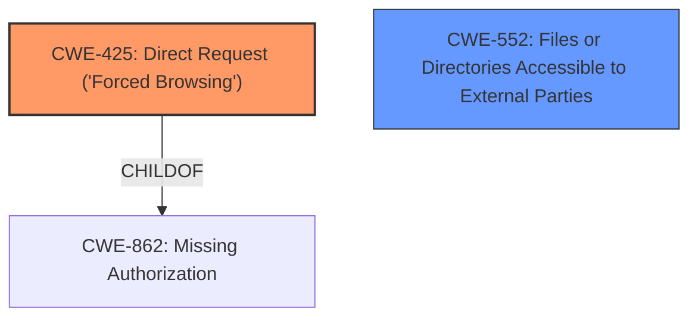

# Raw Analyzer Response for CVE-2021-28150

# Summary
| CWE ID | CWE Name | Confidence | CWE Abstraction Level | CWE Vulnerability Mapping Label | CWE-Vulnerability Mapping Notes |
|---|---|---|---|---|---|
| CWE-425 | Direct Request ('Forced Browsing') | 0.9 | Base | Primary | Allowed |
| CWE-552 | Files or Directories Accessible to External Parties | 0.7 | Base | Secondary | Allowed |

## Evidence and Confidence

*   **Confidence Score:** 0.8
*   **Evidence Strength:** HIGH

## Relationship Analysis
The primary CWE, CWE-425 [Direct Request ('Forced Browsing')], is a base-level CWE that accurately represents the vulnerability where an unauthenticated user can directly access a restricted resource. CWE-552 [Files or Directories Accessible to External Parties] is a secondary CWE that highlights the impact of the vulnerability, which is that sensitive files are accessible to unauthorized parties. CWE-425 is a child of CWE-862, which is Missing Authorization. This relationship highlights the underlying authorization issue that enables the vulnerability.

## Vulnerability Chain
The vulnerability chain starts with a **missing authorization** check, leading to a **direct request** to a sensitive file, which ultimately results in the **exposure of sensitive information**.
  - **Root Cause:** Missing authorization check on /backup2.cgi
  - **Weakness:** CWE-425 [Direct Request ('Forced Browsing')]
  - **Impact:** Exposure of sensitive information due to direct access to cli.conf

## Summary of Analysis
The primary assessment is based on the provided evidence, which clearly states that an unprivileged guest user can access the `cli.conf` file containing sensitive information via `/backup2.cgi` without proper authorization. This aligns directly with the definition of CWE-425 [Direct Request ('Forced Browsing')], where the web application **does not adequately enforce appropriate authorization on all restricted URLs, scripts, or files.**

The "CVE Reference Links Content Summary" section explicitly mentions:
"**Insecure direct object references to static files**:
*   **Root Cause:** The device allows direct access to a sensitive configuration file `cli.conf` via `/backup2.cgi` without authentication.
*   **Vulnerability:** Insecure Direct Object Reference.
*   **Impact:** Sensitive information such as the administrator password can be revealed.
*   **Attack Vector:** Direct access to the file via `http://[ip]/backup2.cgi`.
*   **Attacker Capabilities/Position:** The attacker needs network access to the device."

The selection of CWE-425 [Direct Request ('Forced Browsing')] is at the optimal level of specificity (Base) as it directly describes the **lack of authorization** leading to direct access to a restricted resource. Other CWEs like CWE-284 [Improper Access Control] are too high-level (Pillar) and don't provide enough specific information about the vulnerability. CWE-552 [Files or Directories Accessible to External Parties] is a secondary CWE that describes the impact of the **missing authorization**, which is the exposure of sensitive files to external parties.

Relevant CWE Information:

# Enhanced Context (25 CWEs)

## CWE-274: Improper Handling of Insufficient Privileges
**Abstraction Level**: Base
**Similarity Score**: 0.77

**Description**:
The product does not handle or incorrectly handles when it has insufficient privileges to perform an operation, leading to resultant weaknesses.
*This CWE is not applicable because the issue is not about handling insufficient privileges but about the **missing authorization** to access the resource in the first place.*

## CWE-639: Authorization Bypass Through User-Controlled Key
**Abstraction Level**: Base
**Similarity Score**: 0.77

**Description**:
The system's authorization functionality does not prevent one user from gaining access to another user's data or record by modifying the key value identifying the data.
*This CWE is not applicable because the vulnerability is not related to modifying a key value to bypass authorization. The user is **directly accessing the resource without any authorization check**.*

## CWE-653: Improper Isolation or Compartmentalization
**Abstraction Level**: Class
**Similarity Score**: 0.76

**Description**:
The product does not properly compartmentalize or isolate functionality, processes, or resources that require different privilege levels, rights, or permissions.
*This CWE is not applicable because the vulnerability is not about improper isolation but about the **missing authorization** to access the resource in the first place.*

## CWE-807: Reliance on Untrusted Inputs in a Security Decision
**Abstraction Level**: Base
**Similarity Score**: 0.76

**Description**:
The product uses a protection mechanism that relies on the existence or values of an input, but the input can be modified by an untrusted actor in a way that bypasses the protection mechanism.
*This CWE is not applicable because the vulnerability does not rely on untrusted inputs to make a security decision. The resource is **directly accessible without any checks**.*

## CWE-472: External Control of Assumed-Immutable Web Parameter
**Abstraction Level**: Base
**Similarity Score**: 0.76

**Description**:
The web application does not sufficiently verify inputs that are assumed to be immutable but are actually externally controllable, such as hidden form fields.
*This CWE is not applicable because the vulnerability does not involve modification of assumed-immutable web parameters. The resource is **directly accessible without any checks**.*

## CWE-1220: Insufficient Granularity of Access Control
**Abstraction Level**: Base
**Similarity Score**: 0.76

**Description**:
The product implements access controls via a policy or other feature with the intention to disable or restrict accesses (reads and/or writes) to assets in a system from untrusted agents. However, implemented access controls lack required granularity, which renders the control policy too broad because it allows accesses from unauthorized agents to the security-sensitive assets.
*This CWE is not applicable because the vulnerability doesn't involve an access control policy that is too broad. There's a **lack of access control**.*

## CWE-668: Exposure of Resource to Wrong Sphere
**Abstraction Level**: Class
**Similarity Score**: 0.76

**Description**:
The product exposes a resource to the wrong control sphere, providing unintended actors with inappropriate access to the resource.
*This CWE is not applicable because it is too general and high-level. CWE-425 [Direct Request ('Forced Browsing')] is a more specific and appropriate match.*

## CWE-280: Improper Handling of Insufficient Permissions or Privileges
**Abstraction Level**: Base
**Similarity Score**: 0.76

**Description**:
The product does not handle or incorrectly handles when it has insufficient privileges to access resources or functionality as specified by their permissions. This may cause it to follow unexpected code paths that may leave the product in an invalid state.
*This CWE is not applicable because the issue is not about handling insufficient permissions but about the **missing authorization** to access the resource in the first place.*

## CWE-41: Improper Resolution of Path Equivalence
**Abstraction Level**: Base
**Similarity Score**: 0.76

**Description**:
The product is vulnerable to file system contents disclosure through path equivalence. Path equivalence involves the use of special characters in file and directory names. The associated manipulations are intended to generate multiple names for the same object.
*This CWE is not applicable because the vulnerability is not related to path equivalence or special characters in file names. The resource is **directly accessible without any checks**.*

## CWE-552: Files or Directories Accessible to External Parties
**Abstraction Level**: Base
**Similarity Score**: 0.75

**Description**:
The product makes files or directories accessible to unauthorized actors, even though they should not be.
*This CWE is a secondary consideration as the impact of the **missing authorization** is that external parties have access to the files.*

## CWE-22: Improper Limitation of a Pathname to a Restricted Directory ('Path Traversal')
**Abstraction Level**: Base
**Similarity Score**: 6577.65

**Description**:
The product uses external input to construct a pathname that is intended to identify a file or directory that is located underneath a restricted parent directory, but the product does not properly neutralize special elements within the pathname that can cause the pathname to resolve to a location that is outside of the restricted directory.
*This CWE is not applicable because the vulnerability doesn't involve path traversal. The resource is **directly accessible without any checks**.*

## CWE-425: Direct Request ('Forced Browsing')
**Abstraction Level**: Base
**Similarity Score**: 6470.50

**