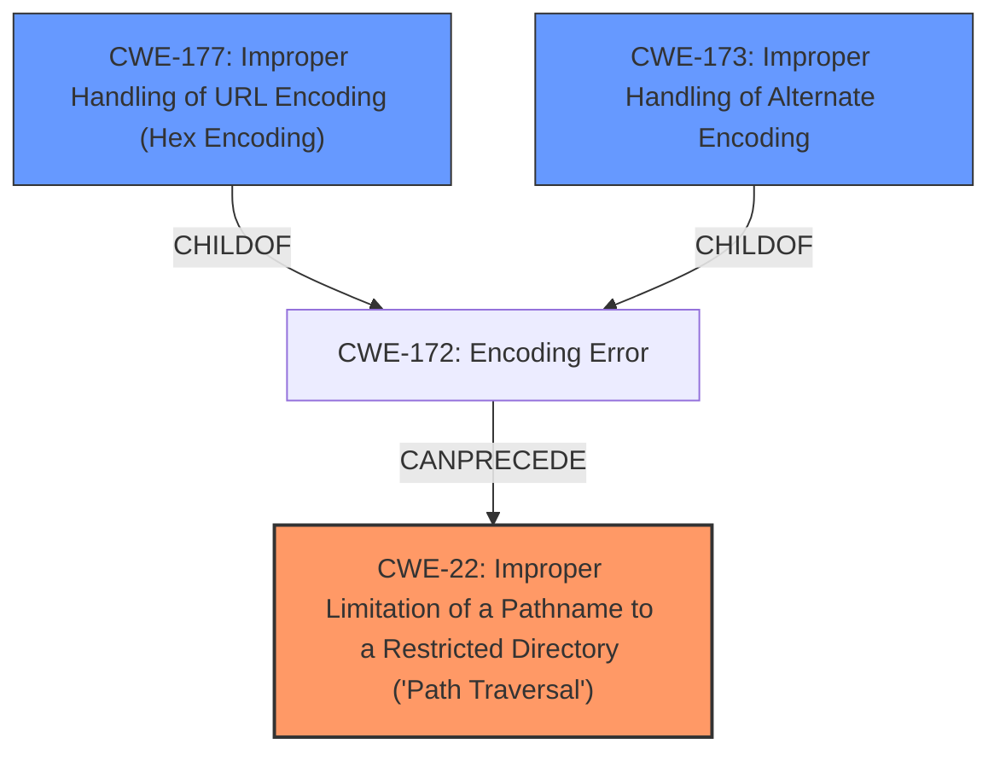

# Analysis for CVE-2021-28164

# Summary
| CWE ID  | CWE Name  | Confidence | CWE Abstraction Level | CWE Vulnerability Mapping Label | CWE-Vulnerability Mapping Notes |
|---|---|---|---|---|---|
| CWE-22 | Improper Limitation of a Pathname to a Restricted Directory ('Path Traversal') | 0.9 | Base | Allowed | Primary CWE |
| CWE-177 | Improper Handling of URL Encoding (Hex Encoding) | 0.7 | Variant | Allowed | Secondary Candidate |
| CWE-173 | Improper Handling of Alternate Encoding | 0.6 | Variant | Allowed | Secondary Candidate |

## Evidence and Confidence

*   **Confidence Score:** 0.9
*   **Evidence Strength:** HIGH

## Relationship Analysis
The primary CWE is CWE-22, which is a base level CWE. CWE-177 and CWE-173 are variants that can lead to path traversal. The vulnerability involves accessing protected resources using encoded path traversal sequences, making CWE-22 the core issue. CWE-177 and CWE-173 represent the specific encoding bypass techniques used.



## Vulnerability Chain
The chain of weaknesses begins with the **improper handling of URL encoding** (potentially CWE-177 or CWE-173), leading to a failure to neutralize path traversal sequences, ultimately resulting in **improper limitation of a pathname to a restricted directory** (CWE-22). This allows attackers to bypass intended restrictions and access sensitive files like web.xml.

## Summary of Analysis
The primary weakness is CWE-22 because the vulnerability's description explicitly mentions accessing protected resources by bypassing directory restrictions. The vulnerability allows requests with URIs that contain `%2e` or `%2e%2e` segments to access protected resources within the `WEB-INF` directory. The **default compliance mode** allows these requests.

The following is quoted from the CVE Reference Links Content Summary section:
```
{
  "cve": "CVE-2021-28164",
  "description": "The default compliance mode allows requests with URIs that contain `%2e` or `%2e%2e` segments to access protected resources within the `WEB-INF` directory. For example a request to `/context/%2e/WEB-INF/web.xml` can retrieve the `web.xml` file. This can reveal sensitive information regarding the implementation of a web application.",
  "affected_versions": [
    "9.4.37.v20210219",
    "9.4.38.v20210224"
  ],
  "fixed_versions": [
    "9.4.39"
  ],
  "vulnerability": {
    "root_cause": "A more precise implementation of RFC3986 with regards to URI decoding, together with some new compliance modes, allowed `%2e` or `%2e%2e` characters, which were not assumed by common Servlet implementations, to be excluded for URI normalization. This enabled accessing resources within the WEB-INF directory.",
    "weakness": [
      "CWE-200",
      "CWE-551"
    ],
    "impact": "Disclosure of sensitive information regarding the implementation of a web application by accessing protected resources within the `WEB-INF` directory, for example, retrieving the `web.xml` file.",
    "attack_vector": "Network",
     "attacker_capabilities": "None",
     "cvss_score":"5.3"
  }
}
```

CWE-177 (Improper Handling of URL Encoding) and CWE-173 (Improper Handling of Alternate Encoding) were also considered because the attack vector involves URL-encoded characters. However, the core issue is the **failure to properly restrict access to the protected directory**, making CWE-22 the most accurate primary classification. CWE-177 and CWE-173 could be considered secondary because they describe how the path traversal is achieved, but the evidence best supports CWE-22 as the primary weakness.

The abstraction level of CWE-22 (Base) is appropriate as it directly represents the vulnerability. CWE-177 and CWE-173, being more specific variants, are suitable as secondary classifications to provide more context to the attack.

Relevant CWE Information:

# Enhanced Context (25 CWEs)
The following CWEs were identified as potentially relevant to this vulnerability:

## CWE-177: Improper Handling of URL Encoding (Hex Encoding)
**Abstraction Level**: Variant
**Similarity Score**: 0.80
**Source**: dense

**Description**:
The product does not properly handle when all or part of an input has been URL encoded.

## CWE-173: Improper Handling of Alternate Encoding
**Abstraction Level**: Variant
**Similarity Score**: 0.79
**Source**: dense

**Description**:
The product does not properly handle when an input uses an alternate encoding that is valid for the control sphere to which the input is being sent.

## CWE-41: Improper Resolution of Path Equivalence
**Abstraction Level**: Base
**Similarity Score**: 0.79
**Source**: dense

**Description**:
The product is vulnerable to file system contents disclosure through path equivalence. Path equivalence involves the use of special characters in file and directory names. The associated manipulations are intended to generate multiple names for the same object.

## CWE-23: Relative Path Traversal
**Abstraction Level**: Base
**Similarity Score**: 0.78
**Source**: dense

**Description**:
The product uses external input to construct a pathname that should be within a restricted directory, but it does not properly neutralize sequences such as ".." that can resolve to a location that is outside of that directory.

## CWE-611: Improper Restriction of XML External Entity Reference
**Abstraction Level**: Base
**Similarity Score**: 0.78
**Source**: dense

**Description**:
The product processes an XML document that can contain XML entities with URIs that resolve to documents outside of the intended sphere of control, causing the product to embed incorrect documents into its output.

## CWE-116: Improper Encoding or Escaping of Output
**Abstraction Level**: Class
**Similarity Score**: 0.78
**Source**: dense

**Description**:
The product prepares a structured message for communication with another component, but encoding or escaping of the data is either missing or done incorrectly. As a result, the intended structure of the message is not preserved.

## CWE-668: Exposure of Resource to Wrong Sphere
**Abstraction Level**: Class
**Similarity Score**: 0.77
**Source**: dense

**Description**:
The product exposes a resource to the wrong control sphere, providing unintended actors with inappropriate access to the resource.

## CWE-74: Improper Neutralization of Special Elements in Output Used by a Downstream Component ('Injection')
**Abstraction Level**: Class
**Similarity Score**: 0.77
**Source**: dense

**Description**:
The product constructs all or part of a command, data structure, or record using externally-influenced input from an upstream component, but it does not neutralize or incorrectly neutralizes special elements that could modify how it is parsed or interpreted when it is sent to a downstream component.

## CWE-838: Inappropriate Encoding for Output Context
**Abstraction Level**: Base
**Similarity Score**: 0.77
**Source**: dense

**Description**:
The product uses or specifies an encoding when generating output to a downstream component, but the specified encoding is not the same as the encoding that is expected by the downstream component.

## CWE-923: Improper Restriction of Communication Channel to Intended Endpoints
**Abstraction Level**: Class
**Similarity Score**: 0.76
**Source**: dense

**Description**:
The product establishes a communication channel to (or from) an endpoint for privileged or protected operations, but it does not properly ensure that it is communicating with the correct endpoint.

## CWE-23: Relative Path Traversal
**Abstraction Level**: Base
**Similarity Score**: 4142.59
**Source**: sparse

**Description**:
The product uses external input to construct a pathname that should be within a restricted directory, but it does not properly neutralize sequences such as ".." that can resolve to a location that is outside of that directory.