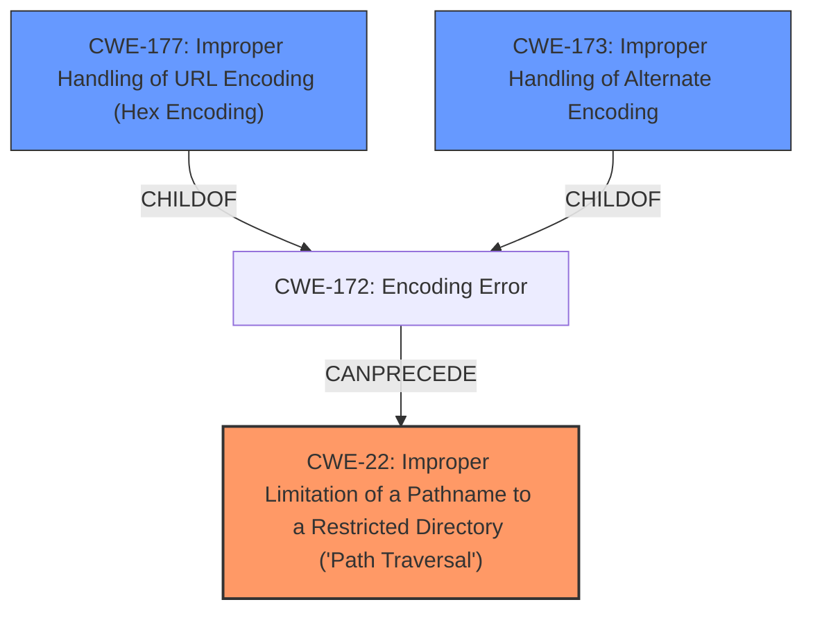

# Analysis for CVE-2021-28164

# Summary
| CWE ID  | CWE Name  | Confidence | CWE Abstraction Level | CWE Vulnerability Mapping Label | CWE-Vulnerability Mapping Notes |
|---|---|---|---|---|---|
| CWE-22 | Improper Limitation of a Pathname to a Restricted Directory ('Path Traversal') | 0.9 | Base | Allowed | Primary CWE |
| CWE-177 | Improper Handling of URL Encoding (Hex Encoding) | 0.7 | Variant | Allowed | Secondary Candidate |
| CWE-173 | Improper Handling of Alternate Encoding | 0.6 | Variant | Allowed | Secondary Candidate |

## Evidence and Confidence

*   **Confidence Score:** 0.9
*   **Evidence Strength:** HIGH

## Relationship Analysis
The primary CWE is CWE-22, which is a base level CWE. CWE-177 and CWE-173 are variants that can lead to path traversal. The vulnerability involves accessing protected resources using encoded path traversal sequences, making CWE-22 the core issue. CWE-177 and CWE-173 represent the specific encoding bypass techniques used.



## Vulnerability Chain
The chain of weaknesses begins with the **improper handling of URL encoding** (potentially CWE-177 or CWE-173), leading to a failure to neutralize path traversal sequences, ultimately resulting in **improper limitation of a pathname to a restricted directory** (CWE-22). This allows attackers to bypass intended restrictions and access sensitive files like web.xml.

## Summary of Analysis
The primary weakness is CWE-22 because the vulnerability's description explicitly mentions accessing protected resources by bypassing directory restrictions. The vulnerability allows requests with URIs that contain `%2e` or `%2e%2e` segments to access protected resources within the `WEB-INF` directory. The **default compliance mode** allows these requests.

The following is quoted from the CVE Reference Links Content Summary section:
```
{
  "cve": "CVE-2021-28164",
  "description": "The default compliance mode allows requests with URIs that contain `%2e` or `%2e%2e` segments to access protected resources within the `WEB-INF` directory. For example a request to `/context/%2e/WEB-INF/web.xml` can retrieve the `web.xml` file. This can reveal sensitive information regarding the implementation of a web application.",
  "affected_versions": [
    "9.4.37.v20210219",
    "9.4.38.v20210224"
  ],
  "fixed_versions": [
    "9.4.39"
  ],
  "vulnerability": {
    "root_cause": "A more precise implementation of RFC3986 with regards to URI decoding, together with some new compliance modes, allowed `%2e` or `%2e%2e` characters, which were not assumed by common Servlet implementations, to be excluded for URI normalization. This enabled accessing resources within the WEB-INF directory.",
    "weakness": [
      "CWE-200",
      "CWE-551"
    ],
    "impact": "Disclosure of sensitive information regarding the implementation of a web application by accessing protected resources within the `WEB-INF` directory, for example, retrieving the `web.xml` file.",
    "attack_vector": "Network",
     "attacker_capabilities": "None",
     "cvss_score":"5.3"
  }
}
```

CWE-177 (Improper Handling of URL Encoding) and CWE-173 (Improper Handling of Alternate Encoding) were also considered because the attack vector involves URL-encoded characters. However, the core issue is the **failure to properly restrict access to the protected directory**, making CWE-22 the most accurate primary classification. CWE-177 and CWE-173 could be considered secondary because they describe how the path traversal is achieved, but the evidence best supports CWE-22 as the primary weakness.

The abstraction level of CWE-22 (Base) is appropriate as it directly represents the vulnerability. CWE-177 and CWE-173, being more specific variants, are suitable as secondary classifications to provide more context to the attack.

Relevant CWE Information:

# Enhanced Context (25 CWEs)
The following CWEs were identified as potentially relevant to this vulnerability:

## CWE-177: Improper Handling of URL Encoding (Hex Encoding)
**Abstraction Level**: Variant
**Similarity Score**: 0.80
**Source**: dense

**Description**:
The product does not properly handle when all or part of an input has been URL encoded.

## CWE-173: Improper Handling of Alternate Encoding
**Abstraction Level**: Variant
**Similarity Score**: 0.79
**Source**: dense

**Description**:
The product does not properly handle when an input uses an alternate encoding that is valid for the control sphere to which the input is being sent.

## CWE-41: Improper Resolution of Path Equivalence
**Abstraction Level**: Base
**Similarity Score**: 0.79
**Source**: dense

**Description**:
The product is vulnerable to file system contents disclosure through path equivalence. Path equivalence involves the use of special characters in file and directory names. The associated manipulations are intended to generate multiple names for the same object.

## CWE-23: Relative Path Traversal
**Abstraction Level**: Base
**Similarity Score**: 0.78
**Source**: dense

**Description**:
The product uses external input to construct a pathname that should be within a restricted directory, but it does not properly neutralize sequences such as ".." that can resolve to a location that is outside of that directory.

## CWE-611: Improper Restriction of XML External Entity Reference
**Abstraction Level**: Base
**Similarity Score**: 0.78
**Source**: dense

**Description**:
The product processes an XML document that can contain XML entities with URIs that resolve to documents outside of the intended sphere of control, causing the product to embed incorrect documents into its output.

## CWE-116: Improper Encoding or Escaping of Output
**Abstraction Level**: Class
**Similarity Score**: 0.78
**Source**: dense

**Description**:
The product prepares a structured message for communication with another component, but encoding or escaping of the data is either missing or done incorrectly. As a result, the intended structure of the message is not preserved.

## CWE-668: Exposure of Resource to Wrong Sphere
**Abstraction Level**: Class
**Similarity Score**: 0.77
**Source**: dense

**Description**:
The product exposes a resource to the wrong control sphere, providing unintended actors with inappropriate access to the resource.

## CWE-74: Improper Neutralization of Special Elements in Output Used by a Downstream Component ('Injection')
**Abstraction Level**: Class
**Similarity Score**: 0.77
**Source**: dense

**Description**:
The product constructs all or part of a command, data structure, or record using externally-influenced input from an upstream component, but it does not neutralize or incorrectly neutralizes special elements that could modify how it is parsed or interpreted when it is sent to a downstream component.

## CWE-838: Inappropriate Encoding for Output Context
**Abstraction Level**: Base
**Similarity Score**: 0.77
**Source**: dense

**Description**:
The product uses or specifies an encoding when generating output to a downstream component, but the specified encoding is not the same as the encoding that is expected by the downstream component.

## CWE-923: Improper Restriction of Communication Channel to Intended Endpoints
**Abstraction Level**: Class
**Similarity Score**: 0.76
**Source**: dense

**Description**:
The product establishes a communication channel to (or from) an endpoint for privileged or protected operations, but it does not properly ensure that it is communicating with the correct endpoint.

## CWE-23: Relative Path Traversal
**Abstraction Level**: Base
**Similarity Score**: 4142.59
**Source**: sparse

**Description**:
The product uses external input to construct a pathname that should be within a restricted directory, but it does not properly neutralize sequences such as ".." that can resolve to a location that is outside of that directory.

# Enhanced Query for CVE-2021-28164

## Vulnerability Description
In Eclipse Jetty 9.4.37.v20210219 to 9.4.38.v20210224, the **default compliance mode** allows requests with URIs that contain %2e or %2e%2e segments to access protected resources within the WEB-INF directory. For example a request to /context/%2e/WEB-INF/web.xml can retrieve the web.xml file. This can reveal sensitive information regarding the implementation of a web application.

### Vulnerability Description Key Phrases
- **rootcause:** **default compliance mode**
- **impact:** access protected resources within the WEB-INF directory
- **vector:** requests with URIs that contain %2e or %2e%2e segments
- **product:** Eclipse Jetty
- **version:** 9.4.37.v20210219 to 9.4.38.v20210224

## CVE Reference Links Content Summary
```
{
  "cve": "CVE-2021-28164",
  "description": "The default compliance mode allows requests with URIs that contain `%2e` or `%2e%2e` segments to access protected resources within the `WEB-INF` directory. For example a request to `/context/%2e/WEB-INF/web.xml` can retrieve the `web.xml` file. This can reveal sensitive information regarding the implementation of a web application.",
  "affected_versions": [
    "9.4.37.v20210219",
    "9.4.38.v20210224"
  ],
  "fixed_versions": [
    "9.4.39"
  ],
  "vulnerability": {
    "root_cause": "A more precise implementation of RFC3986 with regards to URI decoding, together with some new compliance modes, allowed `%2e` or `%2e%2e` characters, which were not assumed by common Servlet implementations, to be excluded for URI normalization. This enabled accessing resources within the WEB-INF directory.",
    "weakness": [
      "CWE-200",
      "CWE-551"
    ],
    "impact": "Disclosure of sensitive information regarding the implementation of a web application by accessing protected resources within the `WEB-INF` directory, for example, retrieving the `web.xml` file.",
    "attack_vector": "Network",
     "attacker_capabilities": "None",
     "cvss_score":"5.3"
  }
}
```

## Retriever Results

### Top Combined Results

| Rank | CWE ID | Name | Abstraction | Usage  | Retrievers | Individual Scores |
|------|--------|------|-------------|-------|------------|-------------------|
| 1 | 173 | Improper Handling of Alternate Encoding | Variant | Allowed | sparse | 0.793 |
| 2 | 174 | Double Decoding of the Same Data | Variant | Allowed | sparse | 0.464 |
| 3 | 611 | Improper Restriction of XML External Entity Reference | Base | Allowed | sparse | 0.352 |
| 4 | 176 | Improper Handling of Unicode Encoding | Variant | Allowed | sparse | 0.350 |
| 5 | 23 | Relative Path Traversal | Base | Allowed | sparse | 0.333 |
| 6 | 9 | J2EE Misconfiguration: Weak Access Permissions for EJB Methods | Variant | Allowed | dense | 0.507 |
| 7 | 289 | Authentication Bypass by Alternate Name | Base | Allowed | graph | 0.002 |
| 8 | 923 | Improper Restriction of Communication Channel to Intended Endpoints | Class | Allowed-with-Review | sparse | 0.328 |
| 9 | 177 | Improper Handling of URL Encoding (Hex Encoding) | Variant | Allowed | sparse | 0.328 |
| 10 | 172 | Encoding Error | Class | Allowed-with-Review | sparse | 0.325 |


# Complete CWE Specifications


## CWE-173: Improper Handling of Alternate Encoding
**Abstraction:** Variant
**Status:** Draft

### Description
The product does not properly handle when an input uses an alternate encoding that is valid for the control sphere to which the input is being sent.

### Extended Description
Not provided

### Alternative Terms
None

### Relationships
ChildOf -> CWE-172
CanPrecede -> CWE-289

### Mapping Guidance
**Usage:** Allowed
**Rationale:** This CWE entry is at the Variant level of abstraction, which is a preferred level of abstraction for mapping to the root causes of vulnerabilities.
**Comments:** Carefully read both the name and description to ensure that this mapping is an appropriate fit. Do not try to 'force' a mapping to a lower-level Base/Variant simply to comply with this preferred level of abstraction.
**Reasons:**
- Acceptable-Use


## CWE-174: Double Decoding of the Same Data
**Abstraction:** Variant
**Status:** Draft

### Description
The product decodes the same input twice, which can limit the effectiveness of any protection mechanism that occurs in between the decoding operations.

### Extended Description
Not provided

### Alternative Terms
None

### Relationships
ChildOf -> CWE-172
ChildOf -> CWE-675

### Mapping Guidance
**Usage:** Allowed
**Rationale:** This CWE entry is at the Variant level of abstraction, which is a preferred level of abstraction for mapping to the root causes of vulnerabilities.
**Comments:** Carefully read both the name and description to ensure that this mapping is an appropriate fit. Do not try to 'force' a mapping to a lower-level Base/Variant simply to comply with this preferred level of abstraction.
**Reasons:**
- Acceptable-Use


### Additional Notes
**[Research Gap]** Probably under-studied.


### Observed Examples
- **CVE-2004-1315:** Forum software improperly URL decodes the highlight parameter when extracting text to highlight, which allows remote attackers to execute arbitrary PHP code by double-encoding the highlight value so that special characters are inserted into the result.
- **CVE-2004-1939:** XSS protection mechanism attempts to remove "/" that could be used to close tags, but it can be bypassed using double encoded slashes (%252F)
- **CVE-2001-0333:** Directory traversal using double encoding.


## CWE-611: Improper Restriction of XML External Entity Reference
**Abstraction:** Base
**Status:** Draft

### Description
The product processes an XML document that can contain XML entities with URIs that resolve to documents outside of the intended sphere of control, causing the product to embed incorrect documents into its output.

### Extended Description


XML documents optionally contain a Document Type Definition (DTD), which, among other features, enables the definition of XML entities. It is possible to define an entity by providing a substitution string in the form of a URI. The XML parser can access the contents of this URI and embed these contents back into the XML document for further processing.


By submitting an XML file that defines an external entity with a file:// URI, an attacker can cause the processing application to read the contents of a local file. For example, a URI such as "file:///c:/winnt/win.ini" designates (in Windows) the file C:\Winnt\win.ini, or file:///etc/passwd designates the password file in Unix-based systems. Using URIs with other schemes such as http://, the attacker can force the application to make outgoing requests to servers that the attacker cannot reach directly, which can be used to bypass firewall restrictions or hide the source of attacks such as port scanning.


Once the content of the URI is read, it is fed back into the application that is processing the XML. This application may echo back the data (e.g. in an error message), thereby exposing the file contents.


### Alternative Terms
XXE: An acronym used for the term "XML eXternal Entities"

### Relationships
ChildOf -> CWE-610
ChildOf -> CWE-610
PeerOf -> CWE-441

### Mapping Guidance
**Usage:** Allowed
**Rationale:** This CWE entry is at the Base level of abstraction, which is a preferred level of abstraction for mapping to the root causes of vulnerabilities.
**Comments:** Carefully read both the name and description to ensure that this mapping is an appropriate fit. Do not try to 'force' a mapping to a lower-level Base/Variant simply to comply with this preferred level of abstraction.
**Reasons:**
- Acceptable-Use


### Additional Notes
**[Relationship]** CWE-918 (SSRF) and CWE-611 (XXE) are closely related, because they both involve web-related technologies and can launch outbound requests to unexpected destinations. However, XXE can be performed client-side, or in other contexts in which the software is not acting directly as a server, so the "Server" portion of the SSRF acronym does not necessarily apply.


### Observed Examples
- **CVE-2022-42745:** Recruiter software allows reading arbitrary files using XXE
- **CVE-2005-1306:** A browser control can allow remote attackers to determine the existence of files via Javascript containing XML script.
- **CVE-2012-5656:** XXE during SVG image conversion


## CWE-176: Improper Handling of Unicode Encoding
**Abstraction:** Variant
**Status:** Draft

### Description
The product does not properly handle when an input contains Unicode encoding.

### Extended Description
Not provided

### Alternative Terms
None

### Relationships
ChildOf -> CWE-172

### Mapping Guidance
**Usage:** Allowed
**Rationale:** This CWE entry is at the Variant level of abstraction, which is a preferred level of abstraction for mapping to the root causes of vulnerabilities.
**Comments:** Carefully read both the name and description to ensure that this mapping is an appropriate fit. Do not try to 'force' a mapping to a lower-level Base/Variant simply to comply with this preferred level of abstraction.
**Reasons:**
- Acceptable-Use


### Observed Examples
- **CVE-2000-0884:** Server allows remote attackers to read documents outside of the web root, and possibly execute arbitrary commands, via malformed URLs that contain Unicode encoded characters.
- **CVE-2001-0709:** Server allows a remote attacker to obtain source code of ASP files via a URL encoded with Unicode.
- **CVE-2001-0669:** Overlaps interaction error.


## CWE-23: Relative Path Traversal
**Abstraction:** Base
**Status:** Draft

### Description
The product uses external input to construct a pathname that should be within a restricted directory, but it does not properly neutralize sequences such as ".." that can resolve to a location that is outside of that directory.

### Extended Description
This allows attackers to traverse the file system to access files or directories that are outside of the restricted directory.

### Alternative Terms
Zip Slip: "Zip slip" is an attack that uses file archives (e.g., ZIP, tar, rar, etc.) that contain filenames with path traversal sequences that cause the files to be written outside of the directory under which the archive is expected to be extracted [REF-1282]. It is most commonly used for relative path traversal (CWE-23) and link following (CWE-59).

### Relationships
ChildOf -> CWE-22
ChildOf -> CWE-22
ChildOf -> CWE-22

### Mapping Guidance
**Usage:** Allowed
**Rationale:** This CWE entry is at the Base level of abstraction, which is a preferred level of abstraction for mapping to the root causes of vulnerabilities.
**Comments:** Carefully read both the name and description to ensure that this mapping is an appropriate fit. Do not try to 'force' a mapping to a lower-level Base/Variant simply to comply with this preferred level of abstraction.
**Reasons:**
- Acceptable-Use


### Observed Examples
- **CVE-2024-37032:** Large language model (LLM) management tool does not validate the format of a digest value (CWE-1287) from a private, untrusted model registry, enabling relative path traversal (CWE-23), a.k.a. Probllama
- **CVE-2022-45918:** Chain: a learning management tool debugger uses external input to locate previous session logs (CWE-73) and does not properly validate the given path (CWE-20), allowing for filesystem path traversal using "../" sequences (CWE-24)
- **CVE-2019-20916:** Python package manager does not correctly restrict the filename specified in a Content-Disposition header, allowing arbitrary file read using path traversal sequences such as "../"


## CWE-9: J2EE Misconfiguration: Weak Access Permissions for EJB Methods
**Abstraction:** Variant
**Status:** Draft

### Description
If elevated access rights are assigned to EJB methods, then an attacker can take advantage of the permissions to exploit the product.

### Extended Description
If the EJB deployment descriptor contains one or more method permissions that grant access to the special ANYONE role, it indicates that access control for the application has not been fully thought through or that the application is structured in such a way that reasonable access control restrictions are impossible.

### Alternative Terms
None

### Relationships
ChildOf -> CWE-266

### Mapping Guidance
**Usage:** Allowed
**Rationale:** This CWE entry is at the Variant level of abstraction, which is a preferred level of abstraction for mapping to the root causes of vulnerabilities.
**Comments:** Carefully read both the name and description to ensure that this mapping is an appropriate fit. Do not try to 'force' a mapping to a lower-level Base/Variant simply to comply with this preferred level of abstraction.
**Reasons:**
- Acceptable-Use


## CWE-289: Authentication Bypass by Alternate Name
**Abstraction:** Base
**Status:** Incomplete

### Description
The product performs authentication based on the name of a resource being accessed, or the name of the actor performing the access, but it does not properly check all possible names for that resource or actor.

### Extended Description
Not provided

### Alternative Terms
None

### Relationships
ChildOf -> CWE-1390

### Mapping Guidance
**Usage:** Allowed
**Rationale:** This CWE entry is at the Base level of abstraction, which is a preferred level of abstraction for mapping to the root causes of vulnerabilities.
**Comments:** Carefully read both the name and description to ensure that this mapping is an appropriate fit. Do not try to 'force' a mapping to a lower-level Base/Variant simply to comply with this preferred level of abstraction.
**Reasons:**
- Acceptable-Use


### Additional Notes
**[Relationship]** Overlaps equivalent encodings, canonicalization, authorization, multiple trailing slash, trailing space, mixed case, and other equivalence issues.

**[Theoretical]** Alternate names are useful in data driven manipulation attacks, not just for authentication.


### Observed Examples
- **CVE-2003-0317:** Protection mechanism that restricts URL access can be bypassed using URL encoding.
- **CVE-2004-0847:** Bypass of authentication for files using "\" (backslash) or "%5C" (encoded backslash).


## CWE-923: Improper Restriction of Communication Channel to Intended Endpoints
**Abstraction:** Class
**Status:** Incomplete

### Description
The product establishes a communication channel to (or from) an endpoint for privileged or protected operations, but it does not properly ensure that it is communicating with the correct endpoint.

### Extended Description


Attackers might be able to spoof the intended endpoint from a different system or process, thus gaining the same level of access as the intended endpoint.


While this issue frequently involves authentication between network-based clients and servers, other types of communication channels and endpoints can have this weakness.


### Alternative Terms
None

### Relationships
ChildOf -> CWE-284

### Mapping Guidance
**Usage:** Allowed-with-Review
**Rationale:** This CWE entry is a Class and might have Base-level children that would be more appropriate
**Comments:** Examine children of this entry to see if there is a better fit
**Reasons:**
- Abstraction


### Observed Examples
- **CVE-2022-30319:** S-bus functionality in a home automation product performs access control using an IP allowlist, which can be bypassed by a forged IP address.
- **CVE-2022-22547:** A troubleshooting tool exposes a web server on a random port between 9000-65535 that could be used for information gathering
- **CVE-2022-4390:** A WAN interface on a router has firewall restrictions enabled for IPv4, but it does not for IPv6, which is enabled by default


## CWE-177: Improper Handling of URL Encoding (Hex Encoding)
**Abstraction:** Variant
**Status:** Draft

### Description
The product does not properly handle when all or part of an input has been URL encoded.

### Extended Description
Not provided

### Alternative Terms
None

### Relationships
ChildOf -> CWE-172

### Mapping Guidance
**Usage:** Allowed
**Rationale:** This CWE entry is at the Variant level of abstraction, which is a preferred level of abstraction for mapping to the root causes of vulnerabilities.
**Comments:** Carefully read both the name and description to ensure that this mapping is an appropriate fit. Do not try to 'force' a mapping to a lower-level Base/Variant simply to comply with this preferred level of abstraction.
**Reasons:**
- Acceptable-Use


### Observed Examples
- **CVE-2000-0900:** Hex-encoded path traversal variants - "%2e%2e", "%2e%2e%2f", "%5c%2e%2e"
- **CVE-2005-2256:** Hex-encoded path traversal variants - "%2e%2e", "%2e%2e%2f", "%5c%2e%2e"
- **CVE-2004-2121:** Hex-encoded path traversal variants - "%2e%2e", "%2e%2e%2f", "%5c%2e%2e"


## CWE-172: Encoding Error
**Abstraction:** Class
**Status:** Draft

### Description
The product does not properly encode or decode the data, resulting in unexpected values.

### Extended Description
Not provided

### Alternative Terms
None

### Relationships
ChildOf -> CWE-707
CanPrecede -> CWE-22
CanPrecede -> CWE-41

### Mapping Guidance
**Usage:** Allowed-with-Review
**Rationale:** This CWE entry is a Class and might have Base-level children that would be more appropriate
**Comments:** Examine children of this entry to see if there is a better fit
**Reasons:**
- Abstraction


### Additional Notes
**[Relationship]** Partially overlaps path traversal and equivalence weaknesses.

**[Maintenance]** This is more like a category than a weakness.

**[Maintenance]** Many other types of encodings should be listed in this category.


### Observed Examples
- **CVE-2004-1315:** Forum software improperly URL decodes the highlight parameter when extracting text to highlight, which allows remote attackers to execute arbitrary PHP code by double-encoding the highlight value so that special characters are inserted into the result.
- **CVE-2004-1939:** XSS protection mechanism attempts to remove "/" that could be used to close tags, but it can be bypassed using double encoded slashes (%252F)
- **CVE-2001-0709:** Server allows a remote attacker to obtain source code of ASP files via a URL encoded with Unicode.

