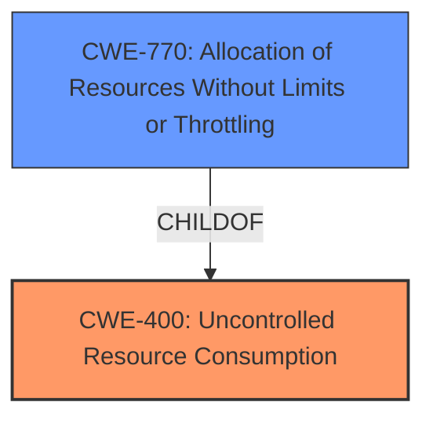

# Analysis for CVE-2021-28165

# Summary
| CWE ID | CWE Name | Confidence | CWE Abstraction Level | CWE Vulnerability Mapping Label | CWE-Vulnerability Mapping Notes |
|---|---|---|---|---|---|
| CWE-400 | Uncontrolled Resource Consumption | 0.8 | Class | Primary | Allowed-with-Review |
| CWE-770 | Allocation of Resources Without Limits or Throttling | 0.7 | Base | Secondary | Allowed |

## Evidence and Confidence

*   **Confidence Score:** 0.8
*   **Evidence Strength:** HIGH

## Relationship Analysis
The primary relationship impacting the decision is the parent-child relationship between CWE-400 and CWE-770. While CWE-400 is a broader class, CWE-770 offers more specific insight into the **allocation of resources without limits**, which directly aligns with the **improper handling of large TLS frames** leading to excessive CPU usage. The retriever results favored CWE-770, and the mapping guidance for CWE-400 suggests considering its children for a more precise mapping.

## Vulnerability Chain
The vulnerability chain starts with the receipt of a **large invalid TLS frame**. This leads to **improper handling**, which results in **uncontrolled resource consumption** (CWE-400) and specifically, **allocation of resources without limits** (CWE-770), eventually causing high CPU usage and a denial of service.

## Summary of Analysis
The initial assessment considered CWE-400 due to the observed denial of service resulting from high CPU usage. However, upon closer examination of the vulnerability description and the "CVE Reference Links Content Summary," the root cause points to **improper handling of large TLS frames** leading to **uncontrolled allocation of resources.** This aligns more precisely with CWE-770, which is a child of CWE-400. The retriever results and MITRE mapping guidance further support this decision, as CWE-770 is at the Base level of abstraction and directly addresses the root cause of the vulnerability. The selection of CWE-400 as a secondary CWE provides a broader context for the resource consumption issue.

The evidence is quoted from the "CVE Reference Links Content Summary": "The server may receive an invalid large (greater than 17408) TLS frame that is incorrectly handled, causing CPU resources to eventually reach 100% usage." This clearly indicates the **improper handling** of the TLS frame and its direct link to CPU resource exhaustion.

The final decision is based on the evidence provided, the relationships between CWEs, and the MITRE mapping guidance, resulting in a high confidence level in the selected CWEs. Both CWEs are at the optimal level of specificity, with CWE-770 providing the root cause and CWE-400 offering a broader context.

Relevant CWE Information:

# Enhanced Context (25 CWEs)
The following CWEs were identified as potentially relevant to this vulnerability:

## CWE-789: Memory Allocation with Excessive Size Value
**Abstraction Level**: Variant
**Similarity Score**: 0.78
**Source**: dense

**Description**:
The product allocates memory based on an untrusted, large size value, but it does not ensure that the size is within expected limits, allowing arbitrary amounts of memory to be allocated.

**Mapping Guidance**:
- Usage: Allowed
- Rationale: This CWE entry is at the Variant level of abstraction, which is a preferred level of abstraction for mapping to the root causes of vulnerabilities.

**Why Not Used:** Although memory allocation is a resource, the description doesn't mention memory allocation specifically, and instead focuses on CPU usage as the primary issue.

## CWE-404: Improper Resource Shutdown or Release
**Abstraction Level**: Class
**Similarity Score**: 0.78
**Source**: dense

**Description**:
The product does not release or incorrectly releases a resource before it is made available for re-use.

**Mapping Guidance**:
- Usage: Allowed-with-Review
- Rationale: This CWE entry is a Class and might have Base-level children that would be more appropriate

**Why Not Used:** The description does not indicate an issue with resource release, instead it focuses on uncontrolled consumption.

## CWE-405: Asymmetric Resource Consumption (Amplification)
**Abstraction Level**: Class
**Similarity Score**: 0.77
**Source**: dense

**Description**:
The product does not properly control situations in which an adversary can cause the product to consume or produce excessive resources without requiring the adversary to invest equivalent work or otherwise prove authorization, i.e., the adversary's influence is "asymmetric."

**Mapping Guidance**:
- Usage: Allowed-with-Review
- Rationale: This CWE entry is a Class and might have Base-level children that would be more appropriate

**Why Not Used:** While the vulnerability does involve resource consumption, the core issue is the lack of limits on resource allocation, not necessarily an asymmetric amplification.

## CWE-1325: Improperly Controlled Sequential Memory Allocation
**Abstraction Level**: Base
**Similarity Score**: 0.76
**Source**: dense

**Description**:
The product manages a group of objects or resources and performs a separate memory allocation for each object, but it does not properly limit the total amount of memory that is consumed by all of the combined objects.

**Mapping Guidance**:
- Usage: Allowed
- Rationale: This CWE entry is at the Base level of abstraction, which is a preferred level of abstraction for mapping to the root causes of vulnerabilities.

**Why Not Used:** While memory allocation is a concern, the vulnerability is more generally about resource allocation, not specifically sequential memory allocation.

## CWE-226: Sensitive Information in Resource Not Removed Before Reuse
**Abstraction Level**: Base
**Similarity Score**: 0.76
**Source**: dense

**Description**:
The product releases a resource such as memory or a file so that it can be made available for reuse, but it does not clear or "zeroize" the information contained in the resource before the product performs a critical state transition or makes the resource available for reuse by other entities.

**Mapping Guidance**:
- Usage: Allowed
- Rationale: This CWE entry is at the Base level of abstraction, which is a preferred level of abstraction for mapping to the root causes of vulnerabilities.

**Why Not Used:** This vulnerability is not related to sensitive information leakage, but rather resource exhaustion.

## CWE-131: Incorrect Calculation of Buffer Size
**Abstraction Level**: Base
**Similarity Score**: 0.76
**Source**: dense

**Description**:
The product does not correctly calculate the size to be used when allocating a buffer, which could lead to a buffer overflow.

**Mapping Guidance**:
- Usage: Allowed
- Rationale: This CWE entry is at the Base level of abstraction, which is a preferred level of abstraction for mapping to the root causes of vulnerabilities.

**Why Not Used:** This CWE is specific to incorrect buffer size calculation, and the vulnerability doesn't give details that align with this.

## CWE-664: Improper Control of a Resource Through its Lifetime
**Abstraction Level**: Pillar
**Similarity Score**: 0.76
**Source**: dense

**Description**:
The product does not maintain or incorrectly maintains control over a resource throughout its lifetime of creation, use, and release.

**Mapping Guidance**:
- Usage: Discouraged
- Rationale: This CWE entry is high-level when lower-level children are available.

**Why Not Used:** This is too general of a CWE. The specifics of the vulnerability point to uncontrolled resource consumption, which is better represented by its child CWEs.

## CWE-130: Improper Handling of Length Parameter Inconsistency
**Abstraction Level**: Base
**Similarity Score**: 0.75
**Source**: dense

**Description**:
The product parses a formatted message or structure, but it does not handle or incorrectly handles a length field that is inconsistent with the actual length of the associated data.

**Mapping Guidance**:
- Usage: Allowed
- Rationale: This CWE entry is at the Base level of abstraction, which is a preferred level of abstraction for mapping to the root causes of vulnerabilities.

**Why Not Used:** This is specific to inconsistent length parameters, which is not clearly indicated in the vulnerability description.

## CWE-407: Inefficient Algorithmic Complexity
**Abstraction Level**: Class
**Similarity Score**: 0.75
**Source**: dense

**Description**:
An algorithm in a product has an inefficient worst-case computational complexity that may be detrimental to system performance and can be triggered by an attacker, typically using crafted manipulations that ensure that the worst case is being reached.

**Mapping Guidance**:
- Usage: Allowed-with-Review
- Rationale: This CWE entry is a Class and might have Base-level children that would be more appropriate

**Why Not Used:** The root cause is not due to inefficient algorithms, but rather the lack of limits on resource