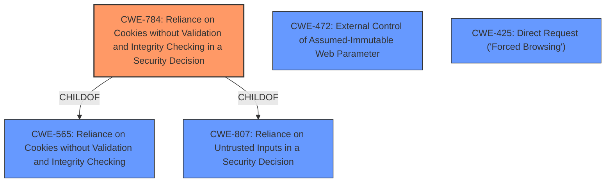

# Enhanced Analysis for CVE-2021-28171

# Summary

| CWE ID | CWE Name | Confidence | CWE Abstraction Level | CWE Vulnerability Mapping Label | CWE-Vulnerability Mapping Notes |
|---|---|---|---|---|---|
| CWE-784 | Reliance on Cookies without Validation and Integrity Checking in a Security Decision | 0.9 | Variant | Allowed | Primary CWE |
| CWE-472 | External Control of Assumed-Immutable Web Parameter | 0.7 | Base | Allowed | Secondary Candidate |
| CWE-425 | Direct Request ('Forced Browsing') | 0.6 | Base | Allowed | Secondary Candidate |

## Evidence and Confidence

*   **Confidence Score:** 0.8
*   **Evidence Strength:** HIGH

## Relationship Analysis

The primary CWE, CWE-784, is a variant of CWE-565 (Reliance on Cookies without Validation and Integrity Checking) and CWE-807 (Reliance on Untrusted Inputs in a Security Decision). This indicates a hierarchical relationship where CWE-784 is more specific. CWE-472 (External Control of Assumed-Immutable Web Parameter) is related as it also deals with untrusted input. CWE-425 (Direct Request) is less directly related but addresses authorization issues. The chosen CWE is at the Variant level which is the preferred level of abstraction.



## Vulnerability Chain

The vulnerability chain starts with the **improper handling of cookies**, leading to **potential modification of user data**, and culminating in the **ability to obtain privileged permissions**.
  - **Root Cause:** **Reliance on Cookies without Validation and Integrity Checking** (CWE-784)
  - **Weakness:** **Tampering with users data in the Cookie**
  - **Impact:** **Obtain privileged permissions**

## Summary of Analysis

The analysis indicates that the Vangene deltaFlow E-platform is vulnerable to privilege escalation due to **improper validation of cookies**. An attacker can **tamper with user data within a cookie** to gain unauthorized access.

The primary CWE selected is CWE-784 (Reliance on Cookies without Validation and Integrity Checking in a Security Decision). This is supported by the vulnerability description which states that attackers can **obtain privileged permissions remotely by tampering with users data in the Cookie**. The "CVE Reference Links Content Summary" also highlights that the server **does not properly validate the cookie, allowing manipulation**, aligning directly with CWE-784's description. The high retriever score of CWE-784 further supports this selection. The Mapping Guidance specifies that the Usage is Allowed.

CWE-472 (External Control of Assumed-Immutable Web Parameter) was also considered because cookies are assumed to be immutable by the server, but this is not enforced. However, CWE-784 is a more specific fit because it directly addresses the reliance on cookies.

CWE-425 (Direct Request ('Forced Browsing')) was considered because modifying the cookie to gain elevated privileges can be seen as directly requesting access to resources without proper authorization.

CWE-863 (Incorrect Authorization) was considered but not selected because it is a Class-level CWE, and more specific Base or Variant CWEs are preferred. While the vulnerability ultimately leads to incorrect authorization, the root cause lies in the **improper handling of cookies**.

CWE-306 (Missing Authentication for Critical Function) was considered, but the application *does* use authentication; it is simply flawed, thus it is not a case of missing authentication.

The selection of CWE-784 is at the optimal level of specificity, providing a clear and accurate representation of the vulnerability's root cause. It aligns with the vulnerability description, supporting evidence, and established CWE mapping practices.


## CWE Relationship Analysis

Current CWEs represent these abstraction levels: .


### Vulnerability Chain Analysis

**Chain starting from CWE-306:**
- 306 (Missing Authentication for Critical Function) - ROOT


**Chain starting from CWE-784:**
- 784 (Reliance on Cookies without Validation and Integrity Checking in a Security Decision) - ROOT


### CWE Relationship Diagram

```mermaid
graph TD
    classDef primary fill:#f96,stroke:#333,stroke-width:2px
    classDef secondary fill:#69f,stroke:#333
    classDef tertiary fill:#9e9,stroke:#333
```