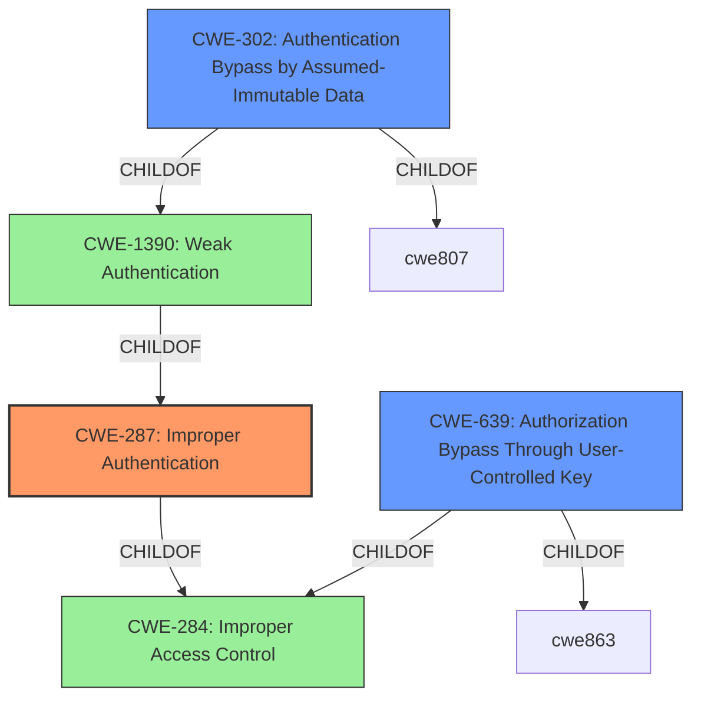

# Enhanced Analysis for CVE-2021-28174

# Summary
| CWE ID | CWE Name | Confidence | CWE Abstraction Level | CWE Vulnerability Mapping Label | CWE-Vulnerability Mapping Notes |
|---|---|---|---|---|---|
| CWE-287 | Improper Authentication | 0.9 | Class | Primary | Discouraged |
| CWE-639 | Authorization Bypass Through User-Controlled Key | 0.7 | Base | Secondary Candidate | Allowed |
| CWE-302 | Authentication Bypass by Assumed-Immutable Data | 0.7 | Base | Secondary Candidate | Allowed |

## Evidence and Confidence

*   **Confidence Score:** 0.8
*   **Evidence Strength:** MEDIUM

## Relationship Analysis
The primary CWE selected is CWE-287 Improper Authentication, which is a Class-level CWE. While it's discouraged to map to Class-level CWEs, the description specifically highlights **broken authentication**. It is a child of CWE-284 Improper Access Control which is too high-level and is a pillar. The secondary CWEs like CWE-639 and CWE-302 are more specific and provide more context to the authentication bypass.



## Vulnerability Chain
The vulnerability chain starts with **broken authentication** (CWE-287). By manipulating parameters in the URL, the attacker bypasses authentication and gains unauthorized access to transaction records, leading to fraudulent trading. This highlights the sequence from a flawed authentication process to unauthorized access and potential financial impact.

## Summary of Analysis
The initial analysis focused on identifying the root cause of the vulnerability. The description clearly states a **broken authentication** issue. Retriever results suggested CWE-287, CWE-639, CWE-472, and CWE-302 as potential candidates.

CWE-287 (Improper Authentication) is a Class-level CWE that broadly describes the authentication failure. While it's discouraged, the clear mention of **broken authentication** in the vulnerability description makes it a relevant primary mapping. The vulnerability description specifically mentions manipulating parameters in the URL, the most accurate fit is CWE-639 (Authorization Bypass Through User-Controlled Key) which involves modifying a key value to gain unauthorized access. CWE-302 (Authentication Bypass by Assumed-Immutable Data) also fits because the URL parameters that are manipulated are assumed to be immutable. These two CWEs are related to authentication bypass through manipulating URL parameters, leading to unauthorized access.

The final decision is based on the evidence from the vulnerability description, which clearly states "broken authentication". While CWE-287 is a Class-level CWE, it accurately reflects the core issue. The additional CWEs provide more specificity, but the primary focus remains on the authentication failure.

Relevant CWE Information:
- **Vulnerability Description Key Phrases**
  -   **rootcause:** **broken authentication**


## CWE Relationship Analysis

Current CWEs represent these abstraction levels: .


### Vulnerability Chain Analysis

**Chain starting from CWE-284:**
- 284 (Improper Access Control) - ROOT


**Chain starting from CWE-287:**
- 287 (Improper Authentication) - ROOT


### CWE Relationship Diagram

```mermaid
graph TD
    classDef primary fill:#f96,stroke:#333,stroke-width:2px
    classDef secondary fill:#69f,stroke:#333
    classDef tertiary fill:#9e9,stroke:#333
```