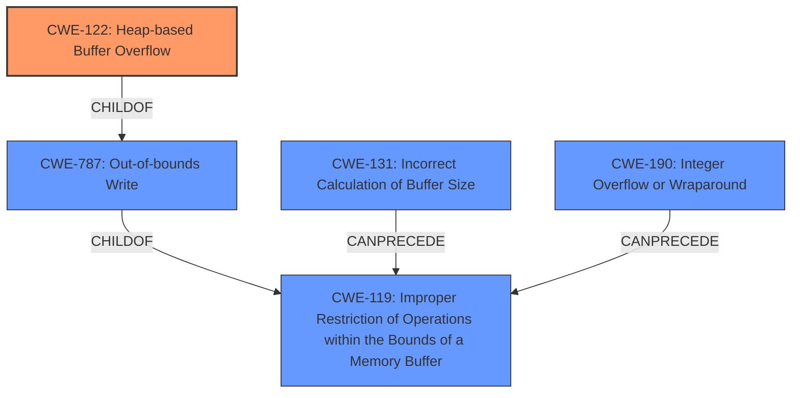

# Enhanced Analysis for CVE-2021-28211

# Summary
| CWE ID | CWE Name | Confidence | CWE Abstraction Level | CWE Vulnerability Mapping Label | CWE-Vulnerability Mapping Notes |
|---|---|---|---|---|---|
| CWE-122 | Heap-based Buffer Overflow | 0.9 | Variant | Allowed | Primary CWE |
| CWE-131 | Incorrect Calculation of Buffer Size | 0.6 | Base | Allowed | Secondary Candidate |
| CWE-190 | Integer Overflow or Wraparound | 0.5 | Base | Allowed | Secondary Candidate |

## Evidence and Confidence

*   **Confidence Score:** 0.9
*   **Evidence Strength:** MEDIUM

## Relationship Analysis
The primary CWE is CWE-122, a **Variant** of CWE-787 (Out-of-bounds Write) and CWE-788. CWE-131 (Incorrect Calculation of Buffer Size) and CWE-190 (Integer Overflow or Wraparound) are potential contributing factors that could lead to the heap overflow. CWE-131 and CWE-190 can **CanPrecede** CWE-119 (Improper Restriction of Operations within the Bounds of a Memory Buffer) which is a parent of CWE-787. Choosing the **Variant** CWE-122 provided a more specific classification than its parents.



## Vulnerability Chain
The vulnerability chain starts with a potential **incorrect calculation of the buffer size** (CWE-131) or an **integer overflow** (CWE-190) that results in a smaller than expected buffer, which then leads to a **heap-based buffer overflow** (CWE-122) when data is written to the buffer.

## Summary of Analysis
The initial analysis focused on the **heap overflow** reported in the vulnerability description, leading to the selection of CWE-122. The retriever results also suggested other related CWEs, such as CWE-131 and CWE-190, which could be contributing factors to the root cause of the overflow. The final decision was to classify the vulnerability as CWE-122 because the description explicitly mentions a **heap overflow** and the retriever results identify it as a potential weakness. The vulnerability description identifies a **heap overflow** in the LzmaUefiDecompressGetInfo function in EDK II. "A **heap overflow** in LzmaUefiDecompressGetInfo function in EDK II."

CWE-122 is at the **Variant** level of abstraction, which is a preferred level of abstraction for mapping to the root causes of vulnerabilities.

Other CWEs Considered:

*   CWE-190: Integer Overflow or Wraparound - Considered because an integer overflow could lead to a smaller buffer allocation than expected and contribute to the **heap overflow**. However, without more evidence, this is only a potential contributing factor.
*   CWE-131: Incorrect Calculation of Buffer Size - Considered because an incorrect calculation of the buffer size could cause the **heap overflow**. However, the description only mentions a **heap overflow**, so this is only a potential contributing factor.
*   CWE-193: Off-by-one Error - Rejected because an off-by-one error is not explicitly stated or implied in the description.
*   CWE-195: Signed to Unsigned Conversion Error - Rejected because a signed to unsigned conversion error is not explicitly stated or implied in the description.
*   CWE-194: Unexpected Sign Extension - Rejected because an unexpected sign extension is not explicitly stated or implied in the description.
*   CWE-409: Improper Handling of Highly Compressed Data (Data Amplification) - Rejected because improper handling of highly compressed data is not explicitly stated or implied in the description.
*   CWE-128: Wrap-around Error - Rejected because a wrap-around error is not explicitly stated or implied in the description.
*   CWE-681: Incorrect Conversion between Numeric Types - Rejected because an incorrect conversion between numeric types is not explicitly stated or implied in the description.
*   CWE-197: Numeric Truncation Error - Rejected because numeric truncation error is not explicitly stated or implied in the description.
*   CWE-120: Buffer Copy without Checking Size of Input ('Classic Buffer Overflow') - Rejected because the description does not provide sufficient information on the root cause.
*   CWE-787: Out-of-bounds Write - Rejected because the **Variant** CWE-122 provides a more specific classification for the **heap overflow**.
*   CWE-196: Unsigned to Signed Conversion Error - Rejected because an unsigned to signed conversion error is not explicitly stated or implied in the description.


## CWE Relationship Analysis

Current CWEs represent these abstraction levels: .


### Vulnerability Chain Analysis

**Chain starting from CWE-787:**
- 787 (Out-of-bounds Write) - ROOT


**Chain starting from CWE-193:**
- 193 (Off-by-one Error) - ROOT


### CWE Relationship Diagram

```mermaid
graph TD
    classDef primary fill:#f96,stroke:#333,stroke-width:2px
    classDef secondary fill:#69f,stroke:#333
    classDef tertiary fill:#9e9,stroke:#333
```