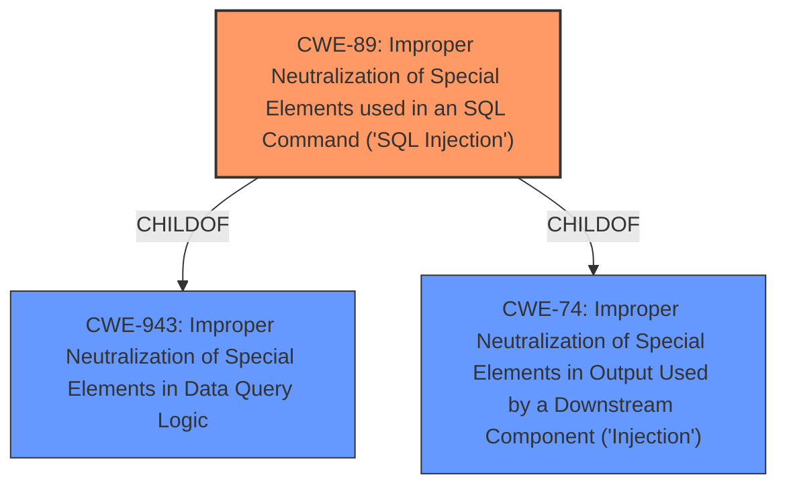

# Analysis Report for CVE-2021-28242

# Vulnerability Analysis Report: CVE-2021-28242

## Description


## Analysis (with Relationship Data)

# Summary
| CWE ID | CWE Name | Confidence | CWE Abstraction Level | CWE Vulnerability Mapping Label | CWE-Vulnerability Mapping Notes |
|---|---|---|---|---|---|
| CWE-89 | Improper Neutralization of Special Elements used in an SQL Command ('SQL Injection') | 1.0 | Base | Allowed | Primary CWE |
| CWE-943 | Improper Neutralization of Special Elements in Data Query Logic | 0.7 | Class | Allowed-with-Review | Secondary Candidate |

## Evidence and Confidence

*   **Confidence Score:** 0.9
*   **Evidence Strength:** HIGH

## Relationship Analysis
The primary relationship influencing the decision is that CWE-89 is a ChildOf CWE-943 and CWE-74. CWE-89 represents the specific case of SQL injection, while CWE-943 is a more general class of weaknesses related to data query logic. Because the vulnerability description specifically mentions "SQL injection," CWE-89 is the more appropriate choice.



## Vulnerability Chain
The vulnerability chain is as follows:
1.  **Root Cause:** **Improper neutralization** of the `cf_name` parameter in the `evoadm.php` component, which is used in constructing SQL queries.
2.  **Weakness:** CWE-89 Improper Neutralization of Special Elements used in an SQL Command ('SQL Injection'). Attackers can inject SQL commands.
3.  **Impact:** Remote attackers can obtain sensitive database information. This could lead to full database compromise, data exfiltration, modification, or deletion.

## Summary of Analysis
The initial analysis strongly suggests CWE-89 as the primary weakness due to the explicit mention of "SQL injection" in the vulnerability description and CVE Reference Links Content Summary. The **root cause** is the **lack of proper sanitization** of the `cf_name` parameter.

The vulnerability description clearly states: "SQL Injection in the evoadm.php component of b2evolution v7.2.2-stable allows remote attackers to obtain sensitive database information by injecting SQL commands into the cf_name parameter when creating a new filter under the Collections tab."
The CVE Reference Links Content Summary confirms this, stating: "**SQL Injection:** The `cf_name` parameter is directly used in a SQL query without proper sanitization, allowing an attacker to inject malicious SQL code."

CWE-89 is the most specific and accurate representation of this vulnerability, and it is at the preferred Base level of abstraction.
CWE-943 was considered, but it's a Class-level CWE, making CWE-89 a better fit.

Relevant CWE Information:
# Enhanced Context (25 CWEs)
The following CWEs were identified as potentially relevant to this vulnerability:

## CWE-943: Improper Neutralization of Special Elements in Data Query Logic
**Abstraction Level**: Class
**Similarity Score**: 0.79
**Source**: dense

**Description**:
The product generates a query intended to access or manipulate data in a data store such as a database, but it does not neutralize or incorrectly neutralizes special elements that can modify the intended logic of the query.

**Mapping Guidance**:
- Usage: Allowed-with-Review
- Rationale: This CWE entry is a Class and might have Base-level children that would be more appropriate

## CWE-89: Improper Neutralization of Special Elements used in an SQL Command ('SQL Injection')
**Abstraction Level**: Base
**Similarity Score**: 1.00
**Source**: Retriever Results

**Description**:
The product constructs all or part of an SQL command using externally-influenced input from an upstream component, but it does not neutralize or incorrectly neutralizes special elements that could modify the intended SQL command when it is sent to a downstream component. Without sufficient removal or quoting of SQL syntax in user-controllable inputs, the generated SQL query can cause those inputs to be interpreted as SQL instead of ordinary user data.

**Mapping Guidance**:
- Usage: Allowed
- Rationale: This CWE entry is at the Base level of abstraction, which is a preferred level of abstraction for mapping to the root causes of vulnerabilities.


## CWE Relationship Analysis

Current CWEs represent these abstraction levels: .


### Vulnerability Chain Analysis

**Chain starting from CWE-89:**
- 89 (Improper Neutralization of Special Elements used in an SQL Command ('SQL Injection')) - ROOT


**Chain starting from CWE-74:**
- 74 (Improper Neutralization of Special Elements in Output Used by a Downstream Component ('Injection')) - ROOT


### CWE Relationship Diagram

```mermaid
graph TD
    classDef primary fill:#f96,stroke:#333,stroke-width:2px
    classDef secondary fill:#69f,stroke:#333
    classDef tertiary fill:#9e9,stroke:#333
```


*Report generated on 2025-04-01 17:08:45*
