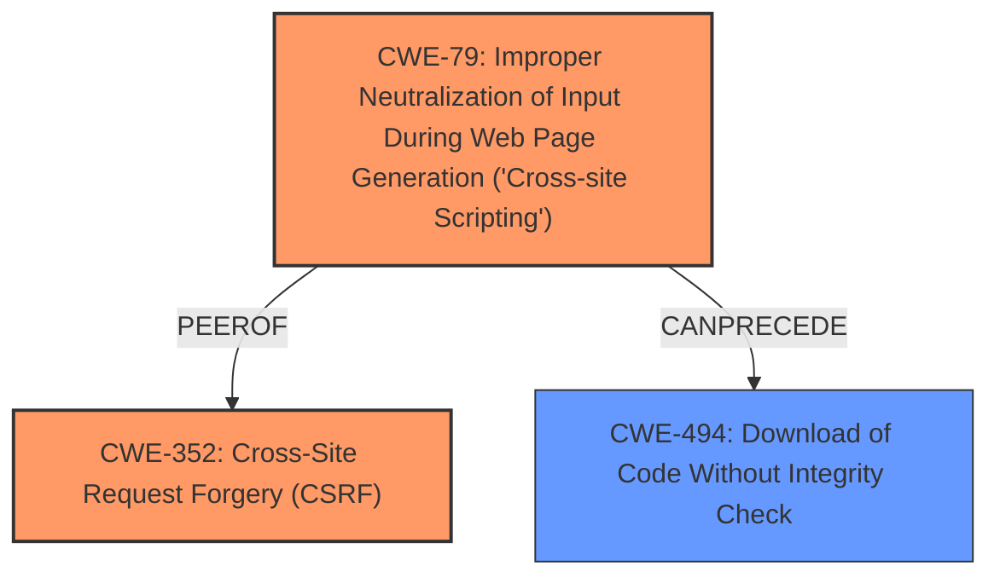

# Analysis Report for CVE-2021-28280

# Vulnerability Analysis Report: CVE-2021-28280

## Description


## Analysis (with Relationship Data)

# Summary
| CWE ID | CWE Name | Confidence | CWE Abstraction Level | CWE Vulnerability Mapping Label | CWE-Vulnerability Mapping Notes |
|---|---|---|---|---|---|
| CWE-352 | Cross-Site Request Forgery (CSRF) | 1.0 | Compound | Allowed | Primary CWE: The application **lacks CSRF protection**, allowing attackers to force users to perform unwanted actions. |
| CWE-79 | Improper Neutralization of Input During Web Page Generation ('Cross-site Scripting') | 1.0 | Base | Allowed | Primary CWE: The application **fails to properly sanitize** user input, leading to XSS vulnerabilities. |

## Evidence and Confidence

*   **Confidence Score:** 1.0
*   **Evidence Strength:** HIGH

## Relationship Analysis
The analysis identified two primary CWEs: CWE-352 and CWE-79.

*   CWE-352 (Cross-Site Request Forgery) is a Compound weakness that occurs when an application doesn't adequately verify if a request was intentionally submitted by the user. In this case, the **lack of CSRF protection** allows attackers to trick users into executing actions, specifically triggering XSS.

*   CWE-79 (Improper Neutralization of Input During Web Page Generation) is a Base weakness describing cross-site scripting. Here, the application **fails to neutralize** user-controllable input before displaying it in a web page. The report states that the `stext` parameter is vulnerable, and functions like `descript()` and `htmlentities()` were not used correctly, leading to reflected XSS.

*   CWE-79 and CWE-352 are listed as peers. Additionally, CWE-79 can precede CWE-494 (Download of Code Without Integrity Check).



## Vulnerability Chain
The vulnerability chain starts with a **lack of CSRF protection** (CWE-352), which allows an attacker to inject a malicious XSS payload. The application then **fails to properly sanitize** this input (CWE-79), leading to the execution of arbitrary code in the user's browser.

## Summary of Analysis
The initial assessment identified two key weaknesses described in the vulnerability description: **lack of CSRF protection** and **cross-site scripting**. The retriever results and the content of the CVE reference links confirmed that CWE-352 and CWE-79 were the most appropriate choices.

The evidence for this is found in the "Vulnerability Description Key Phrases" which states a "**lack of CSRF protection**" and "**cross-site scripting**".

The "CVE Reference Links Content Summary" further reinforces this by stating:

*   "The root cause is the **lack of proper sanitization** of user-provided input in the search functionality of PHPFusion."
*   "**Reflected Cross-Site Scripting (XSS)**: The `stext` parameter allows an attacker to inject arbitrary JavaScript code..."
*   "**Cross-Site Request Forgery (CSRF)**: The vulnerability is exploitable via CSRF..."
*   "**Lack of Input Sanitization**: The application **fails to properly sanitize** user input..."

The choice of CWE-352 and CWE-79 is at the optimal level of specificity. CWE-352 is a Compound weakness. CWE-79 is a Base weakness. Both are preferred levels of abstraction for root cause analysis.

Other CWEs considered but not used:

*   CWE-116 (Improper Encoding or Escaping of Output): While encoding issues contribute to XSS, the core problem is the **lack of initial sanitization**, making CWE-79 a more direct fit.
*   CWE-80 (Improper Neutralization of Script-Related HTML Tags in a Web Page (Basic XSS)): This is a Variant of CWE-79, and while it describes the specific type of XSS, CWE-79 is already sufficiently specific.
*   CWE-434 (Unrestricted Upload of File with Dangerous Type): This CWE is not relevant as the vulnerability does not involve file uploads.
* CWE-96 (Improper Neutralization of Directives in Statically Saved Code ('Static Code Injection')): This CWE is not relevant as the XSS occurs in reflected input, not statically saved code.
* CWE-73 (External Control of File Name or Path): This CWE is not relevant as the vulnerability does not involve file operations.
* CWE-84 (Improper Neutralization of Encoded URI Schemes in a Web Page): While encoded URIs might be used in an XSS attack, the fundamental issue is still the **lack of sanitization** (CWE-79).
* CWE-1004 (Sensitive Cookie Without 'HttpOnly' Flag): This is a potential impact of XSS, not the root cause.
* CWE-601 (URL Redirection to Untrusted Site ('Open Redirect')): This is not part of the vulnerability.


## CWE Relationship Analysis

Current CWEs represent these abstraction levels: .


### Vulnerability Chain Analysis

**Chain starting from CWE-494:**
- 494 (Download of Code Without Integrity Check) - ROOT


**Chain starting from CWE-79:**
- 79 (Improper Neutralization of Input During Web Page Generation ('Cross-site Scripting')) - ROOT


### CWE Relationship Diagram

```mermaid
graph TD
    classDef primary fill:#f96,stroke:#333,stroke-width:2px
    classDef secondary fill:#69f,stroke:#333
    classDef tertiary fill:#9e9,stroke:#333
```


*Report generated on 2025-04-01 17:42:27*
