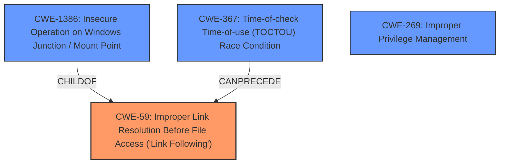

# Raw Analyzer Response for CVE-2021-28313

# Summary
| CWE ID | CWE Name | Confidence | CWE Abstraction Level | CWE Vulnerability Mapping Label | CWE-Vulnerability Mapping Notes |
|---|---|---|---|---|---|
| CWE-59 | Improper Link Resolution Before File Access ('Link Following') | 0.9 | Base | Allowed | Primary CWE |
| CWE-269 | Improper Privilege Management | 0.6 | Class | Allowed-with-Review | Secondary Candidate |
| CWE-367 | Time-of-check Time-of-use (TOCTOU) Race Condition | 0.5 | Base | Allowed | Secondary Candidate |
| CWE-1386 | Insecure Operation on Windows Junction / Mount Point | 0.5 | Base | Allowed | Secondary Candidate |

## Evidence and Confidence

*   **Confidence Score:** 0.7
*   **Evidence Strength:** HIGH

## Relationship Analysis
The primary CWE is CWE-59, which describes the **improper link resolution** that allows attackers to bypass intended security measures. CWE-1386 is a child of CWE-59 and describes the specific scenario of **insecure operations on Windows junctions/mount points**. CWE-367 which is a **Time-of-check Time-of-use (TOCTOU) Race Condition** could be involved in exploiting the link following if an attacker manipulates the file system between when the path is checked and when it is used. CWE-269, **Improper Privilege Management**, is related to the overall impact of the vulnerability, which is elevation of privilege but is not the root cause.

## Vulnerability Chain
The vulnerability chain starts with **improper path validation** due to case-sensitivity issues, which leads to **improper link resolution (CWE-59)**, potentially exploited through a **TOCTOU race condition (CWE-367)**, ultimately resulting in **elevation of privilege**. The case sensitivity issue allows attackers to traverse directories they should not be able to access, leading to the ability to manipulate file permissions and drop files outside the intended scratch directory. This **incorrect privilege management** then allows for arbitrary code execution as NT AUTHORITY\SYSTEM.

## Summary of Analysis
The analysis focuses on the root cause of the vulnerability, which is the **improper link resolution (CWE-59)** due to case-sensitivity discrepancies in path validation. The evidence from the "CVE Reference Links Content Summary" clearly states that the vulnerability stems from a case-sensitivity issue in the Microsoft Diagnostics Hub Standard Collector Service that allows attackers to bypass path validation by exploiting junctions or directories with different capitalization.

The relationship analysis supports the selection of CWE-59 as the primary CWE, with CWE-1386 (Insecure Operation on Windows Junction / Mount Point) as a more specific variant, but less comprehensive. The potential involvement of CWE-367 (Time-of-check Time-of-use (TOCTOU) Race Condition) is acknowledged, but it's considered secondary. Finally, CWE-269 (Improper Privilege Management) is related to the impact, but not the root cause.

The selected CWEs are at the optimal level of specificity because they accurately represent the weakness. CWE-59 directly addresses the **improper link resolution** issue, while CWE-1386 describes the specific scenario within Windows environments using junctions/mount points, and CWE-367 highlights the potential race condition during file access.

Relevant CWE Information:

# Enhanced Context (25 CWEs)
The following CWEs were identified as potentially relevant to this vulnerability:

## CWE-667: Improper Locking
**Abstraction Level**: Class
**Similarity Score**: 0.81
**Source**: dense

**Description**:
The product does not properly acquire or release a lock on a resource, leading to unexpected resource state changes and behaviors.

**Mapping Guidance**:
- Usage: Allowed-with-Review
- Rationale: This CWE entry is a Class and might have Base-level children that would be more appropriate

## CWE-662: Improper Synchronization
**Abstraction Level**: Class
**Similarity Score**: 0.79
**Source**: dense

**Description**:
The product utilizes multiple threads or processes to allow temporary access to a shared resource that can only be exclusive to one process at a time, but it does not properly synchronize these actions, which might cause simultaneous accesses of this resource by multiple threads or processes.

**Mapping Guidance**:
- Usage: Discouraged
- Rationale: This CWE entry is a level-1 Class (i.e., a child of a Pillar). It might have lower-level children that would be more appropriate

## CWE-59: Improper Link Resolution Before File Access ('Link Following')
**Abstraction Level**: Base
**Similarity Score**: 0.78
**Source**: dense

**Description**:
The product attempts to access a file based on the filename, but it does not properly prevent that filename from identifying a link or shortcut that resolves to an unintended resource.

**Mapping Guidance**:
- Usage: Allowed
- Rationale: This CWE entry is at the Base level of abstraction, which is a preferred level of abstraction for mapping to the root causes of vulnerabilities.

## CWE-362: Concurrent Execution using Shared Resource with Improper Synchronization ('Race Condition')
**Abstraction Level**: Class
**Similarity Score**: 0.78
**Source**: dense

**Description**:
The product contains a concurrent code sequence that requires temporary, exclusive access to a shared resource, but a timing window exists in which the shared resource can be modified by another code sequence operating concurrently.

**Mapping Guidance**:
- Usage: Allowed-with-Review
- Rationale: This CWE entry is a Class and might have Base-level children that would be more appropriate

## CWE-367: Time-of-check Time-of-use (TOCTOU) Race Condition
**Abstraction Level**: Base
**Similarity Score**: 0.78
**Source**: dense

**Description**:
The product checks the state of a resource before using that resource, but the resource's state can change between the check and the use in a way that invalidates the results of the check. This can cause the product to perform invalid actions when the resource is in an unexpected state.

**Mapping Guidance**:
- Usage: Allowed
- Rationale: This CWE entry is at the Base level of abstraction, which is a preferred level of abstraction for mapping to the root causes of vulnerabilities.

## CWE-404: Improper Resource Shutdown or Release
**Abstraction Level**: Class
**Similarity Score**: 0.78
**Source**: dense

**Description**:
The product does not release or incorrectly releases a resource before it is made available for re-use.

**Mapping Guidance**:
- Usage: Allowed-with-Review
- Rationale: This CWE entry is a Class and might have Base-level children that would be more appropriate

## CWE-366: Race Condition within a Thread
**Abstraction Level**: Base
**Similarity Score**: 0.77
**Source**: dense

**Description**:
If two threads of execution use a resource simultaneously, there exists the possibility that resources may be used while invalid, in turn making the state of execution undefined.

**Mapping Guidance**:
- Usage: Allowed
- Rationale: This CWE entry is at the Base level of abstraction, which is a preferred level of abstraction for mapping to the root causes of vulnerabilities.

## CWE-754: Improper Check for Unusual or Exceptional Conditions
**Abstraction Level**: Class
**Similarity Score**: 0.77
**Source**: dense

**Description**:
The product does not check or incorrectly checks for unusual or exceptional conditions that are not expected to occur frequently during day to day operation of the product.

**Mapping Guidance**:
- Usage: Allowed-with-Review
- Rationale: This CWE entry is a Class and might have Base-level children that would be more appropriate

## CWE-41: Improper Resolution of Path Equivalence
**Abstraction Level**: Base
**Similarity Score**: 0.77
**Source**: dense

**Description**:
The product is vulnerable to file system contents disclosure through path equivalence. Path equivalence involves the use of special characters in file and directory names. The associated manipulations are intended to generate multiple names for the same object.

**Mapping Guidance**:
- Usage: Allowed
- Rationale: This CWE entry is at the Base level of abstraction, which is a preferred level of abstraction for mapping to the root causes of vulnerabilities.

## CWE-2