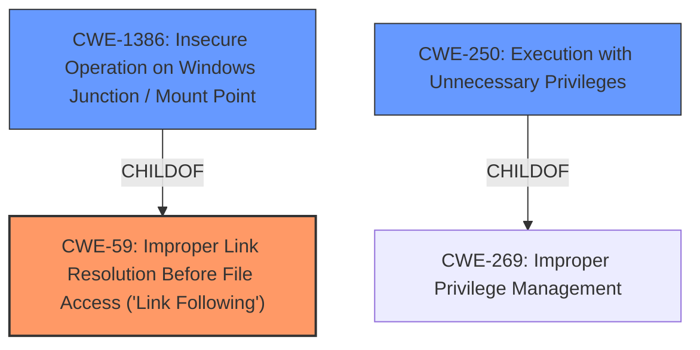

# Analysis for CVE-2021-28321

# Summary
| CWE ID  | CWE Name                                                                                    | Confidence | CWE Abstraction Level | CWE Vulnerability Mapping Label | CWE-Vulnerability Mapping Notes |
| :-------- | :------------------------------------------------------------------------------------------ | :---------- | :----------------------- | :------------------------------ | :------------------------------ |
| CWE-59 | Improper Link Resolution Before File Access ('Link Following') | 0.90       | Base                    | Allowed                     | Primary CWE |
| CWE-1386  | Insecure Operation on Windows Junction / Mount Point                                           | 0.75      | Base                    | Allowed                     | Secondary Candidate          |
| CWE-250  | Execution with Unnecessary Privileges                                           | 0.60      | Base                    | Allowed                     | Secondary Candidate          |

## Evidence and Confidence

*   **Confidence Score:** 0.80
*   **Evidence Strength:** HIGH

## Relationship Analysis
The primary CWE is CWE-59 **Improper Link Resolution Before File Access ('Link Following')**, which is a base level CWE. CWE-1386 **Insecure Operation on Windows Junction / Mount Point** is a child of CWE-59, which could be a more specific match. However, the description of CWE-1386 mentions reparse points, hard links, junctions and mount points whereas the vulnerability description focuses on directory junctions with different case names. Thus, I selected the parent CWE-59 instead of child CWE-1386. CWE-250 **Execution with Unnecessary Privileges** is related because the service runs with NT_AUTHORITY\SYSTEM privileges which enables more damage from the **Improper Link Resolution Before File Access ('Link Following')**.

## Vulnerability Chain
The vulnerability chain starts with a case-sensitivity discrepancy in path validation which leads to directory traversal, then file tampering and arbitrary file drop and finally elevation of privileges.

## Summary of Analysis
The initial assessment identified CWE-269 **Improper Privilege Management** as the primary match based on similar CVE descriptions. However, after analyzing the root cause and technical details, it became clear that the vulnerability stems from **improper link resolution** due to the case-sensitivity issue, leading to directory traversal and ultimately privilege escalation.

The evidence for this is:
*   "The vulnerability stems from a case-sensitivity discrepancy in how the Microsoft Diagnostics Hub Standard Collector Service validates file paths."
*   "The vulnerability allows an attacker to manipulate the "scratch directory" path used by the service by using junctions with different case names."
*   "This directory traversal vulnerability allows the attacker to delete arbitrary files (CVE-2021-28321), drop files in arbitrary locations..."
*   "By combining the ability to drop files in arbitrary locations and take over file permissions, an attacker can achieve code execution with `NT_AUTHORITY\SYSTEM` privileges."

Based on this evidence, CWE-59 **Improper Link Resolution Before File Access ('Link Following')** is the most accurate primary CWE.
The service runs with NT_AUTHORITY\SYSTEM privileges which enables more damage from the **Improper Link Resolution Before File Access ('Link Following')**, so CWE-250 **Execution with Unnecessary Privileges** is a secondary CWE.

The selected CWEs are at the optimal level of specificity because they accurately represent the root cause and contributing factors to the vulnerability, aligning with the evidence and relationship analysis.

Relevant CWE Information:

# Enhanced Context (25 CWEs)
The following CWEs were identified as potentially relevant to this vulnerability:

## CWE-667: Improper Locking
**Abstraction Level**: Class
**Similarity Score**: 0.81
**Source**: dense

**Description**:
The product does not properly acquire or release a lock on a resource, leading to unexpected resource state changes and behaviors.

**Mapping Guidance**:
- Usage: Allowed-with-Review
- Rationale: This CWE entry is a Class and might have Base-level children that would be more appropriate

*This CWE was considered but not selected because the vulnerability doesn't involve improper locking mechanisms.*

## CWE-662: Improper Synchronization
**Abstraction Level**: Class
**Similarity Score**: 0.79
**Source**: dense

**Description**:
The product utilizes multiple threads or processes to allow temporary access to a shared resource that can only be exclusive to one process at a time, but it does not properly synchronize these actions, which might cause simultaneous accesses of this resource by multiple threads or processes.

**Mapping Guidance**:
- Usage: Discouraged
- Rationale: This CWE entry is a level-1 Class (i.e., a child of a Pillar). It might have lower-level children that would be more appropriate

*This CWE was considered but not selected because the vulnerability is not related to improper synchronization.*

## CWE-59: Improper Link Resolution Before File Access ('Link Following')
**Abstraction Level**: Base
**Similarity Score**: 0.78
**Source**: dense

**Description**:
The product attempts to access a file based on the filename, but it does not properly prevent that filename from identifying a link or shortcut that resolves to an unintended resource.

**Mapping Guidance**:
- Usage: Allowed
- Rationale: This CWE entry is at the Base level of abstraction, which is a preferred level of abstraction for mapping to the root causes of vulnerabilities.

*This CWE was selected as the primary match and is described above.*

## CWE-404: Improper Resource Shutdown or Release
**Abstraction Level**: Class
**Similarity Score**: 0.78
**Source**: dense

**Description**:
The product does not release or incorrectly releases a resource before it is made available for re-use.

**Mapping Guidance**:
- Usage: Allowed-with-Review
- Rationale: This CWE entry is a Class and might have Base-level children that would be more appropriate

*This CWE was considered but not selected because the vulnerability doesn't relate to improper resource shutdown or release.*

## CWE-362: Concurrent Execution using Shared Resource with Improper Synchronization ('Race Condition')
**Abstraction Level**: Class
**Similarity Score**: 0.78
**Source**: dense

**Description**:
The product contains a concurrent code sequence that requires temporary, exclusive access to a shared resource, but a timing window exists in which the shared resource can be modified by another code sequence operating concurrently.

**Mapping Guidance**:
- Usage: Allowed-with-Review
- Rationale: This CWE entry is a Class and might have Base-level children that would be more appropriate

*This CWE was considered but not selected because the vulnerability is not due to a race condition.*

## CWE-367: Time-of-check Time-of-use (TOCTOU) Race Condition
**Abstraction Level**: Base
**Similarity Score**: 0.78
**Source**: dense

**Description**:
The product checks the state of a resource before using that resource, but the resource's state can change between the check and the use in a way that invalidates the results of the check. This can cause the product to perform invalid actions when the resource is in an unexpected state.

**Mapping Guidance**:
- Usage: Allowed
- Rationale: This CWE entry is at the Base level of abstraction, which is a preferred level of abstraction for mapping to the root causes of vulnerabilities.

*This CWE was considered but not selected because the vulnerability is not a TOCTOU race condition.*

## CWE-366: Race Condition within a Thread
**Abstraction Level**: Base
**Similarity Score**: 0.77
**Source**: dense

**Description**:
If two threads of execution use a resource simultaneously, there exists the possibility that resources may be used while invalid, in turn making the state of execution undefined.

**Mapping Guidance**:
- Usage: Allowed
- Rationale: This CWE entry is at the Base level of abstraction, which is a preferred level of abstraction for mapping to the root causes of vulnerabilities.

*This CWE was considered but not selected because the vulnerability is not due to a race condition within a thread.*

## CWE-41: Improper Resolution of Path Equivalence
**Abstraction Level**: Base
**Similarity Score**: 0.77
**Source**: dense

**Description**:
The product is vulnerable to file system contents disclosure through path equivalence. Path equivalence involves the use of special characters in file and directory names. The associated manipulations are intended to generate multiple names for the same object.

**Mapping Guidance**:
- Usage: Allowed
- Rationale: This CWE entry is at the Base level of abstraction, which is a preferred