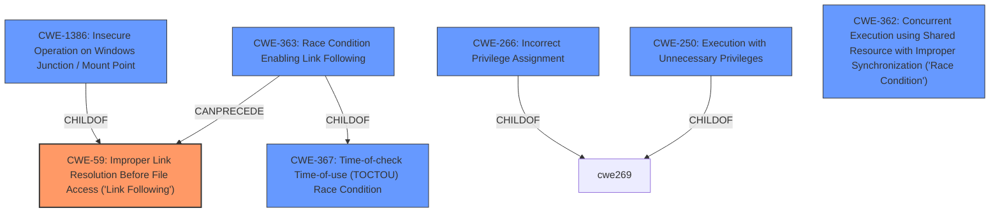

# Enhanced Analysis for CVE-2021-28322

# Summary
| CWE ID | CWE Name | Confidence | CWE Abstraction Level | CWE Vulnerability Mapping Label | CWE-Vulnerability Mapping Notes |
|---|---|---|---|---|---|
| CWE-59 | Improper Link Resolution Before File Access ('Link Following') | 0.9 | Base | Allowed | Primary CWE |
| CWE-250 | Execution with Unnecessary Privileges | 0.7 | Base | Allowed | Secondary Candidate |

## Evidence and Confidence

*   **Confidence Score:** 0.8
*   **Evidence Strength:** HIGH

## Relationship Analysis
The primary CWE is CWE-59, which is a base level CWE. Several other CWEs were considered that relate to race conditions (CWE-362, CWE-363, CWE-367) and privilege issues (CWE-250, CWE-266). CWE-1386 is a child of CWE-59.



## Vulnerability Chain
The vulnerability chain starts with the **improper link resolution** (CWE-59), which allows an attacker to traverse outside the intended scratch directory. This leads to the ability to drop files outside the scratch directory, and ultimately to **elevation of privileges**. The case-sensitivity discrepancy enables this chain.
  - **Root Cause**: **Improper Link Resolution** (CWE-59) due to case-sensitivity issues.
  - **Weakness**: File dropping outside the scratch directory.
  - **Impact**: Elevation of Privileges.

## Summary of Analysis
The initial assessment identified CWE-59 as the primary weakness due to the **improper link resolution** via directory junctions. The vulnerability description and CVE Reference Links Content Summary provide strong evidence for this. The service **fails to properly prevent** the crafted path from resolving to an unintended resource. The vulnerability description mentions a case-sensitivity discrepancy, which is a key factor in exploiting the directory junction.

The graph relationships helped to consider other potential CWEs, such as those related to race conditions and privilege management. While race conditions could theoretically be involved, there isn't enough evidence to support assigning a race condition CWE with high confidence. The **elevation of privilege impact** suggests that **execution with unnecessary privileges** (CWE-250) is a secondary concern, as the service operates with higher privileges than necessary, amplifying the impact of the directory traversal.

The selected CWEs are at the optimal level of specificity. CWE-59 is a Base-level CWE that accurately describes the **improper link resolution** issue. While CWE-1386 (Insecure Operation on Windows Junction / Mount Point) is a child of CWE-59 and more specific to Windows, CWE-59 is more general and better captures the root cause, which is the **improper handling of links** regardless of the specific mechanism (junctions).

*Evidence:*
- "The vulnerability stems from a case-sensitivity discrepancy in how the Microsoft Diagnostics Hub Standard Collector Service validates directory paths."
- "By exploiting the case-sensitivity issue, an attacker can manipulate the provided directory path through junctions to point to locations outside the intended scratch directory."

CWE-269 was rejected because the description did not provide specific information on how the privileges were managed and the retriever results indicated that CWE-59 was more relevant. CWE-266 was rejected because the **incorrect privilege assignment** was not the root cause, but rather the impact.

**CWE-59: Improper Link Resolution Before File Access ('Link Following')**
- **Match:** The vulnerability description clearly states that the service **fails to properly validate** directory paths, allowing an attacker to use directory junctions to point to locations outside the intended scratch directory. This matches the description of CWE-59, which describes the product attempting to access a file based on the filename, but it **does not properly prevent** that filename from identifying a link or shortcut that resolves to an unintended resource.
- **Impact:** This weakness allows an attacker to bypass path validation, leading to directory traversal and the ability to drop files into arbitrary directories.
- **Relationship:** CWE-59 is a base-level CWE, providing a general description of the link following issue.
- **Guidance:** The mapping guidance for CWE-59 allows its usage, as it is at the Base level of abstraction.

**CWE-250: Execution with Unnecessary Privileges**
- **Match:** The vulnerability leads to **elevation of privileges**, implying that the service is running with higher privileges than necessary. This aligns with CWE-250, which describes the product performing an operation at a privilege level that is higher than the minimum level required.
- **Impact:** Running with unnecessary privileges amplifies the consequences of the directory traversal weakness, allowing the attacker to execute arbitrary code as `NT AUTHORITY\SYSTEM`.
- **Relationship:** CWE-250 is a child of CWE-269, and is at the Base level of abstraction.
- **Guidance:** The mapping guidance for CWE-250 allows its usage, as it is at the Base level of abstraction.


## CWE Relationship Analysis

Current CWEs represent these abstraction levels: .


### Vulnerability Chain Analysis

**Chain starting from CWE-362:**
- 362 (Concurrent Execution using Shared Resource with Improper Synchronization ('Race Condition')) - ROOT


**Chain starting from CWE-367:**
- 367 (Time-of-check Time-of-use (TOCTOU) Race Condition) - ROOT


### CWE Relationship Diagram

```mermaid
graph TD
    classDef primary fill:#f96,stroke:#333,stroke-width:2px
    classDef secondary fill:#69f,stroke:#333
    classDef tertiary fill:#9e9,stroke:#333
```