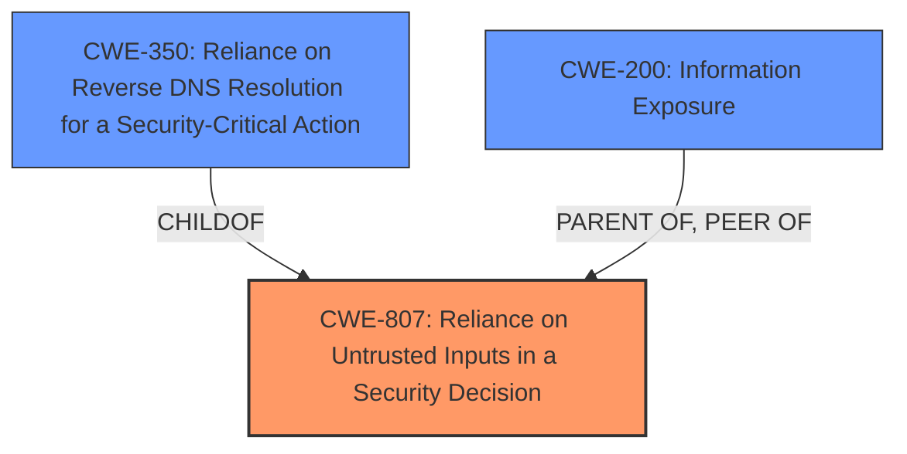

# Analysis Report for CVE-2021-28323

# Vulnerability Analysis Report: CVE-2021-28323

## Description


## Analysis (with Relationship Data)

# Summary
| CWE ID | CWE Name | Confidence | CWE Abstraction Level | CWE Vulnerability Mapping Label | CWE-Vulnerability Mapping Notes |
|---|---|---|---|---|---|
| **CWE-807** | **Reliance on Untrusted Inputs in a Security Decision** | 0.9 | Base | Primary | Allowed |
| CWE-350 | Reliance on Reverse DNS Resolution for a Security-Critical Action | 0.4 | Variant | Secondary | Allowed |
| CWE-200 | Information Exposure | 0.3 | Class | Secondary | Allowed-with-Review |

## Evidence and Confidence

*   **Confidence Score:** 0.9
*   **Evidence Strength:** HIGH

## Relationship Analysis
The primary CWE is CWE-807, which is a Base level CWE. CWE-807 is the parent of CWE-350, which was also considered. The analysis of the vulnerability shows that the system relies on user-supplied input to make a security decision, but **fails to properly validate this input**, leading to a vulnerability.



## Vulnerability Chain
The vulnerability chain begins with the **improper validation of the user-supplied path**, which is then used to make security decisions regarding access to files. The use of a case-insensitive comparison (`wcsnicmp`) allows attackers to bypass path validation.

## Summary of Analysis
The initial analysis considered several CWEs, particularly those related to randomness and communication channel issues. However, the core weakness lies in the **reliance on a case-insensitive comparison of a user-supplied path, leading to directory traversal and information disclosure**. This is best captured by CWE-807.

The evidence for this decision is strong, based on the following excerpt:
"The vulnerability is caused by a case-sensitivity issue in the validation of scratch directory paths within the Microsoft Diagnostics Hub Standard Collector Service. The service uses `GetFinalPathNameByHandleW` to resolve the final path of a directory and compares it to the user-supplied path using `wcsnicmp` which is case-insensitive. However, the NTFS file system can be configured to be case-sensitive which allows the bypass."

The use of `wcsnicmp` (case-insensitive comparison) when a case-sensitive comparison is required is the root cause of the issue. The system makes a security decision (path validation) based on this untrusted input (user-supplied path).

CWE-807 is at the optimal level of specificity because it directly addresses the reliance on untrusted inputs in security decisions. Other CWEs were considered but deemed less appropriate:

*   CWE-350: Reliance on Reverse DNS Resolution for a Security-Critical Action is related to DNS, which is not the primary issue.
*   CWE-200: Information Exposure is a high-level class that describes the impact of the vulnerability but not the root cause.

# Relevant CWE Information:

# Enhanced Context (25 CWEs)

## CWE-330: Use of Insufficiently Random Values
**Abstraction Level**: Class
**Similarity Score**: 0.83
**Source**: dense

**Description**:
The product uses insufficiently random numbers or values in a security context that depends on unpredictable numbers.

**Mapping Guidance**:
- Usage: Discouraged
- Rationale: This CWE entry is a level-1 Class (i.e., a child of a Pillar). It might have lower-level children that would be more appropriate

## CWE-331: Insufficient Entropy
**Abstraction Level**: Base
**Similarity Score**: 0.80
**Source**: dense

**Description**:
The product uses an algorithm or scheme that produces insufficient entropy, leaving patterns or clusters of values that are more likely to occur than others.

**Mapping Guidance**:
- Usage: Allowed
- Rationale: This CWE entry is at the Base level of abstraction, which is a preferred level of abstraction for mapping to the root causes of vulnerabilities.

## CWE-335: Incorrect Usage of Seeds in Pseudo-Random Number Generator (PRNG)
**Abstraction Level**: Base
**Similarity Score**: 0.79
**Source**: dense

**Description**:
The product uses a Pseudo-Random Number Generator (PRNG) but does not correctly manage seeds.

**Mapping Guidance**:
- Usage: Allowed
- Rationale: This CWE entry is at the Base level of abstraction, which is a preferred level of abstraction for mapping to the root causes of vulnerabilities.

## CWE-334: Small Space of Random Values
**Abstraction Level**: Base
**Similarity Score**: 0.78
**Source**: dense

**Description**:
The number of possible random values is smaller than needed by the product, making it more susceptible to brute force attacks.

**Mapping Guidance**:
- Usage: Allowed
- Rationale: This CWE entry is at the Base level of abstraction, which is a preferred level of abstraction for mapping to the root causes of vulnerabilities.

## CWE-338: Use of Cryptographically Weak Pseudo-Random Number Generator (PRNG)
**Abstraction Level**: Base
**Similarity Score**: 0.77
**Source**: dense

**Description**:
The product uses a Pseudo-Random Number Generator (PRNG) in a security context, but the PRNG's algorithm is not cryptographically strong.

**Mapping Guidance**:
- Usage: Allowed
- Rationale: This CWE entry is at the Base level of abstraction, which is a preferred level of abstraction for mapping to the root causes of vulnerabilities.

## CWE-1240: Use of a Cryptographic Primitive with a Risky Implementation
**Abstraction Level**: Base
**Similarity Score**: 0.77
**Source**: dense

**Description**:
To fulfill the need for a cryptographic primitive, the product implements a cryptographic algorithm using a non-standard, unproven, or disallowed/non-compliant cryptographic implementation.

**Mapping Guidance**:
- Usage: Allowed
- Rationale: This CWE entry is at the Base level of abstraction, which is a preferred level of abstraction for mapping to the root causes of vulnerabilities.

## CWE-1391: Use of Weak Credentials
**Abstraction Level**: Class
**Similarity Score**: 0.77
**Source**: dense

**Description**:
The product uses weak credentials (such as a default key or hard-coded password) that can be calculated, derived, reused, or guessed by an attacker.

**Mapping Guidance**:
- Usage: Allowed-with-Review
- Rationale: This CWE entry is a Class and might have Base-level children that would be more appropriate

## CWE-226: Sensitive Information in Resource Not Removed Before Reuse
**Abstraction Level**: Base
**Similarity Score**: 0.76
**Source**: dense

**Description**:
The product releases a resource such as memory or a file so that it can be made available for reuse, but it does not clear or "zeroize" the information contained in the resource before the product performs a critical state transition or makes the resource available for reuse by other entities.

**Mapping Guidance**:
- Usage: Allowed
- Rationale: This CWE entry is at the Base level of abstraction, which is a preferred level of abstraction for mapping to the root causes of vulnerabilities.

## CWE-1204: Generation of Weak Initialization Vector (IV)
**Abstraction Level**: Base
**Similarity Score**: 0.75
**Source**: dense

**Description**:
The product uses a cryptographic primitive that uses an Initialization
			Vector (IV), but the product does not generate IVs that are
			sufficiently unpredictable or unique according to the expected
			cryptographic requirements for that primitive.
			

**Mapping Guidance**:
- Usage: Allowed
- Rationale: This CWE entry is at the Base level of abstraction, which is a preferred level of abstraction for mapping to the root causes of vulnerabilities.

## CWE-703: Improper Check or Handling of Exceptional Conditions
**Abstraction Level**: Pillar
**Similarity Score**: 0.75
**Source**: dense

**Description**:
The product does not properly anticipate or handle exceptional conditions that rarely occur during normal operation of the product.

**Mapping Guidance**:
- Usage: Discouraged
- Rationale: This CWE entry is extremely high-level, a Pillar.

## CWE-923: Improper Restriction of Communication Channel to Intended Endpoints
**Abstraction Level**: Class
**Similarity Score**: 5815.54
**Source**: sparse

**Description**:
The product establishes a communication channel to (or from) an endpoint for privileged or protected operations, but it does not properly ensure that it is communicating with the


## CWE Relationship Analysis

Current CWEs represent these abstraction levels: .


### Vulnerability Chain Analysis

**Chain starting from CWE-350:**
- 350 (Reliance on Reverse DNS Resolution for a Security-Critical Action) - ROOT


**Chain starting from CWE-331:**
- 331 (Insufficient Entropy) - ROOT


### CWE Relationship Diagram

```mermaid
graph TD
    classDef primary fill:#f96,stroke:#333,stroke-width:2px
    classDef secondary fill:#69f,stroke:#333
    classDef tertiary fill:#9e9,stroke:#333
```


*Report generated on 2025-04-02 11:26:55*
