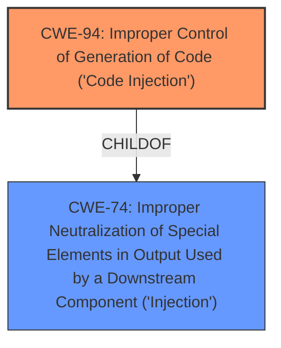

# Analysis for CVE-2021-28474

# Summary
| CWE ID | CWE Name | Confidence | CWE Abstraction Level | CWE Vulnerability Mapping Label | CWE-Vulnerability Mapping Notes |
|---|---|---|---|---|---|
| CWE-94 | Improper Control of Generation of Code ('Code Injection') | 0.75 | Base | Allowed-with-Review | Primary CWE |
| CWE-74 | Improper Neutralization of Special Elements in Output Used by a Downstream Component ('Injection') | 0.5 | Class | Discouraged | Secondary Candidate |

## Evidence and Confidence

*   **Confidence Score:** 0.7
*   **Evidence Strength:** MEDIUM

## Relationship Analysis
The primary relationship is that CWE-94 is a base class that describes the broader category of code injection. CWE-74 is a class level that represents injection vulnerabilities.
The hierarchical relationship that influenced the decision was that CWE-94, being a base CWE, is more specific than CWE-74.

## Vulnerability Chain
The vulnerability chain involves the **improper handling of server-side controls**, leading to the instantiation of an **unsafe server-side control** due to the use of a non-canonical string. This culminates in the execution of arbitrary code.

## Summary of Analysis
The initial assessment considered the primary CWE match, CWE-NVD-noinfo, from similar CVE descriptions but this is not a valid CWE.
The final decision leans heavily on the evidence provided in the "CVE Reference Links Content Summary," specifically the statement: "The vulnerability exists within the handling of server-side controls. By specifying a control using a non-canonical string, an unsafe server-side control can be instantiated." This, coupled with the **impact** of "remote code execution," suggests that the root cause involves injecting code through the **improper handling of server-side controls**.

The selection of CWE-94 is based on its description: "The product constructs all or part of a code segment using externally-influenced input from an upstream component, but it does not neutralize or incorrectly neutralizes special elements that could modify the syntax or behavior of the intended code segment." This aligns with the vulnerability's mechanism of instantiating an unsafe server-side control via a non-canonical string, leading to code execution.

CWE-74 was considered because it generally describes injection, but it is too high-level compared to CWE-94.

Relevant CWE Information:

# Enhanced Context (25 CWEs)
The following CWEs were identified as potentially relevant to this vulnerability:

## CWE-74: Improper Neutralization of Special Elements in Output Used by a Downstream Component ('Injection')
**Abstraction Level**: Class
**Similarity Score**: 0.77
**Source**: dense

**Description**:
The product constructs all or part of a command, data structure, or record using externally-influenced input from an upstream component, but it does not neutralize or incorrectly neutralizes special elements that could modify how it is parsed or interpreted when it is sent to a downstream component.

**Mapping Guidance**:
- Usage: Discouraged
- Rationale: CWE-74 is high-level and often misused when lower-level weaknesses are more appropriate.

### Analysis of CWE-94
CWE-94, Improper Control of Generation of Code ('Code Injection'), is chosen as the primary CWE because the vulnerability involves the instantiation of an unsafe server-side control via a non-canonical string, which leads to the execution of arbitrary code. This aligns with the description of CWE-94, which focuses on the **improper control of generating code**. The vulnerability's description and the "Root cause of vulnerability" statement support this classification. The confidence level is 0.75 due to the direct match between the vulnerability details and the CWE description.

### Analysis of CWE-74
CWE-74, Improper Neutralization of Special Elements in Output Used by a Downstream Component ('Injection'), was considered but not chosen as the primary CWE because it is a high-level, class-level CWE. Although the vulnerability does involve injection, CWE-94 provides a more specific and accurate representation of the **root cause**, which is the **improper control of code generation**.