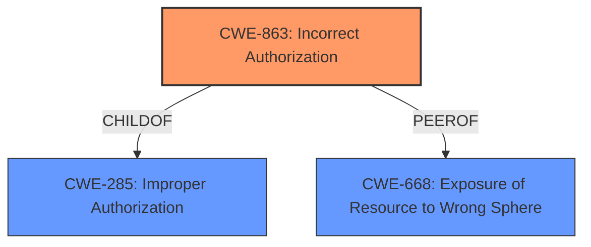

# Raw Analyzer Response for CVE-2021-28488

# Summary
| CWE ID | CWE Name | Confidence | CWE Abstraction Level | CWE Vulnerability Mapping Label | CWE-Vulnerability Mapping Notes |
|---|---|---|---|---|---|
| CWE-863 | Incorrect Authorization | 0.9 | Class | Primary | Allowed-with-Review |
| CWE-285 | Improper Authorization | 0.7 | Class | Secondary | Discouraged |
| CWE-668 | Exposure of Resource to Wrong Sphere | 0.6 | Class | Secondary | Discouraged |

## Evidence and Confidence

*   **Confidence Score:** 0.9
*   **Evidence Strength:** HIGH

## Relationship Analysis
The primary CWE selected is CWE-863, Incorrect Authorization, which is a child of CWE-285, Improper Authorization. CWE-285 represents a higher-level categorization of authorization issues, while CWE-863 specifically addresses cases where an authorization check is performed but is done incorrectly. CWE-668, Exposure of Resource to Wrong Sphere, is also considered due to the potential for unintended access to managed-network data, but it is a more general class.

## Vulnerability Chain
The vulnerability chain starts with **incorrect access-control behavior** (CWE-863), leading to the impact of being able to retrieve managed-network data.

## Summary of Analysis
The analysis centers on the **incorrect access-control behavior** in the Ericsson Network Manager. The description clearly states that "Users in the same AMOS authorization group can retrieve managed-network data that was not set to be accessible to the entire group." This points to an authorization issue, specifically that the authorization check is not correctly performed.

CWE-863, Incorrect Authorization, is selected as the primary CWE because it best fits the described scenario. The software performs an authorization check, but it is **incorrect**. The other CWEs were considered, but not chosen as the primary because they are either too general (CWE-285, Improper Authorization) or focus on a different aspect of the vulnerability (CWE-668, Exposure of Resource to Wrong Sphere).

The decision is based on the evidence from the vulnerability description, specifically the phrase "**incorrect access-control behavior**". This directly aligns with the definition of CWE-863, which involves an authorization check that is not correctly performed.

The CWE selection is at the optimal level of specificity because it captures the core issue of the vulnerability – the authorization check itself is flawed.

Relevant CWE Information:

# Enhanced Context (25 CWEs)
The following CWEs were identified as potentially relevant to this vulnerability:

## CWE-668: Exposure of Resource to Wrong Sphere
**Abstraction Level**: Class
**Similarity Score**: 0.79
**Source**: dense

**Description**:
The product exposes a resource to the wrong control sphere, providing unintended actors with inappropriate access to the resource.

**Mapping Guidance**:
- Usage: Discouraged
- Rationale: CWE-668 is high-level and is often misused as a catch-all when lower-level CWE IDs might be applicable. It is sometimes used for low-information vulnerability reports [REF-1287]. It is a level-1 Class (i.e., a child of a Pillar). It is not useful for trend analysis.

## CWE-863: Incorrect Authorization
**Abstraction Level**: Class
**Similarity Score**: 11172.24
**Source**: sparse

**Description**:
The product performs an authorization check when an actor attempts to access a resource or perform an action, but it does not correctly perform the check.

**Mapping Guidance**:
- Usage: Allowed-with-Review
- Rationale: This CWE entry is a Class and might have Base-level children that would be more appropriate

## CWE-285: Improper Authorization
**Abstraction Level**: Class
**Similarity Score**: 11239.89
**Source**: sparse

**Description**:
The product does not perform or incorrectly performs an authorization check when an actor attempts to access a resource or perform an action.

**Mapping Guidance**:
- Usage: Discouraged
- Rationale: CWE-285 is high-level and lower-level CWEs can frequently be used instead. It is a level-1 Class (i.e., a child of a Pillar).