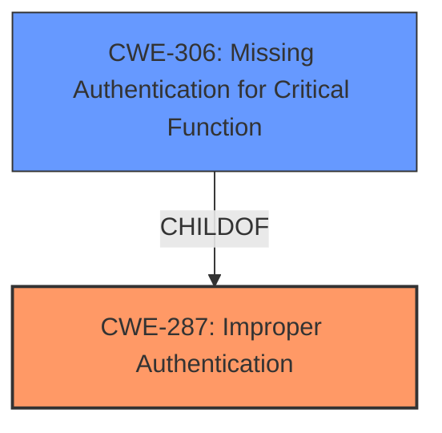

# Raw Analyzer Response for CVE-2021-28494

# Summary
| CWE ID | CWE Name | Confidence | CWE Abstraction Level | CWE Vulnerability Mapping Label | CWE-Vulnerability Mapping Notes |
|---|---|---|---|---|---|
| CWE-287 | Improper Authentication | 0.9 | Class | Primary | Allowed-with-Review |
| CWE-306 | Missing Authentication for Critical Function | 0.7 | Base | Secondary | Allowed |

## Evidence and Confidence

*   **Confidence Score:** 0.9
*   **Evidence Strength:** HIGH

## Relationship Analysis
The primary CWE is CWE-287, Improper Authentication, which is a class-level CWE. CWE-306, Missing Authentication for Critical Function, is a child of CWE-287 and is a base-level CWE. Because the vulnerability description indicates an authentication bypass, both CWE-287 and its child CWE-306 were considered. CWE-287 is a more general case that applies when authentication is attempted but is flawed. CWE-306 applies when authentication is missing altogether for a critical function. Given the evidence, CWE-287 is the more accurate fit.

## Vulnerability Chain
The chain of events is as follows:
1.  **Root Cause:** An unspecified flaw in Arista's MOS software leads to **incorrect authentication**.
2.  **Weakness:** **Improper authentication** allows unprivileged users to bypass authentication.
3.  **Impact:** Unauthorized access to the Web UI, potentially leading to configuration changes and control of the affected system.

## Summary of Analysis
The initial analysis focused on identifying the root cause of the authentication bypass. The description states that "authentication is bypassed by unprivileged users." The "CVE Reference Links Content Summary" confirms this, stating that the **weakness/vulnerability** present is "Authentication bypass" and the root cause is "An internally found vulnerability in Arista's MOS (Metamako Operating System) software." This points to **improper authentication** rather than a complete lack of authentication.

CWE-287 (Improper Authentication) is a class-level CWE that describes situations where the product does not prove or insufficiently proves that a user's claimed identity is correct. This aligns with the vulnerability description, as unprivileged users are able to bypass authentication.

CWE-306 (Missing Authentication for Critical Function) is a base-level CWE that describes situations where the product does not perform any authentication for functionality that requires it. While this could be a contributing factor, the description specifies that there is an attempt at authentication which is bypassed, making CWE-287 a better fit.

The graph relationships show that CWE-306 is a child of CWE-287, indicating a more specific case of authentication failure.

The final decision is to classify the vulnerability as CWE-287 (Improper Authentication) due to the presence of an authentication mechanism that is incorrectly implemented, allowing unprivileged users to bypass it. While CWE-306 could be considered a secondary weakness, the primary issue is with the flawed authentication process itself.

Relevant CWE Information:
*   **CWE-287: Improper Authentication**
    *   The vulnerability description matches the CWE's characteristics because it explicitly states that authentication is bypassed, indicating an **incorrect** or **insufficient** authentication process.
    *   The security implication is unauthorized access to the Web UI, potentially leading to configuration changes and control of the affected system.
    *   CWE-287 is a Class-level CWE, and its child CWE-306 (Missing Authentication for Critical Function) was considered but deemed less appropriate because authentication is not entirely missing but rather flawed.
    *   The MITRE mapping guidance discourages the use of CWE-287 when lower-level CWE entries are applicable, but in this case, the description does not provide enough detail to pinpoint a more specific weakness.
*   **CWE-306: Missing Authentication for Critical Function**
    *   This was considered as a secondary issue, since the description focused on the authentication bypass, but authentication was not entirely missing.
    *   It is a child of CWE-287, but it is a less precise fit since the primary issue is an **incorrect** authentication implementation.