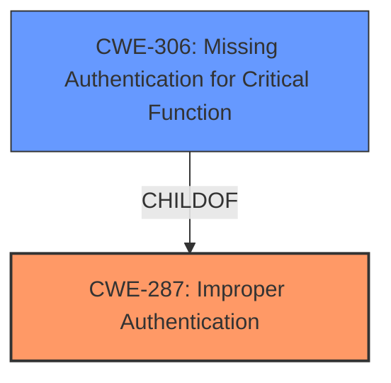

# Analysis for CVE-2021-28494

# Summary
| CWE ID | CWE Name | Confidence | CWE Abstraction Level | CWE Vulnerability Mapping Label | CWE-Vulnerability Mapping Notes |
|---|---|---|---|---|---|
| CWE-287 | Improper Authentication | 0.9 | Class | Primary | Allowed-with-Review |
| CWE-306 | Missing Authentication for Critical Function | 0.7 | Base | Secondary | Allowed |

## Evidence and Confidence

*   **Confidence Score:** 0.9
*   **Evidence Strength:** HIGH

## Relationship Analysis
The primary CWE is CWE-287, Improper Authentication, which is a class-level CWE. CWE-306, Missing Authentication for Critical Function, is a child of CWE-287 and is a base-level CWE. Because the vulnerability description indicates an authentication bypass, both CWE-287 and its child CWE-306 were considered. CWE-287 is a more general case that applies when authentication is attempted but is flawed. CWE-306 applies when authentication is missing altogether for a critical function. Given the evidence, CWE-287 is the more accurate fit.

## Vulnerability Chain
The chain of events is as follows:
1.  **Root Cause:** An unspecified flaw in Arista's MOS software leads to **incorrect authentication**.
2.  **Weakness:** **Improper authentication** allows unprivileged users to bypass authentication.
3.  **Impact:** Unauthorized access to the Web UI, potentially leading to configuration changes and control of the affected system.

## Summary of Analysis
The initial analysis focused on identifying the root cause of the authentication bypass. The description states that "authentication is bypassed by unprivileged users." The "CVE Reference Links Content Summary" confirms this, stating that the **weakness/vulnerability** present is "Authentication bypass" and the root cause is "An internally found vulnerability in Arista's MOS (Metamako Operating System) software." This points to **improper authentication** rather than a complete lack of authentication.

CWE-287 (Improper Authentication) is a class-level CWE that describes situations where the product does not prove or insufficiently proves that a user's claimed identity is correct. This aligns with the vulnerability description, as unprivileged users are able to bypass authentication.

CWE-306 (Missing Authentication for Critical Function) is a base-level CWE that describes situations where the product does not perform any authentication for functionality that requires it. While this could be a contributing factor, the description specifies that there is an attempt at authentication which is bypassed, making CWE-287 a better fit.

The graph relationships show that CWE-306 is a child of CWE-287, indicating a more specific case of authentication failure.

The final decision is to classify the vulnerability as CWE-287 (Improper Authentication) due to the presence of an authentication mechanism that is incorrectly implemented, allowing unprivileged users to bypass it. While CWE-306 could be considered a secondary weakness, the primary issue is with the flawed authentication process itself.

Relevant CWE Information:
*   **CWE-287: Improper Authentication**
    *   The vulnerability description matches the CWE's characteristics because it explicitly states that authentication is bypassed, indicating an **incorrect** or **insufficient** authentication process.
    *   The security implication is unauthorized access to the Web UI, potentially leading to configuration changes and control of the affected system.
    *   CWE-287 is a Class-level CWE, and its child CWE-306 (Missing Authentication for Critical Function) was considered but deemed less appropriate because authentication is not entirely missing but rather flawed.
    *   The MITRE mapping guidance discourages the use of CWE-287 when lower-level CWE entries are applicable, but in this case, the description does not provide enough detail to pinpoint a more specific weakness.
*   **CWE-306: Missing Authentication for Critical Function**
    *   This was considered as a secondary issue, since the description focused on the authentication bypass, but authentication was not entirely missing.
    *   It is a child of CWE-287, but it is a less precise fit since the primary issue is an **incorrect** authentication implementation.

# Enhanced Query for CVE-2021-28494

## Vulnerability Description
In Aristas MOS (Metamako Operating System) software which is supported on the 7130 product line, under certain conditions, authentication is bypassed by unprivileged users who are accessing the Web UI. This issue affects Arista Metamako Operating System MOS-0.34.0 and prior releases

### Vulnerability Description Key Phrases
- **impact:** authentication bypass
- **attacker:** unprivileged users
- **product:** Arista Metamako Operating System
- **version:** MOS-0.34.0 and prior releases
- **component:** Web UI

## CVE Reference Links Content Summary
The provided content is related to CVE-2021-28494.

**Root cause of vulnerability:** An internally found vulnerability in Arista's MOS (Metamako Operating System) software.

**Weaknesses/vulnerabilities present:** Authentication bypass. Under certain conditions, unprivileged users can bypass authentication when accessing the Web UI.

**Impact of exploitation:** Successful exploitation allows unprivileged users to access the Web UI, potentially leading to unauthorized access and control of the affected system. This could allow an attacker to make configuration changes to the system.

**Attack vectors:** The vulnerability is present in the Web UI of the affected systems, exploitable via network access.

**Required attacker capabilities/position:** An attacker requires network access to the Web UI of the affected Arista 7130 systems and requires an unprivileged user to attempt to authenticate.

## Retriever Results

### Top Combined Results

| Rank | CWE ID | Name | Abstraction | Usage  | Retrievers | Individual Scores |
|------|--------|------|-------------|-------|------------|-------------------|
| 1 | 256 | Plaintext Storage of a Password | Base | Allowed | sparse | 0.099 |
| 2 | 287 | Improper Authentication | Class | Discouraged | sparse | 0.097 |
| 3 | 522 | Insufficiently Protected Credentials | Class | Allowed-with-Review | sparse | 0.083 |
| 4 | 306 | Missing Authentication for Critical Function | Base | Allowed | sparse | 0.066 |
| 5 | 377 | Insecure Temporary File | Class | Allowed-with-Review | sparse | 0.065 |
| 6 | 303 | Incorrect Implementation of Authentication Algorithm | Base | Allowed | dense | 0.504 |
| 7 | 613 | Insufficient Session Expiration | Base | Allowed | graph | 0.002 |
| 8 | 732 | Incorrect Permission Assignment for Critical Resource | Class | Allowed-with-Review | sparse | 0.065 |
| 9 | 269 | Improper Privilege Management | Class | Discouraged | sparse | 0.064 |
| 10 | 427 | Uncontrolled Search Path Element | Base | Allowed | sparse | 0.064 |

# Complete CWE Specifications

## CWE-256: Plaintext Storage of a Password
**Abstraction:** Base
**Status:** Incomplete

### Description
Storing a password in plaintext may result in a system compromise.

### Extended Description
Password management issues occur when a password is stored in plaintext in an application's properties, configuration file, or memory. Storing a plaintext password in a configuration file allows anyone who can read the file access to the password-protected resource. In some contexts, even storage of a plaintext password in memory is considered a security risk if the password is not cleared immediately after it is used.

### Alternative Terms
None

### Relationships
ChildOf -> CWE-522

### Mapping Guidance
**Usage:** Allowed
**Rationale:** This CWE entry is at the Base level of abstraction, which is a preferred level of abstraction for mapping to the root causes of vulnerabilities.
**Comments:** Carefully read both the name and description to ensure that this mapping is an appropriate fit. Do not try to 'force' a mapping to a lower-level Base/Variant simply to comply with this preferred level of abstraction.
**Reasons:**
- Acceptable-Use

### Observed Examples
- **CVE-2022-30275:** Remote Terminal Unit (RTU) uses a driver that relies on a password stored in plaintext.

## CWE-287: Improper Authentication
**Abstraction:** Class
**Status:** Draft

### Description
When an actor claims to have a given identity, the product does not prove or insufficiently proves that the claim is correct.

### Extended Description
Not provided

### Alternative Terms
authentification: An alternate term is "authentification", which appears to be most commonly used by people from non-English-speaking countries.
AuthN: "AuthN" is typically used as an abbreviation of "authentication" within the web application security community. It is also distinct from "AuthZ," which is an abbreviation of "authorization." The use of "Auth" as an abbreviation is discouraged, since it could be used for either authentication or authorization.
AuthC: "AuthC" is used as an abbreviation of "authentication," but it appears to used less frequently than "AuthN."

### Relationships
ChildOf -> CWE-284
ChildOf -> CWE-284

### Mapping Guidance
**Usage:** Discouraged
**Rationale:** This CWE entry might be misused when lower-level CWE entries are likely to be applicable. It is a level-1 Class (i.e., a child of a Pillar).
**Comments:** Consider children or descendants, beginning with CWE-1390: Weak Authentication or CWE-306: Missing Authentication for Critical Function.
**Reasons:**
- Frequent Misuse
**Suggested Alternatives:**
- CWE-1390: Weak Authentication
- CWE-306: Missing Authentication for Critical Function

### Additional Notes
**[Relationship]** This can be resultant from SQL injection vulnerabilities and other issues.

**[Maintenance]** The Taxonomy_Mappings to ISA/IEC 62443 were added in CWE 4.10, but they are still under review and might change in future CWE versions. These draft mappings were performed by members of the "Mapping CWE to 62443" subgroup of the CWE-CAPEC ICS/OT Special Interest Group (SIG), and their work is incomplete as of CWE 4.10. The mappings are included to facilitate discussion and review by the broader ICS/OT community, and they are likely to change in future CWE versions.

### Observed Examples
- **CVE-2022-35248:** Chat application skips validation when Central Authentication Service (CAS) is enabled, effectively removing the second factor from two-factor authentication
- **CVE-2022-36436:** Python-based authentication proxy does not enforce password authentication during the initial handshake, allowing the client to bypass authentication by specifying a 'None' authentication type.
- **CVE-2022-30034:** Chain: Web UI for a Python RPC framework does not use regex anchors to validate user login emails (CWE-777), potentially allowing bypass of OAuth (CWE-1390).

## CWE-522: Insufficiently Protected Credentials
**Abstraction:** Class
**Status:** Incomplete

### Description
The product transmits or stores authentication credentials, but it uses an insecure method that is susceptible to unauthorized interception and/or retrieval.

### Extended Description
Not provided

### Alternative Terms
None

### Relationships
ChildOf -> CWE-1390
ChildOf -> CWE-287
ChildOf -> CWE-668

### Mapping Guidance
**Usage:** Allowed-with-Review
**Rationale:** This CWE entry is a Class and might have Base-level children that would be more appropriate
**Comments:** Examine children of this entry to see if there is a better fit
**Reasons:**
- Abstraction

### Observed Examples
- **CVE-2022-30018:** A messaging platform serializes all elements of User/Group objects, making private information available to adversaries
- **CVE-2022-29959:** Initialization file contains credentials that can be decoded using a "simple string transformation"
- **CVE-2022-35411:** Python-based RPC framework enables pickle functionality by default, allowing clients to unpickle untrusted data.

## CWE-306: Missing Authentication for Critical Function
**Abstraction:** Base
**Status:** Draft

### Description
The product does not perform any authentication for functionality that requires a provable user identity or consumes a significant amount of resources.

### Extended Description
Not provided

### Alternative Terms
None

### Relationships
ChildOf -> CWE-287
ChildOf -> CWE-287

### Mapping Guidance
**Usage:** Allowed
**Rationale:** This CWE entry is at the Base level of abstraction, which is a preferred level of abstraction for mapping to the root causes of vulnerabilities.
**Comments:** Carefully read both the name and description to ensure that this mapping is an appropriate fit. Do not try to 'force' a mapping to a lower-level Base/Variant simply to comply with this preferred level of abstraction.
**Reasons:**
- Acceptable-Use

### Observed Examples
- **CVE-2022-31260:** Chain: a digital asset management program has an undisclosed backdoor in the legacy version of a PHP script (CWE-912) that could allow an unauthenticated user to export metadata (CWE-306)
- **CVE-2022-29951:** TCP-based protocol in Programmable Logic Controller (PLC) has no authentication.
- **CVE-2022-29952:** Condition Monitor firmware uses a protocol that does not require authentication.

## CWE-377: Insecure Temporary File
**Abstraction:** Class
**Status:** Incomplete

### Description
Creating and using insecure temporary files can leave application and system data vulnerable to attack.

### Extended Description
Not provided

### Alternative Terms
None

### Relationships
ChildOf -> CWE-668

### Mapping Guidance
**Usage:** Allowed-with-Review
**Rationale:** This CWE entry is a Class and might have Base-level children that would be more appropriate
**Comments:** Examine children of this entry to see if there is a better fit
**Reasons:**
- Abstraction

### Additional Notes
**[Other]** 

Applications require temporary files so frequently that many different mechanisms exist for creating them in the C Library and Windows(R) API. Most of these functions are vulnerable to various forms of attacks.

The functions designed to aid in the creation of temporary files can be broken into two groups based whether they simply provide a filename or actually open a new file. - Group 1: "Unique" Filenames: The first group of C Library and WinAPI functions designed to help with the process of creating temporary files do so by generating a unique file name for a new temporary file, which the program is then supposed to open. This group includes C Library functions like tmpnam(), tempnam(), mktemp() and their C++ equivalents prefaced with an _ (underscore) as well as the GetTempFileName() function from the Windows API. This group of functions suffers from an underlying race condition on the filename chosen. Although the functions guarantee that the filename is unique at the time it is selected, there is no mechanism to prevent another process or an attacker from creating a file with the same name after it is selected but before the application attempts to open the file. Beyond the risk of a legitimate collision caused by another call to the same function, there is a high probability that an attacker will be able to create a malicious collision because the filenames generated by these functions are not sufficiently randomized to make them difficult to guess. If a file with the selected name is created, then depending on how the file is opened the existing contents or access permissions of the file may remain intact. If the existing contents of the file are malicious in nature, an attacker may be able to inject dangerous data into the application when it reads data back from the temporary file. If an attacker pre-creates the file with relaxed access permissions, then data stored in the temporary file by the application may be accessed, modified or corrupted by an attacker. On Unix based systems an even more insidious attack is possible if the attacker pre-creates the file as a link to another important file. Then, if the application truncates or writes data to the file, it may unwittingly perform damaging operations for the attacker. This is an especially serious threat if the program operates with elevated permissions. Finally, in the best case the file will be opened with the a call to open() using the O_CREAT and O_EXCL flags or to CreateFile() using the CREATE_NEW attribute, which will fail if the file already exists and therefore prevent the types of attacks described above. However, if an attacker is able to accurately predict a sequence of temporary file names, then the application may be prevented from opening necessary temporary storage causing a denial of service (DoS) attack. This type of attack would not be difficult to mount given the small amount of randomness used in the selection of the filenames generated by these functions. - Group 2: "Unique" Files: The second group of C Library functions attempts to resolve some of the security problems related to temporary files by not only generating a unique file name, but also opening the file. This group includes C Library functions like tmpfile() and its C++ equivalents prefaced with an _ (underscore), as well as the slightly better-behaved C Library function mkstemp(). The tmpfile() style functions construct a unique filename and open it in the same way that fopen() would if passed the flags "wb+", that is, as a binary file in read/write mode. If the file already exists, tmpfile() will truncate it to size zero, possibly in an attempt to assuage the security concerns mentioned earlier regarding the race condition that exists between the selection of a supposedly unique filename and the subsequent opening of the selected file. However, this behavior clearly does not solve the function's security problems. First, an attacker can pre-create the file with relaxed access-permissions that will likely be retained by the file opened by tmpfile(). Furthermore, on Unix based systems if the attacker pre-creates the file as a link to another important file, the application may use its possibly elevated permissions to truncate that file, thereby doing damage on behalf of the attacker. Finally, if tmpfile() does create a new file, the access permissions applied to that file will vary from one operating system to another, which can leave application data vulnerable even if an attacker is unable to predict the filename to be used in advance. Finally, mkstemp() is a reasonably safe way create temporary files. It will attempt to create and open a unique file based on a filename template provided by the user combined with a series of randomly generated characters. If it is unable to create such a file, it will fail and return -1. On modern systems the file is opened using mode 0600, which means the file will be secure from tampering unless the user explicitly changes its access permissions. However, mkstemp() still suffers from the use of predictable file names and can leave an application vulnerable to denial of service attacks if an attacker causes mkstemp() to fail by predicting and pre-creating the filenames to be used.

### Observed Examples
- **CVE-2022-41954:** A library uses the Java File.createTempFile() method which creates a file with "-rw-r--r--" default permissions on Unix-like operating systems

## CWE-303: Incorrect Implementation of Authentication Algorithm
**Abstraction:** Base
**Status:** Draft

### Description
The requirements for the product dictate the use of an established authentication algorithm, but the implementation of the algorithm is incorrect.

### Extended Description
This incorrect implementation may allow authentication to be bypassed.

### Alternative Terms
None

### Relationships
ChildOf -> CWE-1390

### Mapping Guidance
**Usage:** Allowed
**Rationale:** This CWE entry is at the Base level of abstraction, which is a preferred level of abstraction for mapping to the root causes of vulnerabilities.
**Comments:** Carefully read both the name and description to ensure that this mapping is an appropriate fit. Do not try to 'force' a mapping to a lower-level Base/Variant simply to comply with this preferred level of abstraction.
**Reasons:**
- Acceptable-Use

### Observed Examples
- **CVE-2003-0750:** Conditional should have been an 'or' not an 'and'.

## CWE-613: Insufficient Session Expiration
**Abstraction:** Base
**Status:** Incomplete

### Description
According to WASC, "Insufficient Session Expiration is when a web site permits an attacker to reuse old session credentials or session IDs for authorization."

### Extended Description
Not provided

### Alternative Terms
None

### Relationships
ChildOf -> CWE-672
ChildOf -> CWE-672
CanPrecede -> CWE-287

### Mapping Guidance
**Usage:** Allowed
**Rationale:** This CWE entry is at the Base level of abstraction, which is a preferred level of abstraction for mapping to the root causes of vulnerabilities.
**Comments:** Carefully read both the name and description to ensure that this mapping is an appropriate fit. Do not try to 'force' a mapping to a lower-level Base/Variant simply to comply with this preferred level of abstraction.
**Reasons:**
- Acceptable-Use

### Additional Notes
**[Other]** The lack of proper session expiration may improve the likely success of certain attacks. For example, an attacker may intercept a session ID, possibly via a network sniffer or Cross-site Scripting attack. Although short session expiration times do not help if a stolen token is immediately used, they will protect against ongoing replaying of the session ID. In another scenario, a user might access a web site from a shared computer (such as at a library, Internet cafe, or open work environment). Insufficient Session Expiration could allow an attacker to use the browser's back button to access web pages previously accessed by the victim.

## CWE-732: Incorrect Permission Assignment for Critical Resource
**Abstraction:** Class
**Status:** Draft

### Description
The product specifies permissions for a security-critical resource in a way that allows that resource to be read or modified by unintended actors.

### Extended Description
When a resource is given a permission setting that provides access to a wider range of actors than required, it could lead to the exposure of sensitive information, or the modification of that resource by unintended parties. This is especially dangerous when the resource is related to program configuration, execution, or sensitive user data. For example, consider a misconfigured storage account for the cloud that can be read or written by a public or anonymous user.

### Alternative Terms
None

### Relationships
ChildOf -> CWE-285
ChildOf -> CWE-668

### Mapping Guidance
**Usage:** Allowed-with-Review
**Rationale:** While the name itself indicates an assignment of permissions for resources, this is often misused for vulnerabilities in which "permissions" are not checked, which is an "authorization" weakness (CWE-285 or descendants) within CWE's model [REF-1287].
**Comments:** Closely analyze the specific mistake that is allowing the resource to be exposed, and perform a CWE mapping for that mistake.
**Reasons:**
- Frequent Misuse

### Additional Notes
**[Maintenance]** The relationships between privileges, permissions, and actors (e.g. users and groups) need further refinement within the Research view. One complication is that these concepts apply to two different pillars, related to control of resources (CWE-664) and protection mechanism failures (CWE-693).

### Observed Examples
- **CVE-2022-29527:** Go application for cloud management creates a world-writable sudoers file that allows local attackers to inject sudo rules and escalate privileges to root by winning a race condition.
- **CVE-2009-3482:** Anti-virus product sets insecure "Everyone: Full Control" permissions for files under the "Program Files" folder, allowing attackers to replace executables with Trojan horses.
- **CVE-2009-3897:** Product creates directories with 0777 permissions at installation, allowing users to gain privileges and access a socket used for authentication.

## CWE-269: Improper Privilege Management
**Abstraction:** Class
**Status:** Draft

### Description
The product does not properly assign, modify, track, or check privileges for an actor, creating an unintended sphere of control for that actor.

### Extended Description
Not provided

### Alternative Terms
None

### Relationships
ChildOf -> CWE-284

### Mapping Guidance
**Usage:** Discouraged
**Rationale:** CWE-269 is commonly misused. It can be conflated with "privilege escalation," which is a technical impact that is listed in many low-information vulnerability reports [REF-1287]. It is not useful for trend analysis.
**Comments:** If an error or mistake allows privilege escalation, then use the CWE ID for that mistake. Avoid using CWE-269 when only phrases such as "privilege escalation" or "gain privileges" are available, as these indicate technical impact of the vulnerability - not the root cause weakness. If the root cause seems to be directly related to privileges, then examine the children of CWE-269 for additional hints, such as Execution with Unnecessary Privileges (CWE-250) or Incorrect Privilege Assignment (CWE-266).
**Reasons:**
- Frequent Misuse

### Additional Notes
**[Maintenance]** The relationships between privileges, permissions, and actors (e.g. users and groups) need further refinement within the Research view. One complication is that these concepts apply to two different pillars, related to control of resources (CWE-664) and protection mechanism failures (CWE-693).

### Observed Examples
- **CVE-2001-1555:** Terminal privileges are not reset when a user logs out.
- **CVE-2001-1514:** Does not properly pass security context to child processes in certain cases, allows privilege escalation.
- **CVE-2001-0128:** Does not properly compute roles.

## CWE-427: Uncontrolled Search Path Element
**Abstraction:** Base
**Status:** Draft

### Description
The product uses a fixed or controlled search path to find resources, but one or more locations in that path can be under the control of unintended actors.

### Extended Description

Although this weakness can occur with any type of resource, it is frequently introduced when a product uses a directory search path to find executables or code libraries, but the path contains a directory that can be modified by an attacker, such as "/tmp" or the current working directory.

In Windows-based systems, when the LoadLibrary or LoadLibraryEx function is called with a DLL name that does not contain a fully qualified path, the function follows a search order that includes two path elements that might be uncontrolled:

  - the directory from which the program has been loaded

  - the current working directory

In some cases, the attack can be conducted remotely, such as when SMB or WebDAV network shares are used.

One or more locations in that path could include the Windows drive root or its subdirectories. This often exists in Linux-based code assuming the controlled nature of the root directory (/) or its subdirectories (/etc, etc), or a code that recursively accesses the parent directory. In Windows, the drive root and some of its subdirectories have weak permissions by default, which makes them uncontrolled.

In some Unix-based systems, a PATH might be created that contains an empty element, e.g. by splicing an empty variable into the PATH. This empty element can be interpreted as equivalent to the current working directory, which might be an untrusted search element.

In software package management frameworks (e.g., npm, RubyGems, or PyPi), the framework may identify dependencies on third-party libraries or other packages, then consult a repository that contains the desired package. The framework may search a public repository before a private repository. This could be exploited by attackers by placing a malicious package in the public repository that has the same name as a package from the private repository. The search path might not be directly under control of the developer relying on the framework, but this search order effectively contains an untrusted element.

### Alternative Terms
DLL preloading: This term is one of several that are used to describe exploitation of untrusted search path elements in Windows systems, which received wide attention in August 2010. From a weakness perspective, the term is imprecise because it can apply to both CWE-426 and CWE-427.
Binary planting: This term is one of several that are used to describe exploitation of untrusted search path elements in Windows systems, which received wide attention in August 2010. From a weakness perspective, the term is imprecise because it can apply to both CWE-426 and CWE-427.
Insecure library loading: This term is one of several that are used to describe exploitation of untrusted search path elements in Windows systems, which received wide attention in August 2010. From a weakness perspective, the term is imprecise because it can apply to both CWE-426 and CWE-427.
Dependency confusion: As of February 2021, this term is used to describe CWE-427 in the context of managing installation of software package dependencies, in which attackers release packages on public sites where the names are the same as package names used by private repositories, and the search for the dependent package tries the public site first, downloading untrusted code. It may also be referred to as a "substitution attack."

### Relationships
ChildOf -> CWE-668
ChildOf -> CWE-668

### Mapping Guidance
**Usage:** Allowed
**Rationale:** This CWE entry is at the Base level of abstraction, which is a preferred level of abstraction for mapping to the root causes of vulnerabilities.
**Comments:** Carefully read both the name and description to ensure that this mapping is an appropriate fit. Do not try to 'force' a mapping to a lower-level Base/Variant simply to comply with this preferred level of abstraction.
**Reasons:**
- Acceptable-Use

### Additional Notes
**[Relationship]** Unlike untrusted search path (CWE-426), which inherently involves control over the definition of a control sphere (i.e., modification of a search path), this entry concerns a fixed control sphere in which some part of the sphere may be under attacker control (i.e., the search path cannot be modified by an attacker, but one element of the path can be under attacker control).

**[Theoretical]** This weakness is not a clean fit under CWE-668 or CWE-610, which suggests that the control sphere model might need enhancement or clarification.

### Observed Examples
- **CVE-2023-25815:** chain: a change in an underlying package causes the gettext function to use implicit initialization with a hard-coded path (CWE-1419) under the user-writable C:\ drive, introducing an untrusted search path element (CWE-427) that enables spoofing of messages.
- **CVE-2022-4826:** Go-based git extension on Windows can search for and execute a malicious "..exe" in a repository because Go searches the current working directory if git.exe is not found in the PATH
- **CVE-2020-26284:** A Static Site Generator built in Go, when running on Windows, searches the current working directory for a command, possibly allowing code execution using a malicious .exe or .bat file with the name being searched

