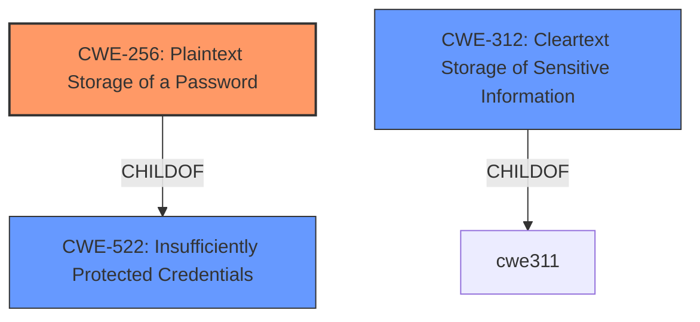

# Analysis Report for CVE-2021-28499

# Vulnerability Analysis Report: CVE-2021-28499

## Description


## Analysis (with Relationship Data)

# Summary
| CWE ID | CWE Name | Confidence | CWE Abstraction Level | CWE Vulnerability Mapping Label | CWE-Vulnerability Mapping Notes |
|---|---|---|---|---|---|
| CWE-256 | Plaintext Storage of a Password | 1.0 | Base | Allowed | Primary CWE.  The **rootcause** of the vulnerability is the storage of passwords in cleartext. |
| CWE-522 | Insufficiently Protected Credentials | 0.7 | Class | Allowed-with-Review | Secondary candidate. This CWE is a higher-level classification that encompasses various insecure methods of handling credentials, including plaintext storage. |
| CWE-312 | Cleartext Storage of Sensitive Information | 0.6 | Base | Allowed | Secondary candidate. This CWE describes the storage of sensitive information in cleartext, which is closely related to the primary issue. |

## Evidence and Confidence

*   **Confidence Score:** 0.85
*   **Evidence Strength:** HIGH

## Relationship Analysis
The primary CWE is CWE-256, which is a child of CWE-522. This reflects the hierarchical relationship where storing passwords in plaintext (CWE-256) is a specific type of insufficiently protected credential (CWE-522). CWE-256 is chosen because it is more specific and directly addresses the **rootcause** described in the vulnerability. CWE-312 is a peer of CWE-256 and represents cleartext storage of sensitive information, reinforcing the **rootcause**.



## Vulnerability Chain
The chain of events is as follows:
1.  **Root Cause:** User account passwords stored in **cleartext** (CWE-256).
2.  **Weakness:** Insufficient protection of credentials (CWE-522) due to the plaintext storage.
3.  **Impact:** Leak of user account passwords to unauthorized users, potentially leading to unauthorized system access and data breaches.

## Summary of Analysis
The initial analysis strongly points to CWE-256 as the primary weakness, given the explicit mention of "**clear text passwords**" in the vulnerability description key phrases and the CVE Reference Links Content Summary. The summary clearly states that the "**root cause** of the vulnerability" is storing user account passwords in **cleartext**.

CWE-256 (Plaintext Storage of a Password) directly aligns with the vulnerability description, which indicates user account passwords are stored in **cleartext**. This allows unauthorized users to gain access to these passwords. The security implication is a high risk of unauthorized access and potential system compromise. The relationship analysis confirms CWE-256 is a specific instance of CWE-522 (Insufficiently Protected Credentials), making it a more appropriate and specific choice.

CWE-522 was considered but deemed less specific than CWE-256. While the credentials were insufficiently protected, the **rootcause** was the **plaintext** storage. CWE-312 was considered because it describes the **cleartext** storage of sensitive information, but CWE-256 is more precise because it focuses specifically on passwords. Other CWEs, such as CWE-287 (Improper Authentication), were considered but rejected as the primary issue is not a failure in the authentication process itself, but rather how the passwords are stored. The mapping guidance for CWE-256 supports its use as it is a Base level of abstraction and directly relevant.

Therefore, CWE-256 is the optimal level of specificity for this vulnerability.


## CWE Relationship Analysis

Current CWEs represent these abstraction levels: .


### Vulnerability Chain Analysis

**Chain starting from CWE-256:**
- 256 (Plaintext Storage of a Password) - ROOT


**Chain starting from CWE-287:**
- 287 (Improper Authentication) - ROOT


### CWE Relationship Diagram

```mermaid
graph TD
    classDef primary fill:#f96,stroke:#333,stroke-width:2px
    classDef secondary fill:#69f,stroke:#333
    classDef tertiary fill:#9e9,stroke:#333
```


*Report generated on 2025-04-02 15:25:06*
