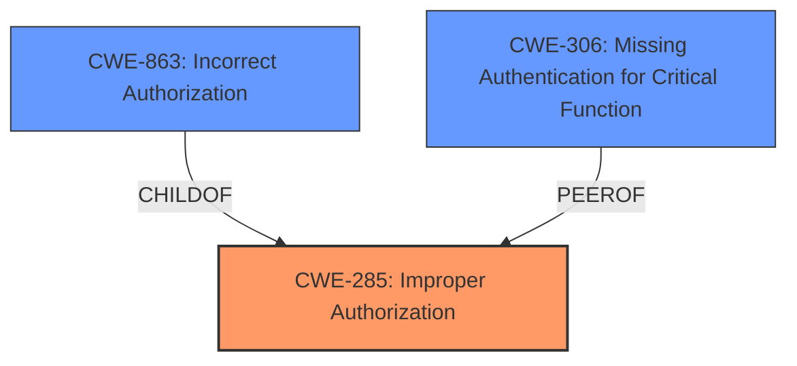

# Analysis Report for CVE-2021-28500

# Vulnerability Analysis Report: CVE-2021-28500

## Description


## Analysis (with Relationship Data)

# Summary
| CWE ID  | CWE Name                                       | Confidence | CWE Abstraction Level | CWE Vulnerability Mapping Label | CWE-Vulnerability Mapping Notes |
| :------- | :--------------------------------------------- | :--------- | :-------------------- | :------------------------------ | :------------------------------ |
| CWE-285 | Improper Authorization                       | 0.8        | Class                  | Primary CWE                      | Discouraged                  |
| CWE-863 | Incorrect Authorization                       | 0.7        | Class                  | Secondary Candidate              | Allowed-with-Review             |
| CWE-306 | Missing Authentication for Critical Function | 0.6        | Base                  | Secondary Candidate              | Allowed                       |

## Evidence and Confidence

*   **Confidence Score:** 0.8
*   **Evidence Strength:** MEDIUM

## Relationship Analysis
The primary relationship influencing the CWE selection is the hierarchical structure, specifically the parent-child relationship. CWE-285 (Improper Authorization) is a parent Class of CWE-863 (Incorrect Authorization). The vulnerability description indicates an issue related to authorization, but the specifics lean towards an **incorrect** implementation of authorization rather than a complete absence. However, the evidence is not sufficient to confirm **incorrect** authorization, so I picked the parent.
Here's the Mermaid diagram:



## Vulnerability Chain
The vulnerability chain starts with the **incorrect use of AAA APIs**, leading to **unrestricted access to the device**.
- **Root Cause:** **Incorrect use of AAA APIs**
- **Weakness:** Improper Authorization
- **Impact:** Unrestricted access to the device

## Summary of Analysis
Initially, the description points towards an authorization issue due to the "incorrect use of AAA APIs". The CVE Reference Links Content Summary confirms this by stating, for CVE-2021-28506, that certain gNOI APIs **incorrectly skip authorization and authentication**.

The selection of CWE-285 is based on the vulnerability description and the Retriever Results. The primary match from similar CVE descriptions is CWE-NVD-noinfo, which indicates insufficient information for proper CWE assignment, which is addressed by looking at the Retriever Results.

The "Vulnerability Description Key Phrases" identify the **rootcause** as **incorrect use of AAA APIs** and the **impact** as unrestricted access. The Retriever Results suggest CWE-285 (Improper Authorization) as the top candidate.

CWE-285 is a Class-level CWE, and its description states, "The product does not perform or incorrectly performs an authorization check when an actor attempts to access a resource or perform an action." Given the **incorrect use** aspect, CWE-863 (Incorrect Authorization) seems more specific, but the evidence isn't strong enough to confirm **incorrect** authorization since the APIs **incorrectly skip authorization and authentication**.

Therefore, I chose the parent class, CWE-285 (Improper Authorization), with a confidence of 0.8. I also considered CWE-306 (Missing Authentication for Critical Function) as a secondary candidate since the root cause included "incorrect use of AAA APIs" which led to skipping authentication and authorization. I am confident this selection captures the essence of the vulnerability, while acknowledging the limitations of the provided information.

Relevant CWE Information:

# Enhanced Context (25 CWEs)
The following CWEs were identified as potentially relevant to this vulnerability:

## CWE-274: Improper Handling of Insufficient Privileges
**Abstraction Level**: Base
**Similarity Score**: 0.78
**Source**: dense

**Description**:
The product does not handle or incorrectly handles when it has insufficient privileges to perform an operation, leading to resultant weaknesses.

**Mapping Guidance**:
- Usage: Discouraged
- Rationale: This CWE entry could be deprecated in a future version of CWE.

## CWE-280: Improper Handling of Insufficient Permissions or Privileges
**Abstraction Level**: Base
**Similarity Score**: 0.77
**Source**: dense

**Description**:
The product does not handle or incorrectly handles when it has insufficient privileges to access resources or functionality as specified by their permissions. This may cause it to follow unexpected code paths that may leave the product in an invalid state.

**Mapping Guidance**:
- Usage: Allowed
- Rationale: This CWE entry is at the Base level of abstraction, which is a preferred level of abstraction for mapping to the root causes of vulnerabilities.

## CWE-303: Incorrect Implementation of Authentication Algorithm
**Abstraction Level**: Base
**Similarity Score**: 0.77
**Source**: dense

**Description**:
The requirements for the product dictate the use of an established authentication algorithm, but the implementation of the algorithm is incorrect.

**Mapping Guidance**:
- Usage: Allowed
- Rationale: This CWE entry is at the Base level of abstraction, which is a preferred level of abstraction for mapping to the root causes of vulnerabilities.

## CWE-266: Incorrect Privilege Assignment
**Abstraction Level**: Base
**Similarity Score**: 0.77
**Source**: dense

**Description**:
A product incorrectly assigns a privilege to a particular actor, creating an unintended sphere of control for that actor.

**Mapping Guidance**:
- Usage: Allowed
- Rationale: This CWE entry is at the Base level of abstraction, which is a preferred level of abstraction for mapping to the root causes of vulnerabilities.

## CWE-1390: Weak Authentication
**Abstraction Level**: Class
**Similarity Score**: 0.77
**Source**: dense

**Description**:
The product uses an authentication mechanism to restrict access to specific users or identities, but the mechanism does not sufficiently prove that the claimed identity is correct.

**Mapping Guidance**:
- Usage: Allowed-with-Review
- Rationale: This CWE entry is a Class and might have Base-level children that would be more appropriate

## CWE-807: Reliance on Untrusted Inputs in a Security Decision
**Abstraction Level**: Base
**Similarity Score**: 0.76
**Source**: dense

**Description**:
The product uses a protection mechanism that relies on the existence or values of an input, but the input can be modified by an untrusted actor in a way that bypasses the protection mechanism.

**Mapping Guidance**:
- Usage: Allowed
- Rationale: This CWE entry is at the Base level of abstraction, which is a preferred level of abstraction for mapping to the root causes of vulnerabilities.

## CWE-1391: Use of Weak Credentials
**Abstraction Level**: Class
**Similarity Score**: 0.76
**Source**: dense

**Description**:
The product uses weak credentials (such as a default key or hard-coded password) that can be calculated, derived, reused, or guessed by an attacker.

**Mapping Guidance**:
- Usage: Allowed-with-Review
- Rationale: This CWE entry is a Class and might have Base-level children that would be more appropriate

## CWE-653: Improper Isolation or Compartmentalization
**Abstraction Level**: Class
**Similarity Score**: 0.76
**Source**: dense

**Description**:
The product does not properly compartmentalize or isolate functionality, processes, or resources that require different privilege levels, rights, or permissions.

**Mapping Guidance**:
- Usage: Allowed
- Rationale: This CWE entry is at the Base level of abstraction, which is a preferred level of abstraction for mapping to the root causes of vulnerabilities.

## CWE-798: Use of Hard-coded Credentials
**Abstraction Level**: Base
**Similarity Score**: 0.76
**Source**: dense

**Description**:
The product contains hard-coded credentials, such as a password or cryptographic key.

**Mapping Guidance**:
- Usage: Allowed
- Rationale: This CWE entry is at the Base level of abstraction, which is a preferred level of abstraction for mapping to the root causes of vulnerabilities.

## CWE-668: Exposure of Resource to Wrong Sphere
**Abstraction Level**: Class
**Similarity Score**: 0.75
**Source**: dense

**Description**:
The product exposes a resource to the wrong control sphere, providing unintended actors with inappropriate access to the resource.

**Mapping Guidance**:
- Usage: Discouraged
- Rationale: CWE-668 is high-level and is often misused as a catch-all when lower-level CWE IDs might be applicable. It is sometimes used for low-information vulnerability reports [REF-1287]. It is a level-1 Class (i.e., a child of a Pillar). It is not useful for trend analysis.

## CWE-285: Improper Authorization
**Abstraction Level**: Class
**Similarity Score**: 4732.22
**Source**: sparse

**Description**:
The product does not perform or incorrectly performs an authorization check when an


## CWE Relationship Analysis

Current CWEs represent these abstraction levels: .


### Vulnerability Chain Analysis

**Chain starting from CWE-306:**
- 306 (Missing Authentication for Critical Function) - ROOT


**Chain starting from CWE-303:**
- 303 (Incorrect Implementation of Authentication Algorithm) - ROOT


### CWE Relationship Diagram

```mermaid
graph TD
    classDef primary fill:#f96,stroke:#333,stroke-width:2px
    classDef secondary fill:#69f,stroke:#333
    classDef tertiary fill:#9e9,stroke:#333
```


*Report generated on 2025-04-02 09:04:31*
