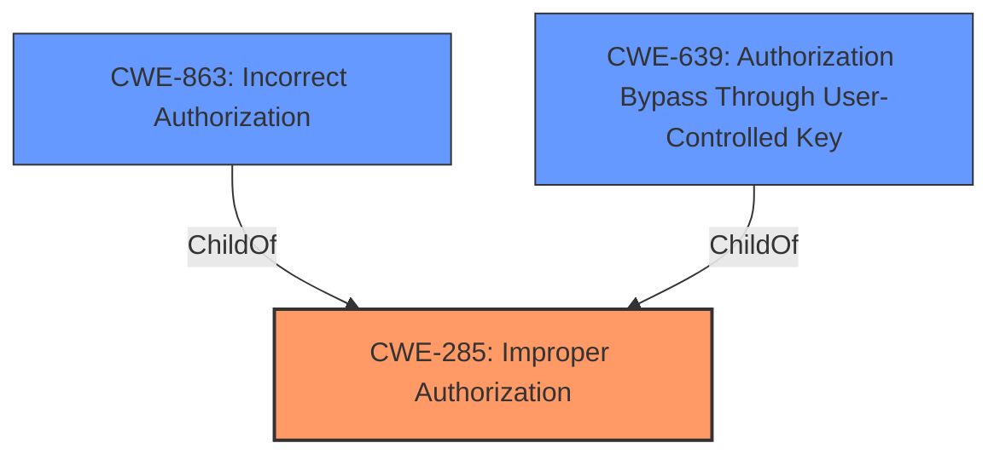

# Enhanced Analysis for CVE-2021-28563

# Summary
| CWE ID | CWE Name | Confidence | CWE Abstraction Level | CWE Vulnerability Mapping Label | CWE-Vulnerability Mapping Notes |
|---|---|---|---|---|---|
| **CWE-285** | **Improper Authorization** | 0.8 | Class | Primary | Discouraged, but chosen due to lack of more specific base-level CWE. |
| CWE-863 | Incorrect Authorization | 0.7 | Class | Secondary | Allowed-with-Review, considered as a more specific alternative to CWE-285. |
| CWE-639 | Authorization Bypass Through User-Controlled Key | 0.6 | Base | Secondary | Allowed, but less applicable as the bypass mechanism isn't explicitly user-controlled key modification. |

## Evidence and Confidence

*   **Confidence Score:** 0.8
*   **Evidence Strength:** MEDIUM

## Relationship Analysis
The primary relationship influencing the decision is the parent-child hierarchy where CWE-285 (Improper Authorization) is a parent of both CWE-863 (Incorrect Authorization) and CWE-639 (Authorization Bypass Through User-Controlled Key). While CWE-863 and CWE-639 offer more specific classifications, the vulnerability description lacks the necessary detail to definitively select one over the other. Therefore, CWE-285 is chosen as the primary CWE due to its higher-level applicability, but with the understanding that a more specific CWE could be appropriate with additional information.



## Vulnerability Chain
The chain of events is as follows:
1.  **Root Cause:** **Improper Authorization** in the Create Customer endpoint.
2.  **Weakness:** Failure to properly restrict access based on user roles/privileges.
3.  **Impact:** Unauthorized modification of customer data by an unauthenticated attacker.

## Summary of Analysis
The initial assessment identified **improper authorization** as the root cause, based on the "Vulnerability Description Key Phrases" and "CVE Reference Links Content Summary". The vulnerability allows an unauthenticated attacker to modify customer data, indicating a flaw in the authorization mechanism.

The Retriever Results suggested CWE-285 (Improper Authorization), CWE-863 (Incorrect Authorization), and CWE-639 (Authorization Bypass Through User-Controlled Key) as potential candidates.

CWE-285 is a Class-level CWE, which is generally discouraged. However, it serves as a suitable starting point when more specific information is lacking.

CWE-863 (Incorrect Authorization) is a more specific Class-level CWE, representing an authorization check that is performed incorrectly. This is a strong candidate, but the description doesn't explicitly state that an authorization check *exists* but is flawed, versus simply missing.

CWE-639 (Authorization Bypass Through User-Controlled Key) is a Base-level CWE, which is preferred. However, it's specifically related to bypass via user-controlled key, which isn't explicitly mentioned in the vulnerability description.

The decision to select CWE-285 as the primary CWE is based on the **rootcause** stated in the vulnerability description and the lack of specific details to definitively choose CWE-863 or CWE-639. The evidence supports a general **improper authorization**, and while more specific CWEs exist, they require more detailed evidence that is not present. I'm overriding the discouragement of CWE-285 to make it the primary because it most directly reflects what is known.

Relevant CWE Information:

# Enhanced Context (25 CWEs)
The following CWEs were identified as potentially relevant to this vulnerability:

## CWE-1289: Improper Validation of Unsafe Equivalence in Input
**Abstraction Level**: Base
**Similarity Score**: 0.79
**Source**: dense

**Description**:
The product receives an input value that is used as a resource identifier or other type of reference, but it does not validate or incorrectly validates that the input is equivalent to a potentially-unsafe value.

**Mapping Guidance**:
- Usage: Allowed
- Rationale: This CWE entry is at the Base level of abstraction, which is a preferred level of abstraction for mapping to the root causes of vulnerabilities.
- *Not Selected:* This CWE is too specific. There's no indication that the vulnerability involves unsafe equivalence validation.

## CWE-807: Reliance on Untrusted Inputs in a Security Decision
**Abstraction Level**: Base
**Similarity Score**: 0.78
**Source**: dense

**Description**:
The product uses a protection mechanism that relies on the existence or values of an input, but the input can be modified by an untrusted actor in a way that bypasses the protection mechanism.

**Mapping Guidance**:
- Usage: Allowed
- Rationale: This CWE entry is at the Base level of abstraction, which is a preferred level of abstraction for mapping to the root causes of vulnerabilities.
- *Not Selected:* This CWE is plausible, but there is no evidence that this vulnerability relies on untrusted inputs.

## CWE-183: Permissive List of Allowed Inputs
**Abstraction Level**: Base
**Similarity Score**: 0.76
**Source**: dense

**Description**:
The product implements a protection mechanism that relies on a list of inputs (or properties of inputs) that are explicitly allowed by policy because the inputs are assumed to be safe, but the list is too permissive - that is, it allows an input that is unsafe, leading to resultant weaknesses.

**Mapping Guidance**:
- Usage: Allowed
- Rationale: This CWE entry is at the Base level of abstraction, which is a preferred level of abstraction for mapping to the root causes of vulnerabilities.
- *Not Selected:* This CWE is too specific. There's no indication that the vulnerability is because the allow list is permissive.

## CWE-184: Incomplete List of Disallowed Inputs
**Abstraction Level**: Base
**Similarity Score**: 0.75
**Source**: dense

**Description**:
The product implements a protection mechanism that relies on a list of inputs (or properties of inputs) that are not allowed by policy or otherwise require other action to neutralize before additional processing takes place, but the list is incomplete.

**Mapping Guidance**:
- Usage: Allowed
- Rationale: This CWE entry is at the Base level of abstraction, which is a preferred level of abstraction for mapping to the root causes of vulnerabilities.
- *Not Selected:* This CWE is too specific. There's no indication that the vulnerability is because the list of disallowed inputs is incomplete.

## CWE-74: Improper Neutralization of Special Elements in Output Used by a Downstream Component ('Injection')
**Abstraction Level**: Class
**Similarity Score**: 0.75
**Source**: dense

**Description**:
The product constructs all or part of a command, data structure, or record using externally-influenced input from an upstream component, but it does not neutralize or incorrectly neutralizes special elements that could modify how it is parsed or interpreted when it is sent to a downstream component.

**Mapping Guidance**:
- Usage: Discouraged
- Rationale: CWE-74 is high-level and often misused when lower-level weaknesses are more appropriate.
- *Not Selected:* There's no evidence of injection in this vulnerability.

## CWE-472: External Control of Assumed-Immutable Web Parameter
**Abstraction Level**: Base
**Similarity Score**: 0.75
**Source**: dense

**Description**:
The web application does not sufficiently verify inputs that are assumed to be immutable but are actually externally controllable, such as hidden form fields.

**Mapping Guidance**:
- Usage: Allowed
- Rationale: This CWE entry is at the Base level of abstraction, which is a preferred level of abstraction for mapping to the root causes of vulnerabilities.
- *Not Selected:* There's no evidence that the web application does not sufficiently verify inputs that are assumed to be immutable

## CWE-138: Improper Neutralization of Special Elements
**Abstraction Level**: Class
**Similarity Score**: 0.75
**Source**: dense

**Description**:
The product receives input from an upstream component, but it does not neutralize or incorrectly neutralizes special elements that could be interpreted as control elements or syntactic markers when they are sent to a downstream component.

**Mapping Guidance**:
- Usage: Discouraged
- Rationale: This CWE entry is a level-1 Class (i.e., a child of a Pillar). It might have lower-level children that would be more appropriate
- *Not Selected:* This CWE is not relevant. There's no mention of failing to neutralize special elements.

## CWE-639: Authorization Bypass Through User-Controlled Key
**Abstraction Level**: Base
**Similarity Score**: 0.75
**Source**: dense

**Description**:
The system's


## CWE Relationship Analysis

Current CWEs represent these abstraction levels: .


### Vulnerability Chain Analysis

**Chain starting from CWE-285:**
- 285 (Improper Authorization) - ROOT


**Chain starting from CWE-1289:**
- 1289 (Improper Validation of Unsafe Equivalence in Input) - ROOT


### CWE Relationship Diagram

```mermaid
graph TD
    classDef primary fill:#f96,stroke:#333,stroke-width:2px
    classDef secondary fill:#69f,stroke:#333
    classDef tertiary fill:#9e9,stroke:#333
```