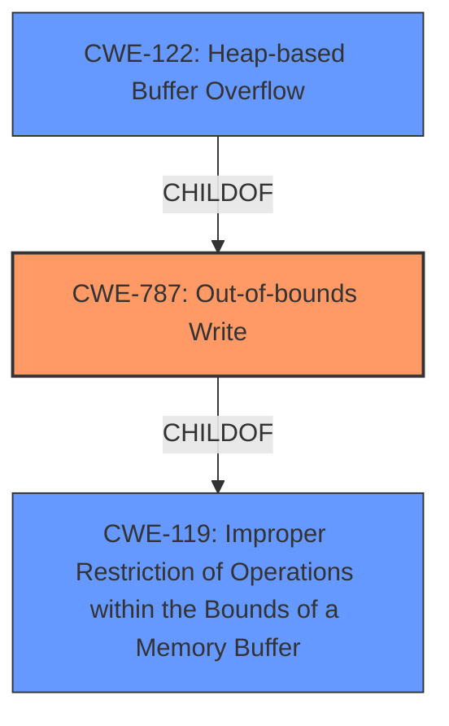

# Analysis Report for CVE-2021-28604

# Vulnerability Analysis Report: CVE-2021-28604

## Description


## Analysis (with Relationship Data)

# Summary

| CWE ID | CWE Name | Confidence | CWE Abstraction Level | CWE Vulnerability Mapping Label | CWE-Vulnerability Mapping Notes |
|---|---|---|---|---|---|
| CWE-787 | Out-of-bounds Write | 1.0 | Base | Allowed | Primary CWE |
| CWE-122 | Heap-based Buffer Overflow | 0.7 | Variant | Allowed | Secondary Candidate |
| CWE-119 | Improper Restriction of Operations within the Bounds of a Memory Buffer | 0.5 | Class | Discouraged | Secondary Candidate |

## Evidence and Confidence

*   **Confidence Score:** 0.9
*   **Evidence Strength:** HIGH

## Relationship Analysis
The primary weakness identified is CWE-787 (**Out-of-bounds Write**), a **Base** level CWE, which is a child of the **Class** level CWE-119 (**Improper Restriction of Operations within the Bounds of a Memory Buffer**). CWE-787 is more specific than CWE-119 and accurately describes the **root cause** of the vulnerability. CWE-122 (**Heap-based Buffer Overflow**) is a **Variant** of CWE-787, specifying the memory location of the overflow. The relationships influenced the decision to prioritize the more specific CWE-787, with CWE-122 as a secondary candidate to provide additional context.



## Vulnerability Chain
The vulnerability chain starts with the parsing of a specially crafted file, leading to a **heap-based buffer overflow** (**CWE-787**), which results in arbitrary code execution.

## Summary of Analysis
The initial analysis focused on the vulnerability description indicating a "**Heap-based Buffer Overflow**" when parsing a specially crafted file. The **Vulnerability Description Key Phrases** section explicitly identifies "**Heap-based Buffer Overflow**" as the **weakness**. The **CVE Reference Links Content Summary** confirms the "**root cause of vulnerability**" as "**Heap-based buffer overflow**".

The primary CWE match from the **CWE for similar CVE Descriptions** section is CWE-787 (**Out-of-bounds Write**). The Retriever Results also list CWE-787 as a strong candidate.

CWE-787 is the selected CWE because it accurately describes the **root cause** of the vulnerability, which is writing data beyond the intended buffer boundary.

CWE-122 (Heap-based Buffer Overflow) was considered but ultimately ranked as a secondary candidate, as it specifies the location of the buffer, making it a variant of CWE-787. While accurate, the base CWE-787 is preferred for root cause analysis.

CWE-119 (Improper Restriction of Operations within the Bounds of a Memory Buffer) was considered, but it is a more general **Class** level CWE. MITRE mapping guidance **discourages** using CWE-119 when more specific CWEs are available.

Relevant CWE Information:

# Enhanced Context (25 CWEs)

## CWE-1289: Improper Validation of Unsafe Equivalence in Input
**Abstraction Level**: Base
**Similarity Score**: 0.80

Not selected. Although the vulnerability involves parsing a file, there is no evidence to suggest that the input validation is related to unsafe equivalence.

## CWE-1288: Improper Validation of Consistency within Input
**Abstraction Level**: Base
**Similarity Score**: 0.77

Not selected. While a crafted file is involved, the core issue isn't the validation of consistency within the input file's structure but the buffer overflow itself.

## CWE-606: Unchecked Input for Loop Condition
**Abstraction Level**: Base
**Similarity Score**: 0.76

Not selected. This CWE is not applicable as the vulnerability is a buffer overflow, not related to unchecked loop conditions.

## CWE-183: Permissive List of Allowed Inputs
**Abstraction Level**: Base
**Similarity Score**: 0.76

Not selected. The vulnerability is not related to a permissive list of allowed inputs.

## CWE-807: Reliance on Untrusted Inputs in a Security Decision
**Abstraction Level**: Base
**Similarity Score**: 0.75

Not selected. The issue is not about relying on untrusted inputs for security decisions, but rather about a buffer overflow during file parsing.

## CWE-179: Incorrect Behavior Order: Early Validation
**Abstraction Level**: Base
**Similarity Score**: 0.75

Not selected. There's no indication that the order of validation is the issue.

## CWE-184: Incomplete List of Disallowed Inputs
**Abstraction Level**: Base
**Similarity Score**: 0.75

Not selected. This CWE doesn't fit the vulnerability description.

## CWE-1173: Improper Use of Validation Framework
**Abstraction Level**: Base
**Similarity Score**: 0.74

Not selected. The description does not mention anything about validation frameworks.

## CWE-115: Misinterpretation of Input
**Abstraction Level**: Base
**Similarity Score**: 0.74

Not selected. The issue is not misinterpretation of input, but rather a buffer overflow.

## CWE-681: Incorrect Conversion between Numeric Types
**Abstraction Level**: Base
**Similarity Score**: 0.74

Not selected. This CWE is not related to the identified buffer overflow.

## CWE-190: Integer Overflow or Wraparound
**Abstraction Level**: Base
**Similarity Score**: 7382.89

Not selected. The vulnerability is a buffer overflow, not an integer overflow.

## CWE-125: Out-of-bounds Read
**Abstraction Level**: Base
**Similarity Score**: 6883.50

Not selected. The vulnerability is an out-of-bounds write (buffer overflow), not a read.

## CWE-119: Improper Restriction of Operations within the Bounds of a Memory Buffer
**Abstraction Level**: Class
**Similarity Score**: 6730.80

Selected as a secondary candidate. This is a broader category that encompasses buffer overflows. However, CWE-787 is a more specific and appropriate classification.

## CWE-1284: Improper Validation of Specified Quantity in Input
**Abstraction Level**: Base
**Similarity Score**: 6707.53

Not selected. This CWE is not directly related to a buffer overflow.

## CWE-839: Numeric Range Comparison Without Minimum Check
**Abstraction Level**: Base
**Similarity Score**: 6572.05

Not selected. This CWE is not applicable as the vulnerability is a buffer overflow.

## CWE-128: Wrap-around Error
**Abstraction Level**: base
**Similarity Score**: 5.03

Not selected. This vulnerability is not related to a wrap-around error.

## CWE-41: Improper Resolution of Path Equivalence
**Abstraction Level**: base
**Similarity Score**: 5.03

Not selected. This vulnerability is not related to path equivalence.

## CWE-123: Write-what-where Condition
**Abstraction Level**: base
**Similarity Score**: 4.82

Not selected. While the buffer overflow can lead to write-what-where, the root cause is the overflow itself.

## CWE-170: Improper Null Termination
**Abstraction Level**: base
**Similarity Score**: 4.33

Not selected. This vulnerability is not related to null termination.

## CWE-22: Improper Limitation of a Pathname to a Restricted Directory ('Path Traversal')
**Abstraction Level**: base
**Similarity Score**: 4.33

Not selected. This vulnerability is not related to path traversal.

## CWE-770: Allocation of Resources Without Limits or Throttling
**Abstraction Level**: base
**Similarity Score**: 4.33

Not selected. This vulnerability is not related to resource allocation.

## CWE-73: External Control of File Name or Path
**Abstraction Level**: base
**Similarity Score**: 4.33

Not selected. This vulnerability is not related to external control of file names.

## CWE-122: Heap-based Buffer Overflow
**Abstraction Level**: Variant
**Similarity Score**: 0.451

Selected as a secondary candidate. This CWE is more specific than CWE-787 by detailing the location of the buffer.

## CWE-121: Stack-based Buffer Overflow
**Abstraction Level**: Variant
**Similarity Score**: 0.509

Not selected. The vulnerability is specifically identified as


## CWE Relationship Analysis

Current CWEs represent these abstraction levels: .


### Vulnerability Chain Analysis

**Chain starting from CWE-787:**
- 787 (Out-of-bounds Write) - ROOT


**Chain starting from CWE-839:**
- 839 (Numeric Range Comparison Without Minimum Check) - ROOT


### CWE Relationship Diagram

```mermaid
graph TD
    classDef primary fill:#f96,stroke:#333,stroke-width:2px
    classDef secondary fill:#69f,stroke:#333
    classDef tertiary fill:#9e9,stroke:#333
```


*Report generated on 2025-04-02 10:55:16*
