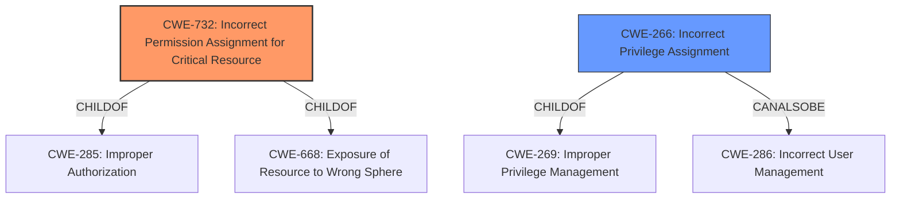

# Analysis for CVE-2021-28645

# Summary
| CWE ID | CWE Name | Confidence | CWE Abstraction Level | CWE Vulnerability Mapping Label | CWE-Vulnerability Mapping Notes |
|---|---|---|---|---|---|
| CWE-732 | Incorrect Permission Assignment for Critical Resource | 1.0 | Class | Allowed-with-Review | Primary CWE |
| CWE-266 | Incorrect Privilege Assignment | 0.7 | Base | Allowed | Secondary Candidate |

## Evidence and Confidence

*   **Confidence Score:** 0.9
*   **Evidence Strength:** HIGH

## Relationship Analysis
The primary CWE selected is CWE-732, which is a Class-level CWE. It is related to CWE-285 (Improper Authorization) and CWE-668 (Exposure of Resource to Wrong Sphere) through ChildOf relationships. CWE-266 is a Base-level CWE and child of CWE-269 (Improper Privilege Management) and peer of CWE-286 (Incorrect User Management). Given the provided information, CWE-732 provides a higher-level classification that aligns with the description of the vulnerability, while CWE-266 provides a more specific root cause which can also be associated.

## Vulnerability Chain
The vulnerability chain starts with the **incorrect permission assignment** on a resource, leading to privilege escalation. A local attacker, having already gained the ability to execute low-privileged code, can then exploit this vulnerability to escalate privileges to SYSTEM and execute arbitrary code.

## Summary of Analysis
The initial assessment identified CWE-732 as the primary candidate due to the **incorrect permission assignment** being the root cause. The CVE Reference Links Content Summary supports this by stating "Incorrect permissions set on a resource used by the Apex One Security Agent service." The description clearly states the vulnerability is an **"incorrect permission assignment"** which can "allow a local attacker to escalate privileges."

CWE-732 (Incorrect Permission Assignment for Critical Resource) aligns directly with the vulnerability description. The vulnerability involves incorrect permissions being set on a critical resource, allowing an attacker to escalate privileges. This matches the description of CWE-732, which states, "The product specifies permissions for a security-critical resource in a way that allows that resource to be read or modified by unintended actors."

CWE-266 (Incorrect Privilege Assignment) was considered as a secondary CWE. While the **incorrect permission assignment** leads to privilege escalation, the initial mistake is the incorrect assignment of permissions, not necessarily the assignment of privileges. Therefore, CWE-732 is a more direct and appropriate classification.

CWE-284 (Improper Access Control) was considered but deemed too high-level. While it's related, CWE-732 is more specific and accurately captures the root cause. The MITRE mapping guidance discourages the use of CWE-284 because it is a Pillar.

CWE-250 (Execution with Unnecessary Privileges) doesn't fit because the vulnerability isn't about the program running with unnecessary privileges, but rather the incorrect permissions on a resource allowing privilege escalation.

The final decision is to classify this vulnerability as CWE-732 (Incorrect Permission Assignment for Critical Resource) with high confidence, and CWE-266 (Incorrect Privilege Assignment) as a secondary candidate. This classification is based on the evidence provided in the vulnerability description, CVE reference links, and the definitions of the CWEs.