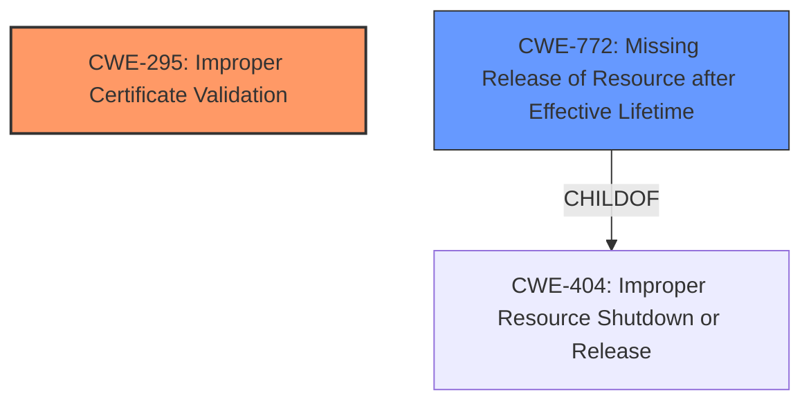

# Raw Analyzer Response for CVE-2021-28681

# Summary
| CWE ID | CWE Name | Confidence | CWE Abstraction Level | CWE Vulnerability Mapping Label | CWE-Vulnerability Mapping Notes |
|---|---|---|---|---|---|
| CWE-295 | Improper Certificate Validation | 0.8 | Base | Allowed | Primary CWE |
| CWE-772 | Missing Release of Resource after Effective Lifetime | 0.6 | Base | Allowed | Secondary Candidate |

## Evidence and Confidence

*   **Confidence Score:** 0.7
*   **Evidence Strength:** MEDIUM

## Relationship Analysis
The primary CWE is CWE-295, which represents the **improper certificate validation**. CWE-295 is a base level CWE, which means it's at a good level of abstraction for the root cause. CWE-295 has a PeerOf relationship with CWE-322 (Key Exchange without Entity Authentication).

## Vulnerability Chain
The vulnerability chain starts with the **improper certificate validation** (CWE-295). Because the connection isn't torn down properly, there is a **missing release of resource** (CWE-772) after the lifetime of the connection.

## Summary of Analysis
The vulnerability description indicates that the Pion WebRTC library **did not properly tear down the DTLS Connection when certificate verification failed**. The key phrase "improper DTLS Connection teardown" and the CVE Reference Links summary stating that "The library **did not properly terminate the connection** upon DTLS fingerprint verification failure" both point to a failure in managing the connection's lifecycle after a verification failure.

The primary CWE is CWE-295 Improper Certificate Validation, because that's where the teardown should have happened, and that is the root cause.
The secondary CWE is CWE-772 Missing Release of Resource after Effective Lifetime, because the connection was not terminated.

Relevant CWE Information:

# Enhanced Context (25 CWEs)
The following CWEs were identified as potentially relevant to this vulnerability:

## CWE-404: Improper Resource Shutdown or Release
**Abstraction Level**: Class
**Similarity Score**: 0.81
**Source**: dense

**Description**:
The product does not release or incorrectly releases a resource before it is made available for re-use.

**Mapping Guidance**:
- Usage: Allowed-with-Review
- Rationale: This CWE entry is a Class and might have Base-level children that would be more appropriate

## CWE-772: Missing Release of Resource after Effective Lifetime
**Abstraction Level**: Base
**Similarity Score**: 0.79
**Source**: dense

**Description**:
The product does not release a resource after its effective lifetime has ended, i.e., after the resource is no longer needed.

**Mapping Guidance**:
- Usage: Allowed
- Rationale: This CWE entry is at the Base level of abstraction, which is a preferred level of abstraction for mapping to the root causes of vulnerabilities.

## CWE-295: Improper Certificate Validation
**Abstraction Level**: Base
**Similarity Score**: 4632.59
**Source**: sparse

**Description**:
The product does not validate, or incorrectly validates, a certificate.

**Mapping Guidance**:
- Usage: Allowed
- Rationale: This CWE entry is at the Base level of abstraction, which is a preferred level of abstraction for mapping to the root causes of vulnerabilities.