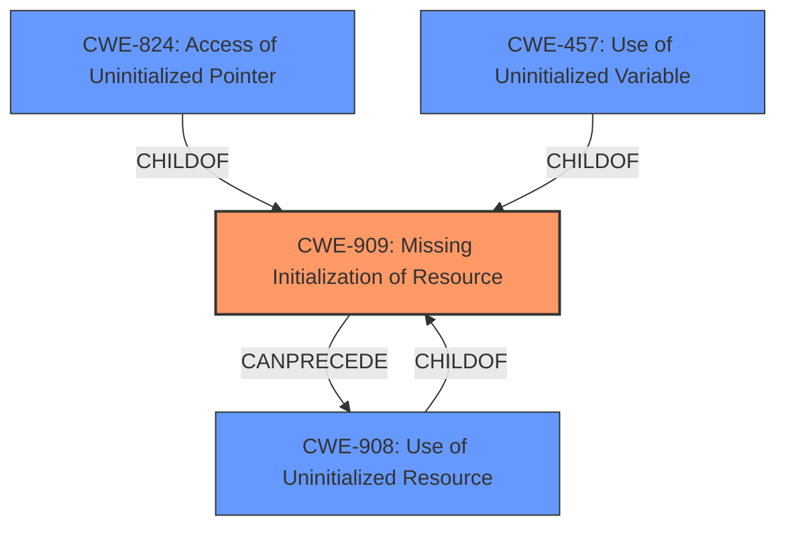

# Enhanced Analysis for CVE-2021-28687

# Summary
| CWE ID | CWE Name | Confidence | CWE Abstraction Level | CWE Vulnerability Mapping Label | CWE-Vulnerability Mapping Notes |
|---|---|---|---|---|---|
| CWE-909 | Missing Initialization of Resource | 0.9 | Class | Allowed-with-Review | Primary CWE |
| CWE-908 | Use of Uninitialized Resource | 0.7 | Base | Allowed | Secondary Candidate |
| CWE-824 | Access of Uninitialized Pointer | 0.6 | Base | Allowed | Secondary Candidate |
| CWE-457 | Use of Uninitialized Variable | 0.6 | Variant | Allowed | Secondary Candidate |

## Evidence and Confidence

*   **Confidence Score:** 0.9
*   **Evidence Strength:** HIGH

## Relationship Analysis
The primary CWE selected is CWE-909 (Missing Initialization of Resource), a Class-level CWE. This is supported by the vulnerability description, which explicitly states that the **uninitialized data structure** `libxl__domain_suspend_state` structure leads to a crash. CWE-909 has a CanPrecede relationship with CWE-908 (Use of Uninitialized Resource), indicating that a missing initialization can lead to the use of an uninitialized resource. However, the description focuses more on the missing initialization as the direct cause, making CWE-909 a more accurate primary classification. The relationship between CWE-909 and it's children, such as CWE-908, was considered, but the evidence focuses on the missing initialization.



## Vulnerability Chain
The chain of events starts with the **missing initialization** (CWE-909) of the `libxl__domain_suspend_state` structure, which leads to the use of an **uninitialized data structure**. This, in turn, causes the `assert()` function to fail when the code encounters the structure in an unexpected state. The failure of `assert()` then leads to a process crash, causing a localized or system-wide Denial of Service (DoS).

## Summary of Analysis
The primary assessment is based on the provided evidence, specifically the **rootcause** of the **"uninitialized data structure"** and the **missing initialization**. The graph relationships highlight the connection between CWE-909 and its potential consequences, such as the use of uninitialized resources.

The selection of CWE-909 is at the appropriate level of specificity because the provided description explicitly identifies the **missing initialization** as the root cause. While the use of the **uninitialized data structure** (CWE-908 or children like CWE-824 and CWE-457) is a direct consequence, the vulnerability lies in the fact that the structure was not initialized in the first place. The "CVE Reference Links Content Summary" reinforces this by stating that "The vulnerability stems from a missing initialization of the `libxl__domain_suspend_state` structure within the "soft reset" feature of Xen."

Relevant CWE Information:

# Enhanced Context (25 CWEs)
The following CWEs were identified as potentially relevant to this vulnerability:

## CWE-909: Missing Initialization of Resource
**Abstraction Level**: Class
**Similarity Score**: 0.80
**Source**: dense

**Description**:
The product does not initialize a critical resource.

**Mapping Guidance**:
- Usage: Allowed-with-Review
- Rationale: This CWE entry is a Class and might have Base-level children that would be more appropriate

## CWE-404: Improper Resource Shutdown or Release
**Abstraction Level**: Class
**Similarity Score**: 0.78
**Source**: dense

**Description**:
The product does not release or incorrectly releases a resource before it is made available for re-use.

## CWE-226: Sensitive Information in Resource Not Removed Before Reuse
**Abstraction Level**: Base
**Similarity Score**: 0.78
**Source**: dense

**Description**:
The product releases a resource such as memory or a file so that it can be made available for reuse, but it does not clear or "zeroize" the information contained in the resource before the product performs a critical state transition or makes the resource available for reuse by other entities.

## CWE-665: Improper Initialization
**Abstraction Level**: Class
**Similarity Score**: 0.78
**Source**: dense

**Description**:
The product does not initialize or incorrectly initializes a resource, which might leave the resource in an unexpected state when it is accessed or used.

## CWE-908: Use of Uninitialized Resource
**Abstraction Level**: Base
**Similarity Score**: 0.77
**Source**: dense

**Description**:
The product uses or accesses a resource that has not been initialized.

## CWE-667: Improper Locking
**Abstraction Level**: Class
**Similarity Score**: 0.77
**Source**: dense

**Description**:
The product does not properly acquire or release a lock on a resource, leading to unexpected resource state changes and behaviors.

## CWE-824: Access of Uninitialized Pointer
**Abstraction Level**: Base
**Similarity Score**: 0.76
**Source**: dense

**Description**:
The product accesses or uses a pointer that has not been initialized.

## CWE-457: Use of Uninitialized Variable
**Abstraction Level**: Variant
**Similarity Score**: 0.76
**Source**: dense

**Description**:
The code uses a variable that has not been initialized, leading to unpredictable or unintended results.

## CWE-754: Improper Check for Unusual or Exceptional Conditions
**Abstraction Level**: Class
**Similarity Score**: 0.75
**Source**: dense

**Description**:
The product does not check or incorrectly checks for unusual or exceptional conditions that are not expected to occur frequently during day to day operation of the product.

## CWE-755: Improper Handling of Exceptional Conditions
**Abstraction Level**: Class
**Similarity Score**: 0.75
**Source**: dense

**Description**:
The product does not handle or incorrectly handles an exceptional condition.

## CWE-909: Missing Initialization of Resource
**Abstraction Level**: Class
**Similarity Score**: 6039.28
**Source**: sparse

**Description**:
The product does not initialize a critical resource.

## CWE-754: Improper Check for Unusual or Exceptional Conditions
**Abstraction Level**: Class
**Similarity Score**: 5320.46
**Source**: sparse

**Description**:
The product does not check or incorrectly checks for unusual or exceptional conditions that are not expected to occur frequently during day to day operation of the product.

## CWE-252: Unchecked Return Value
**Abstraction Level**: Base
**Similarity Score**: 5273.69
**Source**: sparse

**Description**:
The product does not check the return value from a method or function, which can prevent it from detecting unexpected states and conditions.

## CWE-824: Access of Uninitialized Pointer
**Abstraction Level**: Base
**Similarity Score**: 5133.14
**Source**: sparse

**Description**:
The product accesses or uses a pointer that has not been initialized.

## CWE-789: Memory Allocation with Excessive Size Value
**Abstraction Level**: Variant
**Similarity Score**: 5093.06
**Source**: sparse

**Description**:
The product allocates memory based on an untrusted, large size value, but it does not ensure that the size is within expected limits, allowing arbitrary amounts of memory to be allocated.

## CWE-1325: Improperly Controlled Sequential Memory Allocation
**Abstraction Level**: base
**Similarity Score**: 5.03
**Source**: graph

**Description**:
CWE-1325: Improperly Controlled Sequential Memory Allocation

## CWE-1284: Improper Validation of Specified Quantity in Input
**Abstraction Level**: base
**Similarity Score**: 4.33
**Source**: graph

**Description**:
CWE-1284: Improper Validation of Specified Quantity in Input

## CWE-476: NULL Pointer Dereference
**Abstraction Level**: base
**Similarity Score**: 4.33
**Source**: graph

**Description**:
CWE-476: NULL Pointer Dereference

## CWE-190: Integer Overflow


## CWE Relationship Analysis

Current CWEs represent these abstraction levels: .


### Vulnerability Chain Analysis

**Chain starting from CWE-667:**
- 667 (Improper Locking) - ROOT


**Chain starting from CWE-754:**
- 754 (Improper Check for Unusual or Exceptional Conditions) - ROOT


### CWE Relationship Diagram

```mermaid
graph TD
    classDef primary fill:#f96,stroke:#333,stroke-width:2px
    classDef secondary fill:#69f,stroke:#333
    classDef tertiary fill:#9e9,stroke:#333
```