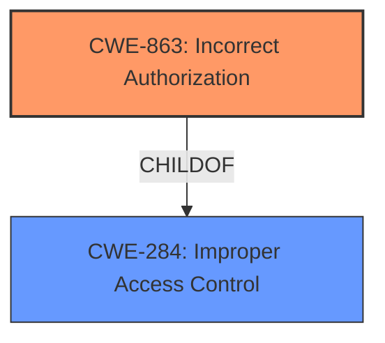

# Analysis Report for CVE-2021-28694

# Vulnerability Analysis Report: CVE-2021-28694

## Description


## Analysis (with Relationship Data)

# Summary
| CWE ID | CWE Name | Confidence | CWE Abstraction Level | CWE Vulnerability Mapping Label | CWE-Vulnerability Mapping Notes |
|---|---|---|---|---|---|
| CWE-863 | Incorrect Authorization | 0.9 | Class | Primary | Allowed-with-Review |
| CWE-284 | Improper Access Control | 0.6 | Pillar | Secondary | Discouraged |

## Evidence and Confidence

*   **Confidence Score:** 0.8
*   **Evidence Strength:** HIGH

## Relationship Analysis
The primary relationship that influenced the decision was the hierarchical relationship between CWE-284 (Improper Access Control) and CWE-863 (Incorrect Authorization). CWE-863 is a child of CWE-284, providing a more specific classification for authorization issues. The vulnerability description indicates an authorization problem, making CWE-863 the more appropriate choice.



## Vulnerability Chain
The vulnerability chain involves the following:

1.  **Root Cause:** **IOMMU page mapping issues** due to a **failure to prevent guests from undoing/replacing mappings** and **leaving identity mappings in place** after device de-assignment.
2.  **Weakness:** Incorrect Authorization (CWE-863) leading to **improper access control**.
3.  **Impact:** Guest gaining continued access to memory ranges they should not have, potentially leading to privilege escalation, denial of service, or information leaks.

## Summary of Analysis
The initial analysis pointed towards access control issues related to IOMMU page mappings. The key evidence for this lies in the **Vulnerability Description** which mentions "**IOMMU page mapping issues**" and how "Xen failed to prevent guests from undoing/replacing such mappings" (CVE-2021-28694) and "upon de-assigment of a physical device from a guest, the identity mappings would be left in place, allowing a guest continued access to ranges of memory which it shouldnt have access to anymore (CVE-2021-28696)". The CVE reference link content summary also explicitly states "**Improper access control. The hypervisor did not enforce restrictions on modifying untranslated memory regions**".

The **CWE for similar CVE Descriptions** lists CWE-863 as the Top CWE.

The Retriever Results also list CWE-863 (Incorrect Authorization) as the top candidate.

CWE-284 (Improper Access Control) was considered, but CWE-863 is a more specific child of CWE-284. The vulnerability involves **incorrect authorization** checks related to memory mappings, making CWE-863 a better fit.

The selection of CWE-863 is at the optimal level of specificity because it accurately reflects the nature of the vulnerability, which is an **incorrect authorization** mechanism related to IOMMU page mappings.

Relevant CWE Information:

# Enhanced Context (25 CWEs)

## CWE-404: Improper Resource Shutdown or Release
**Abstraction Level**: Class
**Similarity Score**: 0.79
**Source**: dense

**Description**:
The product does not release or incorrectly releases a resource before it is made available for re-use.

**Mapping Guidance**:
- Usage: Allowed-with-Review
- Rationale: This CWE entry is a Class and might have Base-level children that would be more appropriate

*Not Selected*: This CWE focuses on the improper release of resources, which isn't the primary issue described in the vulnerability. The vulnerability is more focused on the authorization and access control mechanisms related to memory mappings.

## CWE-667: Improper Locking
**Abstraction Level**: Class
**Similarity Score**: 0.79
**Source**: dense

**Description**:
The product does not properly acquire or release a lock on a resource, leading to unexpected resource state changes and behaviors.

**Mapping Guidance**:
- Usage: Allowed-with-Review
- Rationale: This CWE entry is a Class and might have Base-level children that would be more appropriate

*Not Selected*: This CWE relates to locking mechanisms and concurrent access. While concurrency might be involved at some level, the core issue is the **incorrect authorization** related to memory mappings.

## CWE-226: Sensitive Information in Resource Not Removed Before Reuse
**Abstraction Level**: Base
**Similarity Score**: 0.78
**Source**: dense

**Description**:
The product releases a resource such as memory or a file so that it can be made available for reuse, but it does not clear or "zeroize" the information contained in the resource before the product performs a critical state transition or makes the resource available for reuse by other entities.

**Mapping Guidance**:
- Usage: Allowed
- Rationale: This CWE entry is at the Base level of abstraction, which is a preferred level of abstraction for mapping to the root causes of vulnerabilities.

*Not Selected*: This CWE focuses on the failure to clear sensitive information before resource reuse. While related to memory management, it is not the primary issue. The core vulnerability lies in the **incorrect authorization** of memory regions.

## CWE-703: Improper Check or Handling of Exceptional Conditions
**Abstraction Level**: Pillar
**Similarity Score**: 0.78
**Source**: dense

**Description**:
The product does not properly anticipate or handle exceptional conditions that rarely occur during normal operation of the product.

**Mapping Guidance**:
- Usage: Discouraged
- Rationale: This CWE entry is extremely high-level, a Pillar.

*Not Selected*: This is a very general CWE and doesn't accurately represent the specific **incorrect authorization** issue related to memory mappings.

## CWE-754: Improper Check for Unusual or Exceptional Conditions
**Abstraction Level**: Class
**Similarity Score**: 0.77
**Source**: dense

**Description**:
The product does not check or incorrectly checks for unusual or exceptional conditions that are not expected to occur frequently during day to day operation of the product.

**Mapping Guidance**:
- Usage: Allowed-with-Review
- Rationale: This CWE entry is a Class and might have Base-level children that would be more appropriate

*Not Selected*: Similar to CWE-703, this is too general and doesn't pinpoint the **incorrect authorization** mechanism.

## CWE-274: Improper Handling of Insufficient Privileges
**Abstraction Level**: Base
**Similarity Score**: 0.77
**Source**: dense

**Description**:
The product does not handle or incorrectly handles when it has insufficient privileges to perform an operation, leading to resultant weaknesses.

**Mapping Guidance**:
- Usage: Discouraged
- Rationale: This CWE entry could be deprecated in a future version of CWE.

*Not Selected*: While privilege escalation is a potential impact, the root cause is the **incorrect authorization**, not merely the handling of insufficient privileges.

## CWE-664: Improper Control of a Resource Through its Lifetime
**Abstraction Level**: Pillar
**Similarity Score**: 0.76
**Source**: dense

**Description**:
The product does not maintain or incorrectly maintains control over a resource throughout its lifetime of creation, use, and release.

**Mapping Guidance**:
- Usage: Discouraged
- Rationale: This CWE entry is high-level when lower-level children are available.

*Not Selected*: This is too broad and doesn't address the specific **incorrect authorization** issue.

## CWE-789: Memory Allocation with Excessive Size Value
**Abstraction Level**: Variant
**Similarity Score**: 0.76
**Source**: dense

**Description**:
The product allocates memory based on an untrusted, large size value, but it does not ensure that the size is within expected limits, allowing arbitrary amounts of memory to be allocated.

**Mapping Guidance**:
- Usage: Allowed
- Rationale: This CWE entry is at the Variant level of abstraction, which is a preferred level of abstraction for mapping to the root causes of vulnerabilities.

*Not Selected*: The vulnerability isn't primarily about memory allocation size but about **incorrect authorization** of memory regions.

## CWE-131: Incorrect Calculation of Buffer Size
**Abstraction Level**: Base
**Similarity Score**: 0.76
**Source**: dense

**Description**:
The product does not correctly calculate the size to be used when allocating a buffer, which could lead to a buffer overflow.

**Mapping Guidance**:
- Usage: Allowed
- Rationale: This CWE entry is at the Base level of abstraction, which is a preferred level of abstraction for mapping to the root causes of vulnerabilities.

*Not Selected*: Similar to CWE-789, the buffer size calculation isn't the main problem. It's about the **incorrect authorization**.

## CWE-212: Improper Removal of Sensitive Information Before Storage or Transfer
**Abstraction Level**: Base
**Similarity Score**: 0.76
**Source**: dense

**Description**:
The product stores, transfers, or shares a resource that contains sensitive information,


## CWE Relationship Analysis

Current CWEs represent these abstraction levels: .


### Vulnerability Chain Analysis

**Chain starting from CWE-667:**
- 667 (Improper Locking) - ROOT


**Chain starting from CWE-754:**
- 754 (Improper Check for Unusual or Exceptional Conditions) - ROOT


### CWE Relationship Diagram

```mermaid
graph TD
    classDef primary fill:#f96,stroke:#333,stroke-width:2px
    classDef secondary fill:#69f,stroke:#333
    classDef tertiary fill:#9e9,stroke:#333
```


*Report generated on 2025-04-02 07:48:47*
