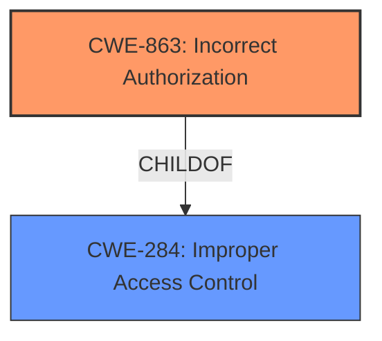

# Analysis Report for CVE-2021-28696

# Vulnerability Analysis Report: CVE-2021-28696

## Description


## Analysis (with Relationship Data)

# Summary
| CWE ID  | CWE Name | Confidence | CWE Abstraction Level | CWE Vulnerability Mapping Label | CWE-Vulnerability Mapping Notes |
|-----------------|-------------------------------------------------------------------------------------------------|------------|-------------------------|------------------------------------|-----------------------------------|
| CWE-863 | Incorrect Authorization | 0.75 | Class | Allowed-with-Review | Primary CWE |
| CWE-284 | Improper Access Control | 0.5 | Pillar | Discouraged | Secondary Candidate |

## Evidence and Confidence

*   **Confidence Score:** 0.75
*   **Evidence Strength:** MEDIUM

## Relationship Analysis
The primary relationship influencing the CWE selection is the hierarchical relationship between CWE-284 and CWE-863. CWE-863 (Incorrect Authorization) is a child of CWE-284 (Improper Access Control). The vulnerability description points towards an authorization issue, making CWE-863 a more specific and therefore better fit than its parent. The chain relationships are not directly applicable in this case, as the description focuses on the initial authorization failure rather than a sequence of events.



## Vulnerability Chain
The vulnerability chain involves a **failure to properly deallocate memory mappings** after a device is de-assigned from a guest, resulting in **incorrect authorization** and continued access to memory ranges.

## Summary of Analysis
The initial assessment identified **IOMMU page mapping issues** as the root cause. The CVE reference link content summary highlights the root cause as "The Xen hypervisor **fails to remove identity mappings** of memory regions when a physical device is de-assigned from a guest." This leads to a weakness of "Improper deallocation of memory mappings" and "Inadequate privilege control," impacting security by allowing a guest to retain access to memory ranges it shouldn't.

The retriever results suggest CWE-863 (Incorrect Authorization) and CWE-284 (Improper Access Control) as potential matches. Given that the core issue is the hypervisor's **failure to prevent continued access to memory** after de-assignment, CWE-863 is the more accurate choice. CWE-284 is a higher-level category, and while applicable, it's less specific than CWE-863, which directly addresses the **incorrect authorization** aspect.

I am basing my assessment on the provided evidence from the "CVE Reference Links Content Summary" and "Vulnerability Description Key Phrases" sections. The graph relationships support selecting the more specific child CWE (CWE-863) over the general parent CWE (CWE-284).

The selected CWEs are at the optimal level of specificity because CWE-863 directly reflects the **incorrect authorization** mechanism that **fails to properly restrict access**, while CWE-284 is too broad.

Relevant CWE Information:

# Enhanced Context (25 CWEs)

## CWE-863: Incorrect Authorization
**Technical Explanation:** CWE-863 (Incorrect Authorization) applies because the Xen hypervisor **fails to properly perform the authorization check** when a physical device is de-assigned from a guest. Specifically, it **does not correctly restrict access** to the memory regions associated with the device, allowing the guest to continue accessing them.
**Security Implications:** This vulnerability can lead to privilege escalation, denial of service, or information leaks, as the guest retains unauthorized access to memory ranges.
**Relationship:** CWE-863 is a child of CWE-284 (Improper Access Control), making it a more specific classification for this vulnerability.
**Mapping Guidance Influence:** The MITRE mapping guidance suggests examining children of CWE-284 for a better fit, which led to the selection of CWE-863.

## CWE-284: Improper Access Control
**Technical Explanation:** CWE-284 (Improper Access Control) is a more general classification that could apply, as the hypervisor **does not properly restrict access to a resource** (memory regions) from an unauthorized actor (the guest after device de-assignment). However, it's less precise than CWE-863.
**Security Implications:** Similar to CWE-863, it can lead to unauthorized access to resources and potential security breaches.
**Relationship:** CWE-284 is a parent of CWE-863, and while it broadly fits, the more specific child CWE is preferred.
**Mapping Guidance Influence:** The MITRE mapping guidance discourages using CWE-284 directly when more specific descendants are available, further justifying the choice of CWE-863.

### CWEs Considered But Not Used:

*   CWE-362 (Concurrent Execution using Shared Resource with Improper Synchronization ('Race Condition')): While the IOMMU and memory management could involve concurrency, the primary issue is **not a race condition** but rather the **failure to deallocate memory mappings** correctly. Therefore, CWE-362 is not the best fit.
*   CWE-789 (Memory Allocation with Excessive Size Value): The vulnerability is **not directly related to excessive memory allocation**, but rather the **failure to deallocate existing mappings**. Therefore, CWE-789 is not applicable.
*   CWE-212 (Improper Removal of Sensitive Information Before Storage or Transfer): While there's a **failure to remove mappings**, it's **not about sensitive information** per se, but about **access control to memory regions**. So, CWE-212 is not appropriate.
*   CWE-1316: Fabric-Address Map Allows Programming of Unwarranted Overlaps of Protected and Unprotected Ranges: While memory ranges are involved, there is no evidence that the **protected and unprotected regions overlap**.


## CWE Relationship Analysis

Current CWEs represent these abstraction levels: .


### Vulnerability Chain Analysis

**Chain starting from CWE-362:**
- 362 (Concurrent Execution using Shared Resource with Improper Synchronization ('Race Condition')) - ROOT


**Chain starting from CWE-284:**
- 284 (Improper Access Control) - ROOT


### CWE Relationship Diagram

```mermaid
graph TD
    classDef primary fill:#f96,stroke:#333,stroke-width:2px
    classDef secondary fill:#69f,stroke:#333
    classDef tertiary fill:#9e9,stroke:#333
```


*Report generated on 2025-04-02 09:03:34*
