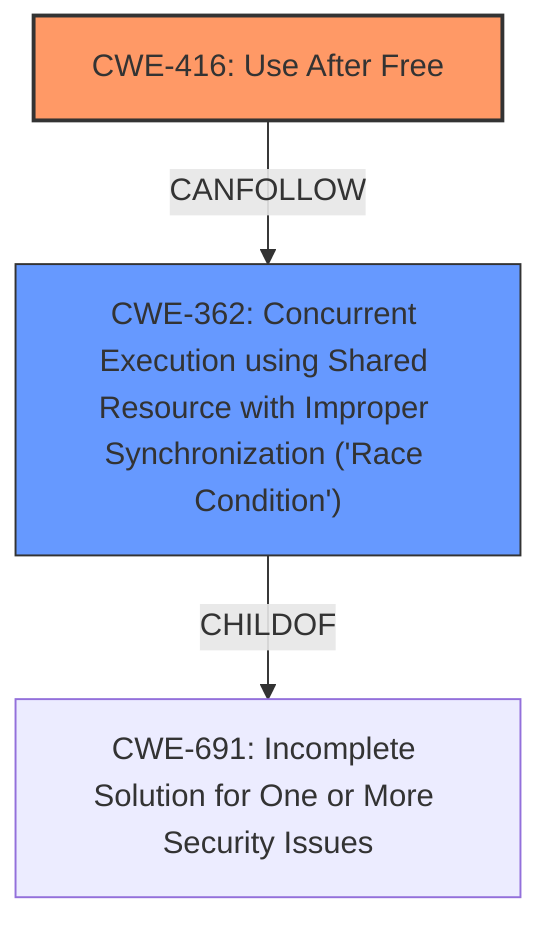

# Enhanced Analysis for CVE-2021-28697

# Summary
| CWE ID | CWE Name | Confidence | CWE Abstraction Level | CWE Vulnerability Mapping Label | CWE-Vulnerability Mapping Notes |
|---|---|---|---|---|---|
| CWE-416 | Use After Free | 0.9 | Variant | Allowed | Primary CWE |
| CWE-362 | Concurrent Execution using Shared Resource with Improper Synchronization ('Race Condition') | 0.8 | Class | Allowed-with-Review | Secondary CWE |

## Evidence and Confidence

*   **Confidence Score:** 0.85
*   **Evidence Strength:** HIGH

## Relationship Analysis
The primary weakness is **CWE-416**: Use After Free, which occurs because the hypervisor **does not properly track all mappings** of grant table v2 status pages, leading to a situation where a guest retains access to deallocated pages.
**CWE-362**: Concurrent Execution using Shared Resource with Improper Synchronization ('Race Condition') is a secondary weakness. The race condition allows multiple mappings of the same page, exacerbating the use-after-free condition.



## Vulnerability Chain
1.  **Race condition** (CWE-362) allows multiple mappings of the same grant table page within the guest's memory.
2.  Hypervisor tracks only one mapping.
3.  Guest switches from grant table v2 to v1.
4.  Hypervisor deallocates the page based on the single tracked mapping.
5.  The guest retains access to the freed memory, resulting in a **use-after-free** (CWE-416) vulnerability.

## Summary of Analysis
The analysis indicates a **use-after-free** vulnerability (CWE-416) caused by a race condition (CWE-362). The hypervisor **does not properly track all mappings** of grant table v2 status pages within guest memory. This is supported by the "CVE Reference Links Content Summary" which states that the root cause is that "The Xen hypervisor **does not properly track all mappings** of grant table v2 status pages within guest memory" and leads to a "use-after-free condition when the guest retains access to the deallocated pages."

**CWE Selection Justification:**

*   **CWE-416: Use After Free** - This is the primary weakness because the guest retains access to memory that has been deallocated, directly leading to a use-after-free condition.
*   **CWE-362: Concurrent Execution using Shared Resource with Improper Synchronization ('Race Condition')** - This is a secondary weakness. The race condition allows the guest to create multiple mappings of the same page, which exacerbates the use-after-free condition. The vulnerability description mentions that "racing requests from the guest to insert mappings of these pages may result in any of them to become mapped in multiple locations."

**CWEs Considered but Not Used:**

*   **CWE-404: Improper Resource Shutdown or Release:** While the hypervisor does deallocate the memory, the core issue is not the deallocation itself but the subsequent use of the freed memory. Therefore, CWE-404 is not the primary weakness.
*   **CWE-425: Direct Request ('Forced Browsing'):** This is not applicable because the vulnerability is not about accessing resources without proper authorization but about using memory after it has been freed.
*   **CWE-909: Missing Initialization of Resource:** The issue is not a missing initialization but an incorrect memory management during deallocation, leading to a use-after-free.
*   **CWE-459: Incomplete Cleanup:** While there's an aspect of incomplete cleanup (not ensuring all mappings are unmapped), the core issue is the use of the freed memory, making CWE-416 more appropriate.
*   **CWE-1421: Exposure of Sensitive Information in Shared Microarchitectural Structures during Transient Execution:** This is not applicable as the vulnerability doesn't involve transient execution or exposure of information through microarchitectural structures.

The selected CWEs are at the optimal level of specificity. CWE-416 is a Variant that directly describes the use-after-free condition, and CWE-362 describes the race condition that contributes to the vulnerability.


## CWE Relationship Analysis

Current CWEs represent these abstraction levels: .


### Vulnerability Chain Analysis

**Chain starting from CWE-691:**
- 691 (Insufficient Control Flow Management) - ROOT


**Chain starting from CWE-1421:**
- 1421 (Exposure of Sensitive Information in Shared Microarchitectural Structures during Transient Execution) - ROOT


### CWE Relationship Diagram

```mermaid
graph TD
    classDef primary fill:#f96,stroke:#333,stroke-width:2px
    classDef secondary fill:#69f,stroke:#333
    classDef tertiary fill:#9e9,stroke:#333
```