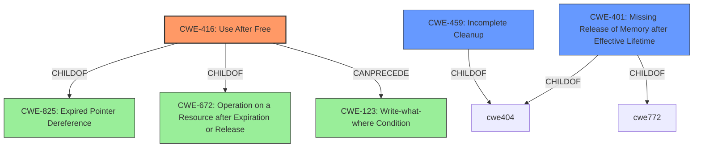

# Analysis Report for CVE-2021-28702

# Vulnerability Analysis Report: CVE-2021-28702

## Description


## Analysis (with Relationship Data)

# Summary
| CWE ID | CWE Name | Confidence | CWE Abstraction Level | CWE Vulnerability Mapping Label | CWE-Vulnerability Mapping Notes |
|---|---|---|---|---|---|
| CWE-416 | Use After Free | 1.0 | Variant | Allowed | Primary CWE |
| CWE-459 | Incomplete Cleanup | 0.7 | Base | Allowed | Secondary Candidate |
| CWE-401 | Missing Release of Memory after Effective Lifetime | 0.6 | Variant | Allowed | Secondary Candidate |

## Evidence and Confidence

*   **Confidence Score:** 0.9
*   **Evidence Strength:** HIGH

## Relationship Analysis
The primary CWE selected is CWE-416 (Use After Free), a variant-level CWE, which is appropriate given the clear evidence of memory being accessed after it has been freed. CWE-416 is a child of CWE-825 (Expired Pointer Dereference) and CWE-672 (Operation on a Resource after Expiration or Release). The relationship to CWE-123 (Write-what-where Condition) as a potential follow-on is also relevant. We also considered CWE-459 (Incomplete Cleanup) and CWE-401 (Missing Release of Memory after Effective Lifetime) as potential contributing factors, reflecting a broader failure to properly manage resources.



## Vulnerability Chain
The vulnerability chain starts with the **improper deassignment** of PCI devices with RMRRs after guest shutdown, which leads to the IOMMU configuration pointing to **freed data structures**. This then results in a **use-after-free** condition (CWE-416), ultimately causing unpredictable behavior and potential memory corruption.

## Summary of Analysis
The analysis is based on the provided vulnerability description and the CVE reference. The core issue is that PCI devices with RMRRs are **not properly deassigned**, leading to a **use-after-free** condition.

The vulnerability description states: "If such a device is passed through to a guest, then on guest shutdown the device is **not properly deassigned**. The IOMMU configuration for these devices which are **not properly deassigned** ends up pointing to a **freed data structure**, including the IO Pagetables. Subsequent DMA or interrupts from the device will have unpredictable behaviour, ranging from IOMMU faults to memory corruption."

The CVE reference confirms this: "PCI devices with Reserved Memory Regions (RMRRs) are **not properly deassigned** on guest shutdown. The IOMMU configuration for these devices points to **freed data structures**." The listed vulnerability is "Improper deassignment of PCI devices with RMRRs leading to **use-after-free**."

Based on this evidence, CWE-416 (Use After Free) is the most appropriate primary CWE. The retriever results also support this, with CWE-416 being the top-ranked CWE.

CWE-459 (Incomplete Cleanup) was considered because the **improper deassignment** can be seen as a failure to properly clean up resources. However, the resulting **use-after-free** is a more specific and direct consequence. CWE-401 (Missing Release of Memory after Effective Lifetime) was also considered because the memory is not being properly managed, leading to a potential memory leak. However, the **use-after-free** is the more immediate and critical vulnerability.

The selection of CWE-416 is at the optimal level of specificity, as it directly addresses the core vulnerability mechanism.


## CWE Relationship Analysis

Current CWEs represent these abstraction levels: .


### Vulnerability Chain Analysis

**Chain starting from CWE-123:**
- 123 (Write-what-where Condition) - ROOT


**Chain starting from CWE-416:**
- 416 (Use After Free) - ROOT


### CWE Relationship Diagram

```mermaid
graph TD
    classDef primary fill:#f96,stroke:#333,stroke-width:2px
    classDef secondary fill:#69f,stroke:#333
    classDef tertiary fill:#9e9,stroke:#333
```


*Report generated on 2025-04-01 18:57:09*
