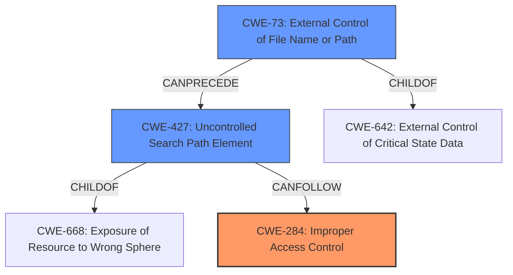

# Enhanced Analysis for CVE-2021-28793

# Summary
| CWE ID | CWE Name | Confidence | CWE Abstraction Level | CWE Vulnerability Mapping Label | CWE-Vulnerability Mapping Notes |
|---|---|---|---|---|---|
| CWE-284 | Improper Access Control | 0.8 | Pillar | Primary | Discouraged |
| CWE-427 | Uncontrolled Search Path Element | 0.7 | Base | Secondary | Allowed |
| CWE-73 | External Control of File Name or Path | 0.6 | Base | Secondary | Allowed |

## Evidence and Confidence

*   **Confidence Score:** 0.8
*   **Evidence Strength:** HIGH

## Relationship Analysis
The primary CWE selected is CWE-284 (Improper Access Control), which is a high-level Pillar. While it captures the essence of the vulnerability, it's discouraged due to its generality. The analysis also considered CWE-427 (Uncontrolled Search Path Element) and CWE-73 (External Control of File Name or Path) as more specific Base-level CWEs that could contribute to the vulnerability. CWE-427 relates to the use of a search path that contains locations controlled by unintended actors, while CWE-73 involves external control of file names or paths. These relationships show a potential chain where improper access control could lead to using external input to control file paths, ultimately enabling the execution of arbitrary binaries. The abstraction levels were considered to choose the most specific CWEs possible while still accurately reflecting the root cause.



## Vulnerability Chain
The vulnerability chain starts with an **incorrect access control** (CWE-284), which allows a crafted project folder to manipulate workspace configurations. This leads to the possibility of an **uncontrolled search path element** (CWE-427) or **external control of file name or path** (CWE-73), enabling the execution of arbitrary binaries, and ultimately resulting in remote code execution.

## Summary of Analysis
The initial assessment pointed to CWE-284 as the primary weakness due to the "**incorrect access control**" vulnerability. However, given the discouraged usage of CWE-284 and the availability of more specific CWEs, a further refinement was necessary. The evidence from the CVE Reference Links Content Summary indicates that the extension doesn't properly validate or restrict workspace settings, allowing malicious configurations to be loaded. This can lead to injecting malicious paths for tools, aligning with CWE-427 (Uncontrolled Search Path Element) and CWE-73 (External Control of File Name or Path). While the root cause is the **improper access control**, the specific mechanism involves the use of a crafted project folder to execute arbitrary binaries, which is closely related to CWE-427 and CWE-73. The relationships between these CWEs support this assessment. Ultimately, I'm retaining CWE-284 as the primary weakness due to the root cause described in the **Vulnerability Description Key Phrases**, with CWE-427 and CWE-73 as secondary contributing factors. The selected CWEs are at the optimal level of specificity, given the available information.

Relevant CWE Information:

# Enhanced Context (25 CWEs)
The following CWEs were identified as potentially relevant to this vulnerability:

## CWE-73: External Control of File Name or Path
**Abstraction Level**: Base
**Similarity Score**: 0.75
**Source**: dense

**Description**:
The product allows user input to control or influence paths or file names that are used in filesystem operations.

**Mapping Guidance**:
- Usage: Allowed
- Rationale: This CWE entry is at the Base level of abstraction, which is a preferred level of abstraction for mapping to the root causes of vulnerabilities.

## CWE-284: Improper Access Control
**Abstraction Level**: Pillar
**Similarity Score**: 0.74
**Source**: dense

**Description**:
The product does not restrict or incorrectly restricts access to a resource from an unauthorized actor.

**Mapping Guidance**:
- Usage: Discouraged
- Rationale: CWE-284 is extremely high-level, a Pillar. Its name, "Improper Access Control," is often misused in low-information vulnerability reports [REF-1287] or by active use of the OWASP Top Ten, such as "A01:2021-Broken Access Control". It is not useful for trend analysis.

## CWE-427: Uncontrolled Search Path Element
**Abstraction Level**: Base
**Similarity Score**: 8486.84
**Source**: sparse

**Description**:
The product uses a fixed or controlled search path to find resources, but one or more locations in that path can be under the control of unintended actors.

**Mapping Guidance**:
- Usage: Allowed
- Rationale: This CWE entry is at the Base level of abstraction, which is a preferred level of abstraction for mapping to the root causes of vulnerabilities.


## CWE Relationship Analysis

Current CWEs represent these abstraction levels: .


### Vulnerability Chain Analysis

**Chain starting from CWE-73:**
- 73 (External Control of File Name or Path) - ROOT


**Chain starting from CWE-284:**
- 284 (Improper Access Control) - ROOT


### CWE Relationship Diagram

```mermaid
graph TD
    classDef primary fill:#f96,stroke:#333,stroke-width:2px
    classDef secondary fill:#69f,stroke:#333
    classDef tertiary fill:#9e9,stroke:#333
```