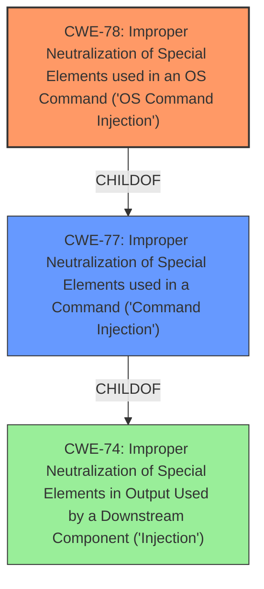

# Analysis for CVE-2021-28800

# Summary
| CWE ID | CWE Name | Confidence | CWE Abstraction Level | CWE Vulnerability Mapping Label | CWE-Vulnerability Mapping Notes |
|---|---|---|---|---|---|
| CWE-78 | Improper Neutralization of Special Elements used in an OS Command ('OS Command Injection') | 1.0 | Base | Allowed | Primary CWE |
| CWE-77 | Improper Neutralization of Special Elements used in a Command ('Command Injection') | 0.7 | Class | Allowed-with-Review | Secondary Candidate |

## Evidence and Confidence

*   **Confidence Score:** 1.0
*   **Evidence Strength:** HIGH

## Relationship Analysis
The primary relationship influencing my decision is the parent-child relationship between CWE-77 and CWE-78. CWE-78 is a more specific Base level weakness that accurately represents the OS command injection vulnerability, while CWE-77 is a broader Class level weakness that includes other command injection types. The vulnerability description specifically mentions "command injection" without explicitly stating that it's limited to OS commands. However, given the context of QNAP NAS devices, which run an operating system, it is most likely to be OS command injection.

## Vulnerability Chain
The vulnerability chain starts with the **improper neutralization** of special elements within a command, leading to the ability to execute arbitrary commands.

## Summary of Analysis
The initial assessment, based on the provided evidence, strongly indicates an OS Command Injection vulnerability (CWE-78). The vulnerability description key phrases explicitly mention "**command injection**" as the **weakness**, and the impact is the ability to "execute arbitrary commands." The CVE Reference Links Content Summary also confirms the "**command injection** vulnerability" allows attackers to "execute arbitrary commands."
The graph relationships confirm that CWE-78 is a child of CWE-77 (Improper Neutralization of Special Elements used in a Command), which is a child of CWE-74 (Improper Neutralization of Special Elements in Output Used by a Downstream Component ('Injection')).

I am overriding the general mapping guidance to prefer the more specific CWE-78 over the more general CWE-77. While the description uses the broader term "command injection", the context of QNAP NAS devices implies OS commands are involved, justifying the selection of CWE-78. My confidence in this assessment is high (1.0) because of the direct evidence and the logical deduction based on the environment.

Relevant CWE Information:

# Enhanced Context (25 CWEs)
The following CWEs were identified as potentially relevant to this vulnerability:

## CWE-74: Improper Neutralization of Special Elements in Output Used by a Downstream Component ('Injection')
**Abstraction Level**: Class
**Similarity Score**: 0.77
**Source**: dense

**Description**:
The product constructs all or part of a command, data structure, or record using externally-influenced input from an upstream component, but it does not neutralize or incorrectly neutralizes special elements that could modify how it is parsed or interpreted when it is sent to a downstream component.

**Mapping Guidance**:
- Usage: Discouraged
- Rationale: CWE-74 is high-level and often misused when lower-level weaknesses are more appropriate.

## CWE-77: Improper Neutralization of Special Elements used in a Command ('Command Injection')
**Abstraction:** Class
**Status:** Draft

### Description
The product constructs all or part of a command using externally-influenced input from an upstream component, but it does not neutralize or incorrectly neutralizes special elements that could modify the intended command when it is sent to a downstream component.

### Extended Description
Many protocols and products have their own custom command language. While OS or shell command strings are frequently discovered and targeted, developers may not realize that these other command languages might also be vulnerable to attacks.

### Alternative Terms
Command injection: an attack-oriented phrase for this weakness. Note: often used when "OS command injection" (CWE-78) was intended.

### Relationships
ChildOf -> CWE-74
ChildOf -> CWE-74

### Mapping Guidance
**Usage:** Allowed-with-Review
**Rationale:** CWE-77 is often misused when OS command injection (CWE-78) was intended instead [REF-1287].
**Comments:** Ensure that the analysis focuses on the root-cause error that allows the execution of commands, as there are many weaknesses that can lead to this consequence. See Terminology Notes. If the weakness involves a command language besides OS shell invocation, then CWE-77 could be used.
**Reasons:**
- Frequent Misuse
**Suggested Alternatives:**
- CWE-78: OS Command Injection

### Additional Notes
**[Terminology]** 

The "command injection" phrase carries different meanings, either as an attack or as a technical impact. The most common usage of "command injection" refers to the more-accurate OS command injection (CWE-78), but there are many command languages.

**[Other]** 

Command injection is a common problem with wrapper programs.

## CWE-78: Improper Neutralization of Special Elements used in an OS Command ('OS Command Injection')
**Abstraction:** Base
**Status:** Stable

### Description
The product constructs all or part of an OS command using externally-influenced input from an upstream component, but it does not neutralize or incorrectly neutralizes special elements that could modify the intended OS command when it is sent to a downstream component.

### Extended Description
This weakness can lead to a vulnerability in environments in which the attacker does not have direct access to the operating system, such as in web applications. Alternately, if the weakness occurs in a privileged program, it could allow the attacker to specify commands that normally would not be accessible, or to call alternate commands with privileges that the attacker does not have. The problem is exacerbated if the compromised process does not follow the principle of least privilege, because the attacker-controlled commands may run with special system privileges that increases the amount of damage.

### Alternative Terms
Shell injection
Shell metacharacters
OS Command Injection

### Relationships
ChildOf -> CWE-77
ChildOf -> CWE-74
ChildOf -> CWE-77
ChildOf -> CWE-77
CanAlsoBe -> CWE-88

### Mapping Guidance
**Usage:** Allowed
**Rationale:** This CWE entry is at the Base level of abstraction, which is a preferred level of abstraction for mapping to the root causes of vulnerabilities.
**Comments:** Carefully read both the name and description to ensure that this mapping is an appropriate fit. Do not try to 'force' a mapping to a lower-level Base/Variant simply to comply with this preferred level of abstraction.
**Reasons:**
- Acceptable-Use

### Additional Notes
**[Terminology]** The "OS command injection" phrase carries different meanings to different people. For some people, it only refers to cases in which the attacker injects command separators into arguments for an application-controlled program that is being invoked. For some people, it refers to any type of attack that can allow the attacker to execute OS commands of their own choosing.

## Other CWE Considerations
CWE-22, CWE-23, CWE-41, CWE-59, CWE-73, CWE-88, CWE-94, CWE-99, CWE-120, CWE-121, CWE-123, CWE-125, CWE-131, CWE-285, CWE-426, CWE-427, CWE-540, CWE-552, CWE-610, CWE-639, CWE-653, CWE-668 were considered. These CWEs were deemed less relevant because they represent different types of vulnerabilities, such as path traversal, buffer overflows, or authorization issues, which are not the primary weaknesses described in the vulnerability. The core issue is **command injection**, making CWE-78 the most appropriate choice.